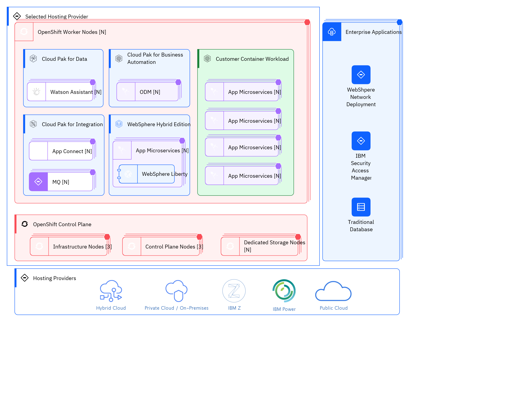

## Diagram

### Name

Deployment View

### Description

## Element

[Expand all](#){ .md-button .diff-line }

### Actor

    

Hybrid Cloud

<table>
    <caption></caption>
    <thead>
        <tr>
            <th></th>
            <th></th>
        </tr>
    </thead>
    <tr>
        <td> <strong>Name</strong> </td>
        <td>Hybrid Cloud</td>
    </tr>
    <tr>
        <td> <strong>Description</strong> </td>
        <td>Hybrid cloud integrates public cloud services, private cloud services and on-premises infrastructure and provides orchestration, management and application portability across all three. The result is a single, unified and flexible distributed computing environment where an organization can run and scale its traditional or cloud-native workloads on the most appropriate computing model.
Hybrid multicloud is hybrid cloud that includes public cloud services from more than one cloud service provider. 
By enabling a company to 
* 		combine best-of-breed cloud services and functionality from multiple cloud computing vendors
* 		choose the optimal cloud computing environment for each workload, and 
* 		move workloads freely between public and private cloud as circumstances change
hybrid cloud - and particularly hybrid multicloud - helps a company achieve its technical and business objectives more effectively and cost-efficiently than public cloud or private cloud alone. In fact, according to one recent study, companies derive up to 2.5x the value from hybrid cloud than from a single-cloud, single-vendor approach.

https://www.ibm.com/cloud/learn/hybrid-cloud</td>
    </tr>
    <tr>
        <td> <strong>Type</strong> </td>
        <td>IT System</td>
    </tr>
    <tr>
        <td> <strong>Generic Group</strong> </td>
<td>
        
</td>
    </tr>
</table>

    

IBM Power

<table>
    <caption></caption>
    <thead>
        <tr>
            <th></th>
            <th></th>
        </tr>
    </thead>
    <tr>
        <td> <strong>Name</strong> </td>
        <td>IBM Power</td>
    </tr>
    <tr>
        <td> <strong>Description</strong> </td>
        <td>IBM Power is specifically architected for data rich applications and workloads, delivering enterprise-class compute with the flexibility of hybrid cloud deployment – traditional on premise, private cloud and public cloud. 

https://www.ibm.com/partnerworld/systems/power</td>
    </tr>
    <tr>
        <td> <strong>Type</strong> </td>
        <td>IT System</td>
    </tr>
    <tr>
        <td> <strong>Generic Group</strong> </td>
<td>
        
</td>
    </tr>
</table>

    

IBM Z

<table>
    <caption></caption>
    <thead>
        <tr>
            <th></th>
            <th></th>
        </tr>
    </thead>
    <tr>
        <td> <strong>Name</strong> </td>
        <td>IBM Z</td>
    </tr>
    <tr>
        <td> <strong>Description</strong> </td>
        <td>IBM Z is a family name that’s used by IBM for all of its z/Architecture mainframe computers, beginning with the z900 released in 2000 to today’s IBM z15 released in September 2019. (The “Z” stands for “zero downtime,” which reflects the reliability of the system.) IBM Z uses the IBM S/390 chip architecture. Data that’s handled by IBM Z is encrypted by dedicated encryption processors over the complete ecosystem, and encryption keys are handled with the most secure hardware security module (HSM) in the industry — which means it is highly secured.

https://developer.ibm.com/articles/what-is-ibm-z/</td>
    </tr>
    <tr>
        <td> <strong>Type</strong> </td>
        <td>IT System</td>
    </tr>
    <tr>
        <td> <strong>Generic Group</strong> </td>
<td>
        
</td>
    </tr>
</table>

    

Private Cloud / On-Premises

<table>
    <caption></caption>
    <thead>
        <tr>
            <th></th>
            <th></th>
        </tr>
    </thead>
    <tr>
        <td> <strong>Name</strong> </td>
        <td>Private Cloud / On-Premises</td>
    </tr>
    <tr>
        <td> <strong>Description</strong> </td>
        <td>Private cloud (also known as an internal cloud or corporate cloud) is a cloud computing environment in which all hardware and software resources are dedicated exclusively to, and accessible only by, a single customer. Private cloud combines many of the benefits of cloud computing—including elasticity, scalability, and ease of service delivery—with the access control, security, and resource customization of on-premises infrastructure.

https://www.ibm.com/cloud/learn/introduction-to-private-cloud</td>
    </tr>
    <tr>
        <td> <strong>Type</strong> </td>
        <td>IT System</td>
    </tr>
    <tr>
        <td> <strong>Generic Group</strong> </td>
<td>
        
</td>
    </tr>
</table>

    

Public Cloud

<table>
    <caption></caption>
    <thead>
        <tr>
            <th></th>
            <th></th>
        </tr>
    </thead>
    <tr>
        <td> <strong>Name</strong> </td>
        <td>Public Cloud</td>
    </tr>
    <tr>
        <td> <strong>Description</strong> </td>
        <td>The rise and adoption of public cloud services is one of the most important shifts in the history of enterprise computing. A public cloud is a type of cloud computing in which a third-party service provider makes computing resources—which can include anything from ready-to-use software applications, to individual virtual machines (VMs), to complete enterprise-grade infrastructures and development platforms—available to users over the public Internet. These resources might be accessible for free, or access might be sold according to subscription-based or pay-per-usage pricing models.

https://www.ibm.com/cloud/learn/public-cloud </td>
    </tr>
    <tr>
        <td> <strong>Type</strong> </td>
        <td>IT System</td>
    </tr>
    <tr>
        <td> <strong>Generic Group</strong> </td>
<td>
        
</td>
    </tr>
</table>

    

### Subsystem

    

OpenShift Worker Nodes [N]

<table>
    <caption></caption>
    <thead>
        <tr>
            <th></th>
            <th></th>
        </tr>
    </thead>
    <tr>
        <td> <strong>Name</strong> </td>
        <td>OpenShift Worker Nodes [N]</td>
    </tr>
    <tr>
        <td> <strong>Description</strong> </td>
        <td>In a Kubernetes cluster, the worker nodes are where the actual workloads requested by Kubernetes users run and are managed. The worker nodes advertise their capacity and the scheduler, which is part of the master services, determines on which nodes to start containers and Pods. Important services run on each worker node, including CRI-O, which is the container engine, Kubelet, which is the service that accepts and fulfills requests for running and stopping container workloads, and a service proxy, which manages communication for pods across workers.
https://docs.openshift.com/container-platform/4.1/architecture/control-plane.html 

 
</td>
    </tr>
</table>

    

Cloud Pak for Business Automation

<table>
    <caption></caption>
    <thead>
        <tr>
            <th></th>
            <th></th>
        </tr>
    </thead>
    <tr>
        <td> <strong>Name</strong> </td>
        <td>Cloud Pak for Business Automation</td>
    </tr>
    <tr>
        <td> <strong>Description</strong> </td>
        <td>IBM Cloud Pak for Business Automation is a set of&nbsp;integrated market-leading&nbsp;software designed to help you solve your toughest operational challenges.&nbsp;
With AI-generated recommendations, analytics to measure impact, and business-friendly low-code tooling, we've&nbsp;helped clients reduce&nbsp;the&nbsp;amount of time&nbsp;spent on&nbsp;manual processes&nbsp;by&nbsp;90% and decreased customer wait times by half. You can now better comply with regulations to&nbsp;reduce risk and save thousands of work hours that can then be reallocated to higher value work.

 

https://www.ibm.com/cloud/cloud-pak-for-business-automation
</td>
    </tr>
</table>

    

Cloud Pak for Data

<table>
    <caption></caption>
    <thead>
        <tr>
            <th></th>
            <th></th>
        </tr>
    </thead>
    <tr>
        <td> <strong>Name</strong> </td>
        <td>Cloud Pak for Data</td>
    </tr>
    <tr>
        <td> <strong>Description</strong> </td>
        <td>IBM® Cloud Pak for Data&nbsp;is a cloud-native solution that enables you to put your data to work quickly and efficiently.
Your enterprise has lots of data. You need to use your data to generate meaningful insights that can help you avoid problems and reach your goals.

But your data is useless if you can't trust it or access it.&nbsp;Cloud Pak for Data&nbsp;lets you do both by enabling you to connect to your data, govern it, find it, and use it for analysis.&nbsp;Cloud Pak for Data&nbsp;also enables all of your data users to collaborate from a single, unified interface that supports many services that are designed to work together.

Cloud Pak for Data&nbsp;fosters productivity by enabling users to find existing data or to request access to data. With modern tools that facilitate analytics and remove barriers to collaboration, users can spend less time finding data and more time using it effectively.

And with&nbsp;Cloud Pak for Data, your IT department doesn't need to deploy multiple applications on disparate systems and then try to figure out how to get them to connect.

 

https://www.ibm.com/support/producthub/icpdata/docs/content/SSQNUZ_latest/cpd/overview/overview.html 

 
</td>
    </tr>
</table>

    

Cloud Pak for Integration

<table>
    <caption></caption>
    <thead>
        <tr>
            <th></th>
            <th></th>
        </tr>
    </thead>
    <tr>
        <td> <strong>Name</strong> </td>
        <td>Cloud Pak for Integration</td>
    </tr>
    <tr>
        <td> <strong>Description</strong> </td>
        <td>IBM Cloud Pak for Integration is the solution to deliver both speed and quality, improving your integrations and your applications by extending AI-powered automation across the integration lifecycle. With it, companies are able to speed their integration development by 300%, reduce costs of integration by over 33% and increase overall operational efficiency while maintaining enhanced security, governance and availability.
 

https://www.ibm.com/downloads/cas/M103EDOO 

 
</td>
    </tr>
</table>

    

Customer Container Workload

<table>
    <caption></caption>
    <thead>
        <tr>
            <th></th>
            <th></th>
        </tr>
    </thead>
    <tr>
        <td> <strong>Name</strong> </td>
        <td>Customer Container Workload</td>
    </tr>
    <tr>
        <td> <strong>Description</strong> </td>
        <td></td>
    </tr>
</table>

    

OpenShift Control Plane

<table>
    <caption></caption>
    <thead>
        <tr>
            <th></th>
            <th></th>
        </tr>
    </thead>
    <tr>
        <td> <strong>Name</strong> </td>
        <td>OpenShift Control Plane</td>
    </tr>
    <tr>
        <td> <strong>Description</strong> </td>
        <td>The control plane, which is composed of master machines, manages the OpenShift Container Platform cluster. The control plane machines manage workloads on the compute machines, which are also known as worker machines. The cluster itself manages all upgrades to the machines by the actions of the Cluster Version Operator, the Machine Config Operator, and set of individual Operators.
https://docs.openshift.com/container-platform/4.1/architecture/control-plane.html 

 
</td>
    </tr>
</table>

    

WebSphere Hybrid Edition

<table>
    <caption></caption>
    <thead>
        <tr>
            <th></th>
            <th></th>
        </tr>
    </thead>
    <tr>
        <td> <strong>Name</strong> </td>
        <td>WebSphere Hybrid Edition</td>
    </tr>
    <tr>
        <td> <strong>Description</strong> </td>
        <td>IBM® WebSphere® Hybrid Edition is designed for on-premises, cloud, and hybrid cloud deployments and includes all of the major IBM WebSphere Application Server editions:
* 		IBM WebSphere Application Server Network Deployment

* 		IBM WebSphere Application Server

* 		IBM WebSphere Application Server Liberty Core

IBM WebSphere Hybrid Edition is the solution of choice for existing on-premises WebSphere Application Server deployments, which are the WebSphere deployments that have powered a good portion of the world's economy for the last 20 years. With IBM WebSphere Hybrid Edition 5.0, existing applications can remain in place or make a gradual transition to the cloud. IBM WebSphere Hybrid Edition gives you the flexibility to move between WebSphere editions over time without additional entitlements.

 

https://www.ibm.com/docs/en/websphere-hybrid?topic=overview

 
</td>
    </tr>
</table>

    

### Location

    

Enterprise Applications

<table>
    <caption></caption>
    <thead>
        <tr>
            <th></th>
            <th></th>
        </tr>
    </thead>
    <tr>
        <td> <strong>Name</strong> </td>
        <td>Enterprise Applications</td>
    </tr>
    <tr>
        <td> <strong>Description</strong> </td>
        <td>It is a prevalent scenario to propose a hybrid solution to the customer. This is mainly because there are customer's monolithic applications hosted on regular virtual machines or regular physical systems.  The following are examples of IBM products that are not containerized and can be hosted on traditional virtual machines:  IBM WebSphere Network Deployment IBM Security Access Manager Another example of non-containerized enterprise systems is some traditional database used by the customer.</td>
    </tr>
</table>

    

Hosting Providers

<table>
    <caption></caption>
    <thead>
        <tr>
            <th></th>
            <th></th>
        </tr>
    </thead>
    <tr>
        <td> <strong>Name</strong> </td>
        <td>Hosting Providers</td>
    </tr>
    <tr>
        <td> <strong>Description</strong> </td>
        <td></td>
    </tr>
</table>

    

Selected Hosting Provider

<table>
    <caption></caption>
    <thead>
        <tr>
            <th></th>
            <th></th>
        </tr>
    </thead>
    <tr>
        <td> <strong>Name</strong> </td>
        <td>Selected Hosting Provider</td>
    </tr>
    <tr>
        <td> <strong>Description</strong> </td>
        <td></td>
    </tr>
</table>

    

### Logical Connection

    

### Logical Node

    

App Connect [N]

<table>
    <caption></caption>
    <thead>
        <tr>
            <th></th>
            <th></th>
        </tr>
    </thead>
    <tr>
        <td> <strong>Name</strong> </td>
        <td>App Connect [N]</td>
    </tr>
    <tr>
        <td> <strong>Description</strong> </td>
        <td></td>
    </tr>
    <tr>
        <td> <strong>Type</strong> </td>
        <td></td>
    </tr>
    <tr>
        <td> <strong>Primary Capability</strong> </td>
        <td>
            
                
network routing

            
        </td>
    </tr>
    <tr>
        <td> <strong>Implementation</strong> </td>
        <td>
            
        </td>
    </tr>
    <tr>
        <td> <strong>Architectural Decision</strong> </td>
        <td>
            
        </td>
    </tr>
    <tr>
        <td> <strong>Non Functional Requirement</strong> </td>
        <td>
            
        </td>
    </tr>
    <tr>
        <td> <strong>Generic Group</strong> </td>
        <td></td>
    </tr>
    <tr>
        <td> <strong>Sub-level Diagram</strong> </td>
        <td></td>
    </tr>
    <tr>
        <td> <strong>Related Diagrams</strong> </td>
        <td>
            
                
<a href="../../IT System View/aoditsystem_BydIlEc7sHFF">Deployment View</a>

            
        </td>
    </tr>
    <tr>
        <td> <strong>Related Elements</strong> </td>
        <td>
            
            
                
network routing

                
            
        </td>
    </tr>
</table>

    

App Microservices [N]

<table>
    <caption></caption>
    <thead>
        <tr>
            <th></th>
            <th></th>
        </tr>
    </thead>
    <tr>
        <td> <strong>Name</strong> </td>
        <td>App Microservices [N]</td>
    </tr>
    <tr>
        <td> <strong>Description</strong> </td>
        <td></td>
    </tr>
    <tr>
        <td> <strong>Type</strong> </td>
        <td></td>
    </tr>
    <tr>
        <td> <strong>Primary Capability</strong> </td>
        <td>
            
                
container image

            
        </td>
    </tr>
    <tr>
        <td> <strong>Implementation</strong> </td>
        <td>
            
        </td>
    </tr>
    <tr>
        <td> <strong>Architectural Decision</strong> </td>
        <td>
            
        </td>
    </tr>
    <tr>
        <td> <strong>Non Functional Requirement</strong> </td>
        <td>
            
        </td>
    </tr>
    <tr>
        <td> <strong>Generic Group</strong> </td>
        <td></td>
    </tr>
    <tr>
        <td> <strong>Sub-level Diagram</strong> </td>
        <td></td>
    </tr>
    <tr>
        <td> <strong>Related Diagrams</strong> </td>
        <td>
            
                
<a href="../../IT System View/aoditsystem_SJAvxVcQjStY">OM - Prescribed View</a>

            
                
<a href="../../IT System View/aoditsystem_BydIlEc7sHFF">Deployment View</a>

            
        </td>
    </tr>
    <tr>
        <td> <strong>Related Elements</strong> </td>
        <td>
            
            
                
container image

                
            
        </td>
    </tr>
</table>

    

Control Plane Nodes [3]

<table>
    <caption></caption>
    <thead>
        <tr>
            <th></th>
            <th></th>
        </tr>
    </thead>
    <tr>
        <td> <strong>Name</strong> </td>
        <td>Control Plane Nodes [3]</td>
    </tr>
    <tr>
        <td> <strong>Description</strong> </td>
        <td>In a Kubernetes cluster, the control plane nodes run services that are required to control the Kubernetes cluster. They contain more than just the Kubernetes services for managing the OpenShift Container Platform cluster. Instead of being grouped into a MachineSet, control plane machines are defined by a series of standalone machine API resources. Extra controls apply to control plane machines to prevent you from deleting all control plane machines and breaking your cluster.   https://docs.openshift.com/container-platform/4.9/architecture/control-plane.html</td>
    </tr>
    <tr>
        <td> <strong>Type</strong> </td>
        <td></td>
    </tr>
    <tr>
        <td> <strong>Primary Capability</strong> </td>
        <td>
            
                
container image

            
        </td>
    </tr>
    <tr>
        <td> <strong>Implementation</strong> </td>
        <td>
            
        </td>
    </tr>
    <tr>
        <td> <strong>Architectural Decision</strong> </td>
        <td>
            
        </td>
    </tr>
    <tr>
        <td> <strong>Non Functional Requirement</strong> </td>
        <td>
            
        </td>
    </tr>
    <tr>
        <td> <strong>Generic Group</strong> </td>
        <td></td>
    </tr>
    <tr>
        <td> <strong>Sub-level Diagram</strong> </td>
        <td></td>
    </tr>
    <tr>
        <td> <strong>Related Diagrams</strong> </td>
        <td>
            
                
<a href="../../IT System View/aoditsystem_SJAvxVcQjStY">OM - Prescribed View</a>

            
                
<a href="../../IT System View/aoditsystem_BydIlEc7sHFF">Deployment View</a>

            
        </td>
    </tr>
    <tr>
        <td> <strong>Related Elements</strong> </td>
        <td>
            
            
                
container image

                
            
        </td>
    </tr>
</table>

    

Dedicated Storage Nodes [N]

<table>
    <caption></caption>
    <thead>
        <tr>
            <th></th>
            <th></th>
        </tr>
    </thead>
    <tr>
        <td> <strong>Name</strong> </td>
        <td>Dedicated Storage Nodes [N]</td>
    </tr>
    <tr>
        <td> <strong>Description</strong> </td>
        <td>You need to design the storage solution based on your workload requirements and infrastructure design. You should evaluate all the storage options that satisfy the requirements, i.e. IBM Cloud Block Storage, Red Hat OpenShift Container Storage, Portworx, NetApp, .. or others.

https://www.ibm.com/cloud/architecture/articles/ibmaot-redhat-openshift/02-solutions-guide-solution-design-solution-architecture</td>
    </tr>
    <tr>
        <td> <strong>Type</strong> </td>
        <td></td>
    </tr>
    <tr>
        <td> <strong>Primary Capability</strong> </td>
        <td>
            
                
container image

            
        </td>
    </tr>
    <tr>
        <td> <strong>Implementation</strong> </td>
        <td>
            
        </td>
    </tr>
    <tr>
        <td> <strong>Architectural Decision</strong> </td>
        <td>
            
        </td>
    </tr>
    <tr>
        <td> <strong>Non Functional Requirement</strong> </td>
        <td>
            
        </td>
    </tr>
    <tr>
        <td> <strong>Generic Group</strong> </td>
        <td></td>
    </tr>
    <tr>
        <td> <strong>Sub-level Diagram</strong> </td>
        <td></td>
    </tr>
    <tr>
        <td> <strong>Related Diagrams</strong> </td>
        <td>
            
                
<a href="../../IT System View/aoditsystem_BydIlEc7sHFF">Deployment View</a>

            
        </td>
    </tr>
    <tr>
        <td> <strong>Related Elements</strong> </td>
        <td>
            
            
                
container image

                
            
        </td>
    </tr>
</table>

    

IBM Security 
Access Manager

<table>
    <caption></caption>
    <thead>
        <tr>
            <th></th>
            <th></th>
        </tr>
    </thead>
    <tr>
        <td> <strong>Name</strong> </td>
        <td>IBM Security 
Access Manager</td>
    </tr>
    <tr>
        <td> <strong>Description</strong> </td>
        <td>IBM Security Access Manager is a complete authorization and network security policy management solution. It provides end-to-end protection of resources over geographically dispersed intranets and extranets.
In addition to state-of-the-art security policy management, IBM Security Access Manager provides authentication, authorization, data security, and centralized resource management capabilities.
IBM Security Access Manager offers the following features:
* 		AuthenticationProvides a wide range of built-in authenticators and supports external authenticators.
* 		AuthorizationProvides permit and deny decisions for protected resources requests in the secure domain through the authorization API.
* 		Data security and centralized resource managementManages secure access to private internal network-based resources by using the public Internet's broad connectivity and ease of use with a corporate firewall system.

https://www.ibm.com/docs/en/sva/9.0.4?topic=overview-introduction-security-access-manager</td>
    </tr>
    <tr>
        <td> <strong>Type</strong> </td>
        <td></td>
    </tr>
    <tr>
        <td> <strong>Primary Capability</strong> </td>
        <td>
            
        </td>
    </tr>
    <tr>
        <td> <strong>Implementation</strong> </td>
        <td>
            
        </td>
    </tr>
    <tr>
        <td> <strong>Architectural Decision</strong> </td>
        <td>
            
        </td>
    </tr>
    <tr>
        <td> <strong>Non Functional Requirement</strong> </td>
        <td>
            
        </td>
    </tr>
    <tr>
        <td> <strong>Generic Group</strong> </td>
        <td></td>
    </tr>
    <tr>
        <td> <strong>Sub-level Diagram</strong> </td>
        <td></td>
    </tr>
    <tr>
        <td> <strong>Related Diagrams</strong> </td>
        <td>
            
                
<a href="../../IT System View/aoditsystem_BydIlEc7sHFF">Deployment View</a>

            
        </td>
    </tr>
    <tr>
        <td> <strong>Related Elements</strong> </td>
        <td>
            
            
        </td>
    </tr>
</table>

    

Infrastructure Nodes [3]

<table>
    <caption></caption>
    <thead>
        <tr>
            <th></th>
            <th></th>
        </tr>
    </thead>
    <tr>
        <td> <strong>Name</strong> </td>
        <td>Infrastructure Nodes [3]</td>
    </tr>
    <tr>
        <td> <strong>Description</strong> </td>
        <td>It is recommended to separate the infrastructure nodes for monitoring, logging, metrics, registry, and router components. Therefore, the recommendation is to dedicate three infrastructure nodes for these functionalities. See this link from Red Hat Documentation for more details about Creating Infrastructure Machine Set.

Separating these functionalities in a dedicated infrastructure machine set will free up more space in your worker nodes for your workload to run.

Additionally, these infrastructure nodes don't consume from the customer's Red Hat OpenShift subscription, which is why you should consider having them separated.

Collocating management functions may be feasible when performance is not required, such as in Dev/Test environments, to save the infrastructure-related costs.

https://www.ibm.com/cloud/architecture/articles/ibmaot-redhat-openshift/02-solutions-guide-solution-design-solution-architecture</td>
    </tr>
    <tr>
        <td> <strong>Type</strong> </td>
        <td></td>
    </tr>
    <tr>
        <td> <strong>Primary Capability</strong> </td>
        <td>
            
                
container image

            
        </td>
    </tr>
    <tr>
        <td> <strong>Implementation</strong> </td>
        <td>
            
        </td>
    </tr>
    <tr>
        <td> <strong>Architectural Decision</strong> </td>
        <td>
            
        </td>
    </tr>
    <tr>
        <td> <strong>Non Functional Requirement</strong> </td>
        <td>
            
        </td>
    </tr>
    <tr>
        <td> <strong>Generic Group</strong> </td>
        <td></td>
    </tr>
    <tr>
        <td> <strong>Sub-level Diagram</strong> </td>
        <td></td>
    </tr>
    <tr>
        <td> <strong>Related Diagrams</strong> </td>
        <td>
            
                
<a href="../../IT System View/aoditsystem_SJAvxVcQjStY">OM - Prescribed View</a>

            
                
<a href="../../IT System View/aoditsystem_BydIlEc7sHFF">Deployment View</a>

            
        </td>
    </tr>
    <tr>
        <td> <strong>Related Elements</strong> </td>
        <td>
            
            
                
container image

                
            
        </td>
    </tr>
</table>

    

MQ [N]

<table>
    <caption></caption>
    <thead>
        <tr>
            <th></th>
            <th></th>
        </tr>
    </thead>
    <tr>
        <td> <strong>Name</strong> </td>
        <td>MQ [N]</td>
    </tr>
    <tr>
        <td> <strong>Description</strong> </td>
        <td></td>
    </tr>
    <tr>
        <td> <strong>Type</strong> </td>
        <td></td>
    </tr>
    <tr>
        <td> <strong>Primary Capability</strong> </td>
        <td>
            
        </td>
    </tr>
    <tr>
        <td> <strong>Implementation</strong> </td>
        <td>
            
        </td>
    </tr>
    <tr>
        <td> <strong>Architectural Decision</strong> </td>
        <td>
            
        </td>
    </tr>
    <tr>
        <td> <strong>Non Functional Requirement</strong> </td>
        <td>
            
        </td>
    </tr>
    <tr>
        <td> <strong>Generic Group</strong> </td>
        <td></td>
    </tr>
    <tr>
        <td> <strong>Sub-level Diagram</strong> </td>
        <td></td>
    </tr>
    <tr>
        <td> <strong>Related Diagrams</strong> </td>
        <td>
            
                
<a href="../../IT System View/aoditsystem_BydIlEc7sHFF">Deployment View</a>

            
        </td>
    </tr>
    <tr>
        <td> <strong>Related Elements</strong> </td>
        <td>
            
            
        </td>
    </tr>
</table>

    

ODM [N]

<table>
    <caption></caption>
    <thead>
        <tr>
            <th></th>
            <th></th>
        </tr>
    </thead>
    <tr>
        <td> <strong>Name</strong> </td>
        <td>ODM [N]</td>
    </tr>
    <tr>
        <td> <strong>Description</strong> </td>
        <td></td>
    </tr>
    <tr>
        <td> <strong>Type</strong> </td>
        <td></td>
    </tr>
    <tr>
        <td> <strong>Primary Capability</strong> </td>
        <td>
            
        </td>
    </tr>
    <tr>
        <td> <strong>Implementation</strong> </td>
        <td>
            
        </td>
    </tr>
    <tr>
        <td> <strong>Architectural Decision</strong> </td>
        <td>
            
        </td>
    </tr>
    <tr>
        <td> <strong>Non Functional Requirement</strong> </td>
        <td>
            
        </td>
    </tr>
    <tr>
        <td> <strong>Generic Group</strong> </td>
        <td></td>
    </tr>
    <tr>
        <td> <strong>Sub-level Diagram</strong> </td>
        <td></td>
    </tr>
    <tr>
        <td> <strong>Related Diagrams</strong> </td>
        <td>
            
                
<a href="../../IT System View/aoditsystem_BydIlEc7sHFF">Deployment View</a>

            
        </td>
    </tr>
    <tr>
        <td> <strong>Related Elements</strong> </td>
        <td>
            
            
        </td>
    </tr>
</table>

    

Traditional Database

<table>
    <caption></caption>
    <thead>
        <tr>
            <th></th>
            <th></th>
        </tr>
    </thead>
    <tr>
        <td> <strong>Name</strong> </td>
        <td>Traditional Database</td>
    </tr>
    <tr>
        <td> <strong>Description</strong> </td>
        <td></td>
    </tr>
    <tr>
        <td> <strong>Type</strong> </td>
        <td></td>
    </tr>
    <tr>
        <td> <strong>Primary Capability</strong> </td>
        <td>
            
        </td>
    </tr>
    <tr>
        <td> <strong>Implementation</strong> </td>
        <td>
            
        </td>
    </tr>
    <tr>
        <td> <strong>Architectural Decision</strong> </td>
        <td>
            
        </td>
    </tr>
    <tr>
        <td> <strong>Non Functional Requirement</strong> </td>
        <td>
            
        </td>
    </tr>
    <tr>
        <td> <strong>Generic Group</strong> </td>
        <td></td>
    </tr>
    <tr>
        <td> <strong>Sub-level Diagram</strong> </td>
        <td></td>
    </tr>
    <tr>
        <td> <strong>Related Diagrams</strong> </td>
        <td>
            
                
<a href="../../IT System View/aoditsystem_BydIlEc7sHFF">Deployment View</a>

            
        </td>
    </tr>
    <tr>
        <td> <strong>Related Elements</strong> </td>
        <td>
            
            
        </td>
    </tr>
</table>

    

Watson Assistant  [N]

<table>
    <caption></caption>
    <thead>
        <tr>
            <th></th>
            <th></th>
        </tr>
    </thead>
    <tr>
        <td> <strong>Name</strong> </td>
        <td>Watson Assistant  [N]</td>
    </tr>
    <tr>
        <td> <strong>Description</strong> </td>
        <td>Watson Assistant lets you build conversational interfaces into any application, device, or channel.
Add a natural language interface to your application to automate interactions with your end users. Common applications include virtual agents and chat bots that can integrate and communicate on any channel or device. Train Watson Conversation service through an easy-to-use web application, designed so you can quickly build natural conversation flows between your apps and users, and deploy scalable, cost effective solutions.

https://cloud.ibm.com/catalog/services/watson-assistant#about</td>
    </tr>
    <tr>
        <td> <strong>Type</strong> </td>
        <td></td>
    </tr>
    <tr>
        <td> <strong>Primary Capability</strong> </td>
        <td>
            
                
container image

            
        </td>
    </tr>
    <tr>
        <td> <strong>Implementation</strong> </td>
        <td>
            
        </td>
    </tr>
    <tr>
        <td> <strong>Architectural Decision</strong> </td>
        <td>
            
        </td>
    </tr>
    <tr>
        <td> <strong>Non Functional Requirement</strong> </td>
        <td>
            
        </td>
    </tr>
    <tr>
        <td> <strong>Generic Group</strong> </td>
        <td></td>
    </tr>
    <tr>
        <td> <strong>Sub-level Diagram</strong> </td>
        <td></td>
    </tr>
    <tr>
        <td> <strong>Related Diagrams</strong> </td>
        <td>
            
                
<a href="../../IT System View/aoditsystem_BydIlEc7sHFF">Deployment View</a>

            
        </td>
    </tr>
    <tr>
        <td> <strong>Related Elements</strong> </td>
        <td>
            
            
                
container image

                
            
        </td>
    </tr>
</table>

    

WebShpere
Network Deployment

<table>
    <caption></caption>
    <thead>
        <tr>
            <th></th>
            <th></th>
        </tr>
    </thead>
    <tr>
        <td> <strong>Name</strong> </td>
        <td>WebShpere
Network Deployment</td>
    </tr>
    <tr>
        <td> <strong>Description</strong> </td>
        <td>WebSphere Application Server Network Deployment provides a flexible, secure server runtime environment for large-scale and mission-critical application deployments. It is available on premises or for public, private, or hybrid cloud. Whether you are seeking to reduce costs, unlock new value from your investment in WebSphere, or speed time to market, this product has the correct fit for every business need.
WebSphere Application Server Network Deployment is a bundled application. For more information about bundled applications, see Bundled applications.

https://www.ibm.com/docs/en/cloud-private/3.2.0?topic=paks-websphere-application-server-network-deployment</td>
    </tr>
    <tr>
        <td> <strong>Type</strong> </td>
        <td></td>
    </tr>
    <tr>
        <td> <strong>Primary Capability</strong> </td>
        <td>
            
        </td>
    </tr>
    <tr>
        <td> <strong>Implementation</strong> </td>
        <td>
            
        </td>
    </tr>
    <tr>
        <td> <strong>Architectural Decision</strong> </td>
        <td>
            
        </td>
    </tr>
    <tr>
        <td> <strong>Non Functional Requirement</strong> </td>
        <td>
            
        </td>
    </tr>
    <tr>
        <td> <strong>Generic Group</strong> </td>
        <td></td>
    </tr>
    <tr>
        <td> <strong>Sub-level Diagram</strong> </td>
        <td></td>
    </tr>
    <tr>
        <td> <strong>Related Diagrams</strong> </td>
        <td>
            
                
<a href="../../IT System View/aoditsystem_BydIlEc7sHFF">Deployment View</a>

            
        </td>
    </tr>
    <tr>
        <td> <strong>Related Elements</strong> </td>
        <td>
            
            
        </td>
    </tr>
</table>

    

WebSphere Liberty

<table>
    <caption></caption>
    <thead>
        <tr>
            <th></th>
            <th></th>
        </tr>
    </thead>
    <tr>
        <td> <strong>Name</strong> </td>
        <td>WebSphere Liberty</td>
    </tr>
    <tr>
        <td> <strong>Description</strong> </td>
        <td>IBM® WebSphere® Liberty is a Java EE application server with a low-overhead Java runtime environment for cloud-native apps and microservices. WebSphere Liberty was created to be highly composable, start fast, use less memory and scale easily. Using the open-sourced IBM Open Liberty (link resides outside IBM) code base provides low-cost experimentation, customization and seamless migration from open source to production.

https://www.ibm.com/cloud/websphere-liberty#:~:text=IBM%C2%AE%20WebSphere%C2%AE%20Liberty,Using%20the%20open%2Dsourced</td>
    </tr>
    <tr>
        <td> <strong>Type</strong> </td>
        <td></td>
    </tr>
    <tr>
        <td> <strong>Primary Capability</strong> </td>
        <td>
            
        </td>
    </tr>
    <tr>
        <td> <strong>Implementation</strong> </td>
        <td>
            
        </td>
    </tr>
    <tr>
        <td> <strong>Architectural Decision</strong> </td>
        <td>
            
        </td>
    </tr>
    <tr>
        <td> <strong>Non Functional Requirement</strong> </td>
        <td>
            
        </td>
    </tr>
    <tr>
        <td> <strong>Generic Group</strong> </td>
        <td></td>
    </tr>
    <tr>
        <td> <strong>Sub-level Diagram</strong> </td>
        <td></td>
    </tr>
    <tr>
        <td> <strong>Related Diagrams</strong> </td>
        <td>
            
                
<a href="../../IT System View/aoditsystem_BydIlEc7sHFF">Deployment View</a>

            
        </td>
    </tr>
    <tr>
        <td> <strong>Related Elements</strong> </td>
        <td>
            
            
        </td>
    </tr>
</table>

    

