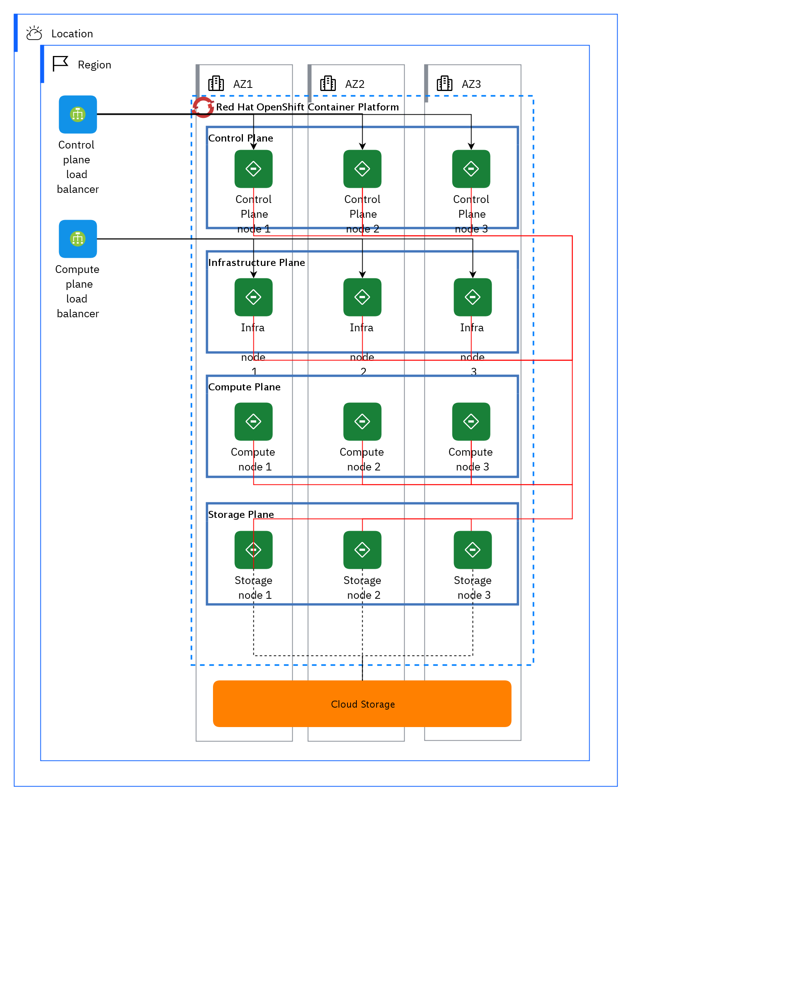

## Diagram

### Name

04 Cloud cluster

### Description

Requirement: Higher availability solution.
 

<ul><li>Deploy cluster over availability zones (AZ).</li></ul>

Number of AZ: 3

 

This topology has been tested and validated on public cloud: Amazon Web Services (AWS), Microsoft® Azure®, Google Cloud Platform, and IBM Cloud®.

 

Nodes are spread over the 3 AZ.

 

Number of nodes:

<ul><li>3 master1 nodes</li><li>3 worker nodes</li><li>3 infrastructure nodes</li></ul>

Note: The number of nodes and their sizing can be adjusted depending on the workload target. See the capacity sizing chapter.

 

Typical use cases:

 

<ul><li>Development</li><li>Test</li><li>Integration</li><li>Production with limited SLA</li></ul>

## Element

[Expand all](#){ .md-button .diff-line }

### Actor

    

Cloud Storage

<table>
    <caption></caption>
    <thead>
        <tr>
            <th></th>
            <th></th>
        </tr>
    </thead>
    <tr>
        <td> <strong>Name</strong> </td>
        <td>Cloud Storage</td>
    </tr>
    <tr>
        <td> <strong>Description</strong> </td>
        <td>Storage for persistent volumes is provided by an external tier solution.
Not embedded into the Red Hat OpenShift Container Platform cluster. It could be, but not limited to:
    NFS server (not recommended for production)
    VMware® Vsphere® Volumes

https://www.ibm.com/cloud/architecture/articles/ibmaot-redhat-openshift/02-solutions-guide-solution-design-reference-architecture</td>
    </tr>
    <tr>
        <td> <strong>Type</strong> </td>
        <td>IT System</td>
    </tr>
    <tr>
        <td> <strong>Generic Group</strong> </td>
<td>
        
</td>
    </tr>
</table>

    

### Subsystem

    

Compute Plane

<table>
    <caption></caption>
    <thead>
        <tr>
            <th></th>
            <th></th>
        </tr>
    </thead>
    <tr>
        <td> <strong>Name</strong> </td>
        <td>Compute Plane</td>
    </tr>
    <tr>
        <td> <strong>Description</strong> </td>
        <td>A physical server that acts as a hypervisor and contains the processing capabilities required to run virtual machines in the environment. A basic RHOSP environment requires at least one Compute node.  
<a href="https://access.redhat.com/documentation/en-us/red_hat_openstack_platform/16.0/html/director_installation_and_usage/planning-your-overcloud " target="_blank">https://access.redhat.com/documentation/en-us/red_hat_openstack_platform/16.0/html/director_installation_and_usage/planning-your-overcloud </a>

 
</td>
    </tr>
</table>

    

Control Plane

<table>
    <caption></caption>
    <thead>
        <tr>
            <th></th>
            <th></th>
        </tr>
    </thead>
    <tr>
        <td> <strong>Name</strong> </td>
        <td>Control Plane</td>
    </tr>
    <tr>
        <td> <strong>Description</strong> </td>
        <td>The control plane, which is composed of master machines, manages the OpenShift Container Platform cluster. 
 

<a href="https://docs.openshift.com/container-platform/4.1/architecture/control-plane.html " target="_blank">https://docs.openshift.com/container-platform/4.1/architecture/control-plane.html </a>

 
</td>
    </tr>
</table>

    

Infrastructure Plane

<table>
    <caption></caption>
    <thead>
        <tr>
            <th></th>
            <th></th>
        </tr>
    </thead>
    <tr>
        <td> <strong>Name</strong> </td>
        <td>Infrastructure Plane</td>
    </tr>
    <tr>
        <td> <strong>Description</strong> </td>
        <td>You can use infrastructure machine sets to create machines that host only infrastructure components, such as the default router, the integrated container image registry, and the components for cluster metrics and monitoring. These infrastructure machines are not counted toward the total number of subscriptions that are required to run the environment.  
<a href="https://docs.openshift.com/container-platform/4.7/machine_management/creating-infrastructure-machinesets.html " target="_blank">https://docs.openshift.com/container-platform/4.7/machine_management/creating-infrastructure-machinesets.html </a>

 
</td>
    </tr>
</table>

    

Red Hat OpenShift Container Platform

<table>
    <caption></caption>
    <thead>
        <tr>
            <th></th>
            <th></th>
        </tr>
    </thead>
    <tr>
        <td> <strong>Name</strong> </td>
        <td>Red Hat OpenShift Container Platform</td>
    </tr>
    <tr>
        <td> <strong>Description</strong> </td>
        <td>Red Hat® OpenShift® offers a consistent hybrid cloud foundation for building and scaling containerized applications. Benefit from streamlined platform installation and upgrades from one of the enterprise Kubernetes leaders.  
<a href="https://cloud.redhat.com/products/container-platform" target="_blank">https://cloud.redhat.com/products/container-platform</a>

 
</td>
    </tr>
</table>

    

Storage Plane

<table>
    <caption></caption>
    <thead>
        <tr>
            <th></th>
            <th></th>
        </tr>
    </thead>
    <tr>
        <td> <strong>Name</strong> </td>
        <td>Storage Plane</td>
    </tr>
    <tr>
        <td> <strong>Description</strong> </td>
        <td>It provides file, block, and object storage classes, enabling a wide range of data modalities and workloads, including: Data at rest, such as databases and data warehouses. Data in motion, automating data pipelines. Data in action, providing services for continuous deployment models, analytics, artificial intelligence (AI), and machine learning (ML). <a href="https://www.redhat.com/en/resources/openshift-data-foundation-datasheet" target="_blank">https://www.redhat.com/en/resources/openshift-data-foundation-datasheet</a>
 
</td>
    </tr>
</table>

    

### Location

    

AZ1

<table>
    <caption></caption>
    <thead>
        <tr>
            <th></th>
            <th></th>
        </tr>
    </thead>
    <tr>
        <td> <strong>Name</strong> </td>
        <td>AZ1</td>
    </tr>
    <tr>
        <td> <strong>Description</strong> </td>
        <td>The requirement is a high-available solution.
Deploy cluster over availability zones (AZ).

Storage solution is managed by Cloud provider across AZ.

This topology has been tested and validated on public cloud, such as Amazon Web Services (AWS), Microsoft® Azure®, Google Cloud Platform (GCP), and IBM Cloud®.

Candidate storage solutions: IBM Cloud Storage, Amazon Elastic Block Store, Azure Files

<a href="https://www.ibm.com/cloud/architecture/articles/ibmaot-redhat-openshift/02-solutions-guide-solution-design-reference-architecture " target="_blank">https://www.ibm.com/cloud/architecture/articles/ibmaot-redhat-openshift/02-solutions-guide-solution-design-reference-architecture </a>

 
</td>
    </tr>
</table>

    

AZ2

<table>
    <caption></caption>
    <thead>
        <tr>
            <th></th>
            <th></th>
        </tr>
    </thead>
    <tr>
        <td> <strong>Name</strong> </td>
        <td>AZ2</td>
    </tr>
    <tr>
        <td> <strong>Description</strong> </td>
        <td>The requirement is a high-available solution.
Deploy cluster over availability zones (AZ).

Storage solution is managed by Cloud provider across AZ.

This topology has been tested and validated on public cloud, such as Amazon Web Services (AWS), Microsoft® Azure®, Google Cloud Platform (GCP), and IBM Cloud®.

Candidate storage solutions: IBM Cloud Storage, Amazon Elastic Block Store, Azure Files

<a href="https://www.ibm.com/cloud/architecture/articles/ibmaot-redhat-openshift/02-solutions-guide-solution-design-reference-architecture " target="_blank">https://www.ibm.com/cloud/architecture/articles/ibmaot-redhat-openshift/02-solutions-guide-solution-design-reference-architecture </a>

 
</td>
    </tr>
</table>

    

AZ3

<table>
    <caption></caption>
    <thead>
        <tr>
            <th></th>
            <th></th>
        </tr>
    </thead>
    <tr>
        <td> <strong>Name</strong> </td>
        <td>AZ3</td>
    </tr>
    <tr>
        <td> <strong>Description</strong> </td>
        <td>The requirement is a high-available solution.
Deploy cluster over availability zones (AZ).

Storage solution is managed by Cloud provider across AZ.

This topology has been tested and validated on public cloud, such as Amazon Web Services (AWS), Microsoft® Azure®, Google Cloud Platform (GCP), and IBM Cloud®.

Candidate storage solutions: IBM Cloud Storage, Amazon Elastic Block Store, Azure Files

<a href="https://www.ibm.com/cloud/architecture/articles/ibmaot-redhat-openshift/02-solutions-guide-solution-design-reference-architecture " target="_blank">https://www.ibm.com/cloud/architecture/articles/ibmaot-redhat-openshift/02-solutions-guide-solution-design-reference-architecture </a>

 
</td>
    </tr>
</table>

    

Location

<table>
    <caption></caption>
    <thead>
        <tr>
            <th></th>
            <th></th>
        </tr>
    </thead>
    <tr>
        <td> <strong>Name</strong> </td>
        <td>Location</td>
    </tr>
    <tr>
        <td> <strong>Description</strong> </td>
        <td></td>
    </tr>
</table>

    

Region

<table>
    <caption></caption>
    <thead>
        <tr>
            <th></th>
            <th></th>
        </tr>
    </thead>
    <tr>
        <td> <strong>Name</strong> </td>
        <td>Region</td>
    </tr>
    <tr>
        <td> <strong>Description</strong> </td>
        <td></td>
    </tr>
</table>

    

### Logical Connection

    

<table>
    <caption></caption>
    <thead>
        <tr>
            <th></th>
            <th></th>
        </tr>
    </thead>
    <tr>
        <td> <strong>Name</strong> </td>
        <td></td>
    </tr>
    <tr>
        <td> <strong>Description</strong> </td>
        <td></td>
    </tr>
</table>

    

<table>
    <caption></caption>
    <thead>
        <tr>
            <th></th>
            <th></th>
        </tr>
    </thead>
    <tr>
        <td> <strong>Name</strong> </td>
        <td></td>
    </tr>
    <tr>
        <td> <strong>Description</strong> </td>
        <td></td>
    </tr>
</table>

    

<table>
    <caption></caption>
    <thead>
        <tr>
            <th></th>
            <th></th>
        </tr>
    </thead>
    <tr>
        <td> <strong>Name</strong> </td>
        <td></td>
    </tr>
    <tr>
        <td> <strong>Description</strong> </td>
        <td></td>
    </tr>
</table>

    

<table>
    <caption></caption>
    <thead>
        <tr>
            <th></th>
            <th></th>
        </tr>
    </thead>
    <tr>
        <td> <strong>Name</strong> </td>
        <td></td>
    </tr>
    <tr>
        <td> <strong>Description</strong> </td>
        <td></td>
    </tr>
</table>

    

<table>
    <caption></caption>
    <thead>
        <tr>
            <th></th>
            <th></th>
        </tr>
    </thead>
    <tr>
        <td> <strong>Name</strong> </td>
        <td></td>
    </tr>
    <tr>
        <td> <strong>Description</strong> </td>
        <td></td>
    </tr>
</table>

    

<table>
    <caption></caption>
    <thead>
        <tr>
            <th></th>
            <th></th>
        </tr>
    </thead>
    <tr>
        <td> <strong>Name</strong> </td>
        <td></td>
    </tr>
    <tr>
        <td> <strong>Description</strong> </td>
        <td></td>
    </tr>
</table>

    

<table>
    <caption></caption>
    <thead>
        <tr>
            <th></th>
            <th></th>
        </tr>
    </thead>
    <tr>
        <td> <strong>Name</strong> </td>
        <td></td>
    </tr>
    <tr>
        <td> <strong>Description</strong> </td>
        <td></td>
    </tr>
</table>

    

<table>
    <caption></caption>
    <thead>
        <tr>
            <th></th>
            <th></th>
        </tr>
    </thead>
    <tr>
        <td> <strong>Name</strong> </td>
        <td></td>
    </tr>
    <tr>
        <td> <strong>Description</strong> </td>
        <td></td>
    </tr>
</table>

    

<table>
    <caption></caption>
    <thead>
        <tr>
            <th></th>
            <th></th>
        </tr>
    </thead>
    <tr>
        <td> <strong>Name</strong> </td>
        <td></td>
    </tr>
    <tr>
        <td> <strong>Description</strong> </td>
        <td></td>
    </tr>
</table>

    

<table>
    <caption></caption>
    <thead>
        <tr>
            <th></th>
            <th></th>
        </tr>
    </thead>
    <tr>
        <td> <strong>Name</strong> </td>
        <td></td>
    </tr>
    <tr>
        <td> <strong>Description</strong> </td>
        <td></td>
    </tr>
</table>

    

<table>
    <caption></caption>
    <thead>
        <tr>
            <th></th>
            <th></th>
        </tr>
    </thead>
    <tr>
        <td> <strong>Name</strong> </td>
        <td></td>
    </tr>
    <tr>
        <td> <strong>Description</strong> </td>
        <td></td>
    </tr>
</table>

    

<table>
    <caption></caption>
    <thead>
        <tr>
            <th></th>
            <th></th>
        </tr>
    </thead>
    <tr>
        <td> <strong>Name</strong> </td>
        <td></td>
    </tr>
    <tr>
        <td> <strong>Description</strong> </td>
        <td></td>
    </tr>
</table>

    

<table>
    <caption></caption>
    <thead>
        <tr>
            <th></th>
            <th></th>
        </tr>
    </thead>
    <tr>
        <td> <strong>Name</strong> </td>
        <td></td>
    </tr>
    <tr>
        <td> <strong>Description</strong> </td>
        <td></td>
    </tr>
</table>

    

<table>
    <caption></caption>
    <thead>
        <tr>
            <th></th>
            <th></th>
        </tr>
    </thead>
    <tr>
        <td> <strong>Name</strong> </td>
        <td></td>
    </tr>
    <tr>
        <td> <strong>Description</strong> </td>
        <td></td>
    </tr>
</table>

    

<table>
    <caption></caption>
    <thead>
        <tr>
            <th></th>
            <th></th>
        </tr>
    </thead>
    <tr>
        <td> <strong>Name</strong> </td>
        <td></td>
    </tr>
    <tr>
        <td> <strong>Description</strong> </td>
        <td></td>
    </tr>
</table>

    

<table>
    <caption></caption>
    <thead>
        <tr>
            <th></th>
            <th></th>
        </tr>
    </thead>
    <tr>
        <td> <strong>Name</strong> </td>
        <td></td>
    </tr>
    <tr>
        <td> <strong>Description</strong> </td>
        <td></td>
    </tr>
</table>

    

### Logical Node

    

Compute node 1

<table>
    <caption></caption>
    <thead>
        <tr>
            <th></th>
            <th></th>
        </tr>
    </thead>
    <tr>
        <td> <strong>Name</strong> </td>
        <td>Compute node 1</td>
    </tr>
    <tr>
        <td> <strong>Description</strong> </td>
        <td>Compute nodes are responsible for running virtual machine instances after they are launched. Compute nodes require bare metal systems that support hardware virtualization. Compute nodes must also have enough memory and disk space to support the requirements of the virtual machine instances that they host.

https://access.redhat.com/documentation/en-us/red_hat_openstack_platform/10/html/director_installation_and_usage/chap-requirements</td>
    </tr>
    <tr>
        <td> <strong>Type</strong> </td>
        <td></td>
    </tr>
    <tr>
        <td> <strong>Primary Capability</strong> </td>
        <td>
            
                
container image

            
        </td>
    </tr>
    <tr>
        <td> <strong>Implementation</strong> </td>
        <td>
            
        </td>
    </tr>
    <tr>
        <td> <strong>Architectural Decision</strong> </td>
        <td>
            
        </td>
    </tr>
    <tr>
        <td> <strong>Non Functional Requirement</strong> </td>
        <td>
            
        </td>
    </tr>
    <tr>
        <td> <strong>Generic Group</strong> </td>
        <td></td>
    </tr>
    <tr>
        <td> <strong>Sub-level Diagram</strong> </td>
        <td></td>
    </tr>
    <tr>
        <td> <strong>Related Diagrams</strong> </td>
        <td>
            
                
<a href="../../IT System View/aoditsystem_HJ4nuWvtF">08 Red Hat OpenShift on IBM Cloud on VPC</a>

            
                
<a href="../../IT System View/aoditsystem_rkfCxWPYY">09 Azure</a>

            
                
<a href="../../IT System View/aoditsystem_HkaCNxvtF">07 AWS</a>

            
                
<a href="../../IT System View/aoditsystem_Sy-F43rKt">06 Two clusters on two regions</a>

            
                
<a href="../../IT System View/aoditsystem_rk9c-3BtF">05 Two clusters on-premises</a>

            
                
<a href="../../IT System View/aoditsystem_ByreAoBFK">04 Cloud cluster</a>

            
                
<a href="../../IT System View/aoditsystem_B1r5OjHFF">03 On-premises cluster</a>

            
                
<a href="../../IT System View/aoditsystem_r18uxVqXsBFK">01 Starter environment</a>

            
        </td>
    </tr>
    <tr>
        <td> <strong>Related Elements</strong> </td>
        <td>
            
            
                
container image

                
            
        </td>
    </tr>
</table>

    

Compute node 2

<table>
    <caption></caption>
    <thead>
        <tr>
            <th></th>
            <th></th>
        </tr>
    </thead>
    <tr>
        <td> <strong>Name</strong> </td>
        <td>Compute node 2</td>
    </tr>
    <tr>
        <td> <strong>Description</strong> </td>
        <td>Compute nodes are responsible for running virtual machine instances after they are launched. Compute nodes require bare metal systems that support hardware virtualization. Compute nodes must also have enough memory and disk space to support the requirements of the virtual machine instances that they host.

https://access.redhat.com/documentation/en-us/red_hat_openstack_platform/10/html/director_installation_and_usage/chap-requirements</td>
    </tr>
    <tr>
        <td> <strong>Type</strong> </td>
        <td></td>
    </tr>
    <tr>
        <td> <strong>Primary Capability</strong> </td>
        <td>
            
                
container image

            
        </td>
    </tr>
    <tr>
        <td> <strong>Implementation</strong> </td>
        <td>
            
        </td>
    </tr>
    <tr>
        <td> <strong>Architectural Decision</strong> </td>
        <td>
            
        </td>
    </tr>
    <tr>
        <td> <strong>Non Functional Requirement</strong> </td>
        <td>
            
        </td>
    </tr>
    <tr>
        <td> <strong>Generic Group</strong> </td>
        <td></td>
    </tr>
    <tr>
        <td> <strong>Sub-level Diagram</strong> </td>
        <td></td>
    </tr>
    <tr>
        <td> <strong>Related Diagrams</strong> </td>
        <td>
            
                
<a href="../../IT System View/aoditsystem_HJ4nuWvtF">08 Red Hat OpenShift on IBM Cloud on VPC</a>

            
                
<a href="../../IT System View/aoditsystem_rkfCxWPYY">09 Azure</a>

            
                
<a href="../../IT System View/aoditsystem_HkaCNxvtF">07 AWS</a>

            
                
<a href="../../IT System View/aoditsystem_Sy-F43rKt">06 Two clusters on two regions</a>

            
                
<a href="../../IT System View/aoditsystem_rk9c-3BtF">05 Two clusters on-premises</a>

            
                
<a href="../../IT System View/aoditsystem_ByreAoBFK">04 Cloud cluster</a>

            
                
<a href="../../IT System View/aoditsystem_B1r5OjHFF">03 On-premises cluster</a>

            
                
<a href="../../IT System View/aoditsystem_r18uxVqXsBFK">01 Starter environment</a>

            
        </td>
    </tr>
    <tr>
        <td> <strong>Related Elements</strong> </td>
        <td>
            
            
                
container image

                
            
        </td>
    </tr>
</table>

    

Compute node 3

<table>
    <caption></caption>
    <thead>
        <tr>
            <th></th>
            <th></th>
        </tr>
    </thead>
    <tr>
        <td> <strong>Name</strong> </td>
        <td>Compute node 3</td>
    </tr>
    <tr>
        <td> <strong>Description</strong> </td>
        <td>Compute nodes are responsible for running virtual machine instances after they are launched. Compute nodes require bare metal systems that support hardware virtualization. Compute nodes must also have enough memory and disk space to support the requirements of the virtual machine instances that they host.

https://access.redhat.com/documentation/en-us/red_hat_openstack_platform/10/html/director_installation_and_usage/chap-requirements</td>
    </tr>
    <tr>
        <td> <strong>Type</strong> </td>
        <td></td>
    </tr>
    <tr>
        <td> <strong>Primary Capability</strong> </td>
        <td>
            
                
container image

            
        </td>
    </tr>
    <tr>
        <td> <strong>Implementation</strong> </td>
        <td>
            
        </td>
    </tr>
    <tr>
        <td> <strong>Architectural Decision</strong> </td>
        <td>
            
        </td>
    </tr>
    <tr>
        <td> <strong>Non Functional Requirement</strong> </td>
        <td>
            
        </td>
    </tr>
    <tr>
        <td> <strong>Generic Group</strong> </td>
        <td></td>
    </tr>
    <tr>
        <td> <strong>Sub-level Diagram</strong> </td>
        <td></td>
    </tr>
    <tr>
        <td> <strong>Related Diagrams</strong> </td>
        <td>
            
                
<a href="../../IT System View/aoditsystem_HJ4nuWvtF">08 Red Hat OpenShift on IBM Cloud on VPC</a>

            
                
<a href="../../IT System View/aoditsystem_rkfCxWPYY">09 Azure</a>

            
                
<a href="../../IT System View/aoditsystem_HkaCNxvtF">07 AWS</a>

            
                
<a href="../../IT System View/aoditsystem_Sy-F43rKt">06 Two clusters on two regions</a>

            
                
<a href="../../IT System View/aoditsystem_rk9c-3BtF">05 Two clusters on-premises</a>

            
                
<a href="../../IT System View/aoditsystem_ByreAoBFK">04 Cloud cluster</a>

            
                
<a href="../../IT System View/aoditsystem_B1r5OjHFF">03 On-premises cluster</a>

            
        </td>
    </tr>
    <tr>
        <td> <strong>Related Elements</strong> </td>
        <td>
            
            
                
container image

                
            
        </td>
    </tr>
</table>

    

Compute plane load balancer

<table>
    <caption></caption>
    <thead>
        <tr>
            <th></th>
            <th></th>
        </tr>
    </thead>
    <tr>
        <td> <strong>Name</strong> </td>
        <td>Compute plane load balancer</td>
    </tr>
    <tr>
        <td> <strong>Description</strong> </td>
        <td>Use a load balancer service to distribute traffic among your application servers residing locally within data center.
 

<a href="https://cloud.ibm.com/catalog/infrastructure/load-balancer-group" target="_blank">https://cloud.ibm.com/catalog/infrastructure/load-balancer-group</a>
</td>
    </tr>
    <tr>
        <td> <strong>Type</strong> </td>
        <td></td>
    </tr>
    <tr>
        <td> <strong>Primary Capability</strong> </td>
        <td>
            
                
network routing

            
        </td>
    </tr>
    <tr>
        <td> <strong>Implementation</strong> </td>
        <td>
            
                
<a href="https://www.ibm.com/cloud/load-balancer"> IBM Cloud Load Balancers</a>

            
        </td>
    </tr>
    <tr>
        <td> <strong>Architectural Decision</strong> </td>
        <td>
            
                
<a href="../../Architectural Decisions/architecturaldecision_SJB57N57srKF">Load Balancer Selection</a>

            
        </td>
    </tr>
    <tr>
        <td> <strong>Non Functional Requirement</strong> </td>
        <td>
            
                
<a href="../../Non Functional Requirements/nonfunctionalrequirement_H1es1ZgIFK">Load balancing</a>

            
        </td>
    </tr>
    <tr>
        <td> <strong>Generic Group</strong> </td>
        <td></td>
    </tr>
    <tr>
        <td> <strong>Sub-level Diagram</strong> </td>
        <td></td>
    </tr>
    <tr>
        <td> <strong>Related Diagrams</strong> </td>
        <td>
            
                
<a href="../../IT System View/aoditsystem_Sy-F43rKt">06 Two clusters on two regions</a>

            
                
<a href="../../IT System View/aoditsystem_rk9c-3BtF">05 Two clusters on-premises</a>

            
                
<a href="../../IT System View/aoditsystem_ByreAoBFK">04 Cloud cluster</a>

            
                
<a href="../../IT System View/aoditsystem_B1r5OjHFF">03 On-premises cluster</a>

            
                
<a href="../../IT System View/aoditsystem_r18uxVqXsBFK">01 Starter environment</a>

            
        </td>
    </tr>
    <tr>
        <td> <strong>Related Elements</strong> </td>
        <td>
            
                
Load balancing

                
                    
                    <li><a href="../../IT System View/aoditsystem_HkaCNxvtF">07 AWS</a></li>
                    
                    <li><a href="../../IT System View/aoditsystem_Sy-F43rKt">06 Two clusters on two regions</a></li>
                    
                    <li><a href="../../IT System View/aoditsystem_rk9c-3BtF">05 Two clusters on-premises</a></li>
                    
                    <li><a href="../../IT System View/aoditsystem_ByreAoBFK">04 Cloud cluster</a></li>
                    
                    <li><a href="../../IT System View/aoditsystem_B1r5OjHFF">03 On-premises cluster</a></li>
                    
                    <li><a href="../../IT System View/aoditsystem_r18uxVqXsBFK">01 Starter environment</a></li>
                    
                
            
                
Load Balancer Selection

                
                    
                    <li><a href="../../IT System View/aoditsystem_HJ4nuWvtF">08 Red Hat OpenShift on IBM Cloud on VPC</a></li>
                    
                    <li><a href="../../IT System View/aoditsystem_HkaCNxvtF">07 AWS</a></li>
                    
                    <li><a href="../../IT System View/aoditsystem_Sy-F43rKt">06 Two clusters on two regions</a></li>
                    
                    <li><a href="../../IT System View/aoditsystem_rk9c-3BtF">05 Two clusters on-premises</a></li>
                    
                    <li><a href="../../IT System View/aoditsystem_ByreAoBFK">04 Cloud cluster</a></li>
                    
                    <li><a href="../../IT System View/aoditsystem_B1r5OjHFF">03 On-premises cluster</a></li>
                    
                    <li><a href="../../IT System View/aoditsystem_By7NIorFt">02 Three nodes cluster</a></li>
                    
                    <li><a href="../../IT System View/aoditsystem_r18uxVqXsBFK">01 Starter environment</a></li>
                    
                
            
            
                
SYS_DU_38v3qxufxWL

                
            
                
network routing

                
            
        </td>
    </tr>
</table>

    

Control plane load balancer

<table>
    <caption></caption>
    <thead>
        <tr>
            <th></th>
            <th></th>
        </tr>
    </thead>
    <tr>
        <td> <strong>Name</strong> </td>
        <td>Control plane load balancer</td>
    </tr>
    <tr>
        <td> <strong>Description</strong> </td>
        <td>Use a load balancer service to distribute traffic among your application servers residing locally within data center.

https://cloud.ibm.com/catalog/infrastructure/load-balancer-group</td>
    </tr>
    <tr>
        <td> <strong>Type</strong> </td>
        <td></td>
    </tr>
    <tr>
        <td> <strong>Primary Capability</strong> </td>
        <td>
            
                
network routing

            
        </td>
    </tr>
    <tr>
        <td> <strong>Implementation</strong> </td>
        <td>
            
                
<a href="https://www.ibm.com/cloud/load-balancer"> IBM Cloud Load Balancers</a>

            
        </td>
    </tr>
    <tr>
        <td> <strong>Architectural Decision</strong> </td>
        <td>
            
                
<a href="../../Architectural Decisions/architecturaldecision_SJB57N57srKF">Load Balancer Selection</a>

            
        </td>
    </tr>
    <tr>
        <td> <strong>Non Functional Requirement</strong> </td>
        <td>
            
                
<a href="../../Non Functional Requirements/nonfunctionalrequirement_H1es1ZgIFK">Load balancing</a>

            
        </td>
    </tr>
    <tr>
        <td> <strong>Generic Group</strong> </td>
        <td></td>
    </tr>
    <tr>
        <td> <strong>Sub-level Diagram</strong> </td>
        <td></td>
    </tr>
    <tr>
        <td> <strong>Related Diagrams</strong> </td>
        <td>
            
                
<a href="../../IT System View/aoditsystem_HkaCNxvtF">07 AWS</a>

            
                
<a href="../../IT System View/aoditsystem_Sy-F43rKt">06 Two clusters on two regions</a>

            
                
<a href="../../IT System View/aoditsystem_rk9c-3BtF">05 Two clusters on-premises</a>

            
                
<a href="../../IT System View/aoditsystem_ByreAoBFK">04 Cloud cluster</a>

            
                
<a href="../../IT System View/aoditsystem_B1r5OjHFF">03 On-premises cluster</a>

            
                
<a href="../../IT System View/aoditsystem_r18uxVqXsBFK">01 Starter environment</a>

            
        </td>
    </tr>
    <tr>
        <td> <strong>Related Elements</strong> </td>
        <td>
            
                
Load balancing

                
                    
                    <li><a href="../../IT System View/aoditsystem_HkaCNxvtF">07 AWS</a></li>
                    
                    <li><a href="../../IT System View/aoditsystem_Sy-F43rKt">06 Two clusters on two regions</a></li>
                    
                    <li><a href="../../IT System View/aoditsystem_rk9c-3BtF">05 Two clusters on-premises</a></li>
                    
                    <li><a href="../../IT System View/aoditsystem_ByreAoBFK">04 Cloud cluster</a></li>
                    
                    <li><a href="../../IT System View/aoditsystem_B1r5OjHFF">03 On-premises cluster</a></li>
                    
                    <li><a href="../../IT System View/aoditsystem_r18uxVqXsBFK">01 Starter environment</a></li>
                    
                
            
                
Load Balancer Selection

                
                    
                    <li><a href="../../IT System View/aoditsystem_HJ4nuWvtF">08 Red Hat OpenShift on IBM Cloud on VPC</a></li>
                    
                    <li><a href="../../IT System View/aoditsystem_HkaCNxvtF">07 AWS</a></li>
                    
                    <li><a href="../../IT System View/aoditsystem_Sy-F43rKt">06 Two clusters on two regions</a></li>
                    
                    <li><a href="../../IT System View/aoditsystem_rk9c-3BtF">05 Two clusters on-premises</a></li>
                    
                    <li><a href="../../IT System View/aoditsystem_ByreAoBFK">04 Cloud cluster</a></li>
                    
                    <li><a href="../../IT System View/aoditsystem_B1r5OjHFF">03 On-premises cluster</a></li>
                    
                    <li><a href="../../IT System View/aoditsystem_By7NIorFt">02 Three nodes cluster</a></li>
                    
                    <li><a href="../../IT System View/aoditsystem_r18uxVqXsBFK">01 Starter environment</a></li>
                    
                
            
            
                
SYS_DU_37sFycoSa3m

                
            
                
network routing

                
            
        </td>
    </tr>
</table>

    

Control Plane node 1

<table>
    <caption></caption>
    <thead>
        <tr>
            <th></th>
            <th></th>
        </tr>
    </thead>
    <tr>
        <td> <strong>Name</strong> </td>
        <td>Control Plane node 1</td>
    </tr>
    <tr>
        <td> <strong>Description</strong> </td>
        <td>In a Kubernetes cluster, the control plane nodes run services that are required to control the Kubernetes cluster. They contain more than just the Kubernetes services for managing the OpenShift Container Platform cluster. Instead of being grouped into a MachineSet, control plane machines are defined by a series of standalone machine API resources. Extra controls apply to control plane machines to prevent you from deleting all control plane machines and breaking your cluster.

https://docs.openshift.com/container-platform/4.9/architecture/control-plane.html</td>
    </tr>
    <tr>
        <td> <strong>Type</strong> </td>
        <td></td>
    </tr>
    <tr>
        <td> <strong>Primary Capability</strong> </td>
        <td>
            
                
container platform

            
        </td>
    </tr>
    <tr>
        <td> <strong>Implementation</strong> </td>
        <td>
            
        </td>
    </tr>
    <tr>
        <td> <strong>Architectural Decision</strong> </td>
        <td>
            
                
<a href="../../Architectural Decisions/architecturaldecision_H1sTQ49miHKt">Control plane node sizing</a>

            
                
<a href="../../Architectural Decisions/architecturaldecision_Hk0F7VcXjrYY">Control Plane Deployment Topology</a>

            
        </td>
    </tr>
    <tr>
        <td> <strong>Non Functional Requirement</strong> </td>
        <td>
            
        </td>
    </tr>
    <tr>
        <td> <strong>Generic Group</strong> </td>
        <td></td>
    </tr>
    <tr>
        <td> <strong>Sub-level Diagram</strong> </td>
        <td></td>
    </tr>
    <tr>
        <td> <strong>Related Diagrams</strong> </td>
        <td>
            
                
<a href="../../IT System View/aoditsystem_HJ4nuWvtF">08 Red Hat OpenShift on IBM Cloud on VPC</a>

            
                
<a href="../../IT System View/aoditsystem_rkfCxWPYY">09 Azure</a>

            
                
<a href="../../IT System View/aoditsystem_HkaCNxvtF">07 AWS</a>

            
                
<a href="../../IT System View/aoditsystem_Sy-F43rKt">06 Two clusters on two regions</a>

            
                
<a href="../../IT System View/aoditsystem_rk9c-3BtF">05 Two clusters on-premises</a>

            
                
<a href="../../IT System View/aoditsystem_ByreAoBFK">04 Cloud cluster</a>

            
                
<a href="../../IT System View/aoditsystem_B1r5OjHFF">03 On-premises cluster</a>

            
                
<a href="../../IT System View/aoditsystem_r18uxVqXsBFK">01 Starter environment</a>

            
        </td>
    </tr>
    <tr>
        <td> <strong>Related Elements</strong> </td>
        <td>
            
                
Control plane node sizing

                
                    
                    <li><a href="../../IT System View/aoditsystem_HJ4nuWvtF">08 Red Hat OpenShift on IBM Cloud on VPC</a></li>
                    
                    <li><a href="../../IT System View/aoditsystem_rkfCxWPYY">09 Azure</a></li>
                    
                    <li><a href="../../IT System View/aoditsystem_HkaCNxvtF">07 AWS</a></li>
                    
                    <li><a href="../../IT System View/aoditsystem_Sy-F43rKt">06 Two clusters on two regions</a></li>
                    
                    <li><a href="../../IT System View/aoditsystem_rk9c-3BtF">05 Two clusters on-premises</a></li>
                    
                    <li><a href="../../IT System View/aoditsystem_ByreAoBFK">04 Cloud cluster</a></li>
                    
                    <li><a href="../../IT System View/aoditsystem_B1r5OjHFF">03 On-premises cluster</a></li>
                    
                    <li><a href="../../IT System View/aoditsystem_r18uxVqXsBFK">01 Starter environment</a></li>
                    
                
            
                
Control Plane Deployment Topology

                
                    
                    <li><a href="../../IT System View/aoditsystem_HJ4nuWvtF">08 Red Hat OpenShift on IBM Cloud on VPC</a></li>
                    
                    <li><a href="../../IT System View/aoditsystem_rkfCxWPYY">09 Azure</a></li>
                    
                    <li><a href="../../IT System View/aoditsystem_HkaCNxvtF">07 AWS</a></li>
                    
                    <li><a href="../../IT System View/aoditsystem_Sy-F43rKt">06 Two clusters on two regions</a></li>
                    
                    <li><a href="../../IT System View/aoditsystem_rk9c-3BtF">05 Two clusters on-premises</a></li>
                    
                    <li><a href="../../IT System View/aoditsystem_ByreAoBFK">04 Cloud cluster</a></li>
                    
                    <li><a href="../../IT System View/aoditsystem_B1r5OjHFF">03 On-premises cluster</a></li>
                    
                    <li><a href="../../IT System View/aoditsystem_r18uxVqXsBFK">01 Starter environment</a></li>
                    
                
            
            
                
container platform

                
            
        </td>
    </tr>
</table>

    

Control Plane node 2

<table>
    <caption></caption>
    <thead>
        <tr>
            <th></th>
            <th></th>
        </tr>
    </thead>
    <tr>
        <td> <strong>Name</strong> </td>
        <td>Control Plane node 2</td>
    </tr>
    <tr>
        <td> <strong>Description</strong> </td>
        <td>In a Kubernetes cluster, the control plane nodes run services that are required to control the Kubernetes cluster. They contain more than just the Kubernetes services for managing the OpenShift Container Platform cluster. Instead of being grouped into a MachineSet, control plane machines are defined by a series of standalone machine API resources. Extra controls apply to control plane machines to prevent you from deleting all control plane machines and breaking your cluster.   https://docs.openshift.com/container-platform/4.9/architecture/control-plane.html</td>
    </tr>
    <tr>
        <td> <strong>Type</strong> </td>
        <td></td>
    </tr>
    <tr>
        <td> <strong>Primary Capability</strong> </td>
        <td>
            
                
container platform

            
        </td>
    </tr>
    <tr>
        <td> <strong>Implementation</strong> </td>
        <td>
            
        </td>
    </tr>
    <tr>
        <td> <strong>Architectural Decision</strong> </td>
        <td>
            
                
<a href="../../Architectural Decisions/architecturaldecision_Hk0F7VcXjrYY">Control Plane Deployment Topology</a>

            
                
<a href="../../Architectural Decisions/architecturaldecision_SJ3uX4qQjBYK">Hosting Platform and Managed or Self-Managed Service</a>

            
                
<a href="../../Architectural Decisions/architecturaldecision_H1sTQ49miHKt">Control plane node sizing</a>

            
        </td>
    </tr>
    <tr>
        <td> <strong>Non Functional Requirement</strong> </td>
        <td>
            
        </td>
    </tr>
    <tr>
        <td> <strong>Generic Group</strong> </td>
        <td></td>
    </tr>
    <tr>
        <td> <strong>Sub-level Diagram</strong> </td>
        <td></td>
    </tr>
    <tr>
        <td> <strong>Related Diagrams</strong> </td>
        <td>
            
                
<a href="../../IT System View/aoditsystem_HJ4nuWvtF">08 Red Hat OpenShift on IBM Cloud on VPC</a>

            
                
<a href="../../IT System View/aoditsystem_rkfCxWPYY">09 Azure</a>

            
                
<a href="../../IT System View/aoditsystem_HkaCNxvtF">07 AWS</a>

            
                
<a href="../../IT System View/aoditsystem_Sy-F43rKt">06 Two clusters on two regions</a>

            
                
<a href="../../IT System View/aoditsystem_rk9c-3BtF">05 Two clusters on-premises</a>

            
                
<a href="../../IT System View/aoditsystem_ByreAoBFK">04 Cloud cluster</a>

            
                
<a href="../../IT System View/aoditsystem_B1r5OjHFF">03 On-premises cluster</a>

            
                
<a href="../../IT System View/aoditsystem_r18uxVqXsBFK">01 Starter environment</a>

            
        </td>
    </tr>
    <tr>
        <td> <strong>Related Elements</strong> </td>
        <td>
            
                
Control Plane Deployment Topology

                
                    
                    <li><a href="../../IT System View/aoditsystem_HJ4nuWvtF">08 Red Hat OpenShift on IBM Cloud on VPC</a></li>
                    
                    <li><a href="../../IT System View/aoditsystem_rkfCxWPYY">09 Azure</a></li>
                    
                    <li><a href="../../IT System View/aoditsystem_HkaCNxvtF">07 AWS</a></li>
                    
                    <li><a href="../../IT System View/aoditsystem_Sy-F43rKt">06 Two clusters on two regions</a></li>
                    
                    <li><a href="../../IT System View/aoditsystem_rk9c-3BtF">05 Two clusters on-premises</a></li>
                    
                    <li><a href="../../IT System View/aoditsystem_ByreAoBFK">04 Cloud cluster</a></li>
                    
                    <li><a href="../../IT System View/aoditsystem_B1r5OjHFF">03 On-premises cluster</a></li>
                    
                    <li><a href="../../IT System View/aoditsystem_r18uxVqXsBFK">01 Starter environment</a></li>
                    
                
            
                
Hosting Platform and Managed or Self-Managed Service

                
                    
                    <li><a href="../../IT System View/aoditsystem_HJ4nuWvtF">08 Red Hat OpenShift on IBM Cloud on VPC</a></li>
                    
                    <li><a href="../../IT System View/aoditsystem_rkfCxWPYY">09 Azure</a></li>
                    
                    <li><a href="../../IT System View/aoditsystem_HkaCNxvtF">07 AWS</a></li>
                    
                    <li><a href="../../IT System View/aoditsystem_Sy-F43rKt">06 Two clusters on two regions</a></li>
                    
                    <li><a href="../../IT System View/aoditsystem_rk9c-3BtF">05 Two clusters on-premises</a></li>
                    
                    <li><a href="../../IT System View/aoditsystem_ByreAoBFK">04 Cloud cluster</a></li>
                    
                    <li><a href="../../IT System View/aoditsystem_B1r5OjHFF">03 On-premises cluster</a></li>
                    
                    <li><a href="../../IT System View/aoditsystem_r18uxVqXsBFK">01 Starter environment</a></li>
                    
                
            
                
Control plane node sizing

                
                    
                    <li><a href="../../IT System View/aoditsystem_HJ4nuWvtF">08 Red Hat OpenShift on IBM Cloud on VPC</a></li>
                    
                    <li><a href="../../IT System View/aoditsystem_rkfCxWPYY">09 Azure</a></li>
                    
                    <li><a href="../../IT System View/aoditsystem_HkaCNxvtF">07 AWS</a></li>
                    
                    <li><a href="../../IT System View/aoditsystem_Sy-F43rKt">06 Two clusters on two regions</a></li>
                    
                    <li><a href="../../IT System View/aoditsystem_rk9c-3BtF">05 Two clusters on-premises</a></li>
                    
                    <li><a href="../../IT System View/aoditsystem_ByreAoBFK">04 Cloud cluster</a></li>
                    
                    <li><a href="../../IT System View/aoditsystem_B1r5OjHFF">03 On-premises cluster</a></li>
                    
                    <li><a href="../../IT System View/aoditsystem_r18uxVqXsBFK">01 Starter environment</a></li>
                    
                
            
            
                
container platform

                
            
        </td>
    </tr>
</table>

    

Control Plane node 3

<table>
    <caption></caption>
    <thead>
        <tr>
            <th></th>
            <th></th>
        </tr>
    </thead>
    <tr>
        <td> <strong>Name</strong> </td>
        <td>Control Plane node 3</td>
    </tr>
    <tr>
        <td> <strong>Description</strong> </td>
        <td>In a Kubernetes cluster, the control plane nodes run services that are required to control the Kubernetes cluster. They contain more than just the Kubernetes services for managing the OpenShift Container Platform cluster. Instead of being grouped into a MachineSet, control plane machines are defined by a series of standalone machine API resources. Extra controls apply to control plane machines to prevent you from deleting all control plane machines and breaking your cluster.   https://docs.openshift.com/container-platform/4.9/architecture/control-plane.html</td>
    </tr>
    <tr>
        <td> <strong>Type</strong> </td>
        <td></td>
    </tr>
    <tr>
        <td> <strong>Primary Capability</strong> </td>
        <td>
            
                
application runtime

            
        </td>
    </tr>
    <tr>
        <td> <strong>Implementation</strong> </td>
        <td>
            
        </td>
    </tr>
    <tr>
        <td> <strong>Architectural Decision</strong> </td>
        <td>
            
                
<a href="../../Architectural Decisions/architecturaldecision_Hk0F7VcXjrYY">Control Plane Deployment Topology</a>

            
                
<a href="../../Architectural Decisions/architecturaldecision_SJ3uX4qQjBYK">Hosting Platform and Managed or Self-Managed Service</a>

            
                
<a href="../../Architectural Decisions/architecturaldecision_H1sTQ49miHKt">Control plane node sizing</a>

            
        </td>
    </tr>
    <tr>
        <td> <strong>Non Functional Requirement</strong> </td>
        <td>
            
        </td>
    </tr>
    <tr>
        <td> <strong>Generic Group</strong> </td>
        <td></td>
    </tr>
    <tr>
        <td> <strong>Sub-level Diagram</strong> </td>
        <td></td>
    </tr>
    <tr>
        <td> <strong>Related Diagrams</strong> </td>
        <td>
            
                
<a href="../../IT System View/aoditsystem_HJ4nuWvtF">08 Red Hat OpenShift on IBM Cloud on VPC</a>

            
                
<a href="../../IT System View/aoditsystem_rkfCxWPYY">09 Azure</a>

            
                
<a href="../../IT System View/aoditsystem_HkaCNxvtF">07 AWS</a>

            
                
<a href="../../IT System View/aoditsystem_Sy-F43rKt">06 Two clusters on two regions</a>

            
                
<a href="../../IT System View/aoditsystem_rk9c-3BtF">05 Two clusters on-premises</a>

            
                
<a href="../../IT System View/aoditsystem_ByreAoBFK">04 Cloud cluster</a>

            
                
<a href="../../IT System View/aoditsystem_B1r5OjHFF">03 On-premises cluster</a>

            
                
<a href="../../IT System View/aoditsystem_r18uxVqXsBFK">01 Starter environment</a>

            
        </td>
    </tr>
    <tr>
        <td> <strong>Related Elements</strong> </td>
        <td>
            
                
Control Plane Deployment Topology

                
                    
                    <li><a href="../../IT System View/aoditsystem_HJ4nuWvtF">08 Red Hat OpenShift on IBM Cloud on VPC</a></li>
                    
                    <li><a href="../../IT System View/aoditsystem_rkfCxWPYY">09 Azure</a></li>
                    
                    <li><a href="../../IT System View/aoditsystem_HkaCNxvtF">07 AWS</a></li>
                    
                    <li><a href="../../IT System View/aoditsystem_Sy-F43rKt">06 Two clusters on two regions</a></li>
                    
                    <li><a href="../../IT System View/aoditsystem_rk9c-3BtF">05 Two clusters on-premises</a></li>
                    
                    <li><a href="../../IT System View/aoditsystem_ByreAoBFK">04 Cloud cluster</a></li>
                    
                    <li><a href="../../IT System View/aoditsystem_B1r5OjHFF">03 On-premises cluster</a></li>
                    
                    <li><a href="../../IT System View/aoditsystem_r18uxVqXsBFK">01 Starter environment</a></li>
                    
                
            
                
Hosting Platform and Managed or Self-Managed Service

                
                    
                    <li><a href="../../IT System View/aoditsystem_HJ4nuWvtF">08 Red Hat OpenShift on IBM Cloud on VPC</a></li>
                    
                    <li><a href="../../IT System View/aoditsystem_rkfCxWPYY">09 Azure</a></li>
                    
                    <li><a href="../../IT System View/aoditsystem_HkaCNxvtF">07 AWS</a></li>
                    
                    <li><a href="../../IT System View/aoditsystem_Sy-F43rKt">06 Two clusters on two regions</a></li>
                    
                    <li><a href="../../IT System View/aoditsystem_rk9c-3BtF">05 Two clusters on-premises</a></li>
                    
                    <li><a href="../../IT System View/aoditsystem_ByreAoBFK">04 Cloud cluster</a></li>
                    
                    <li><a href="../../IT System View/aoditsystem_B1r5OjHFF">03 On-premises cluster</a></li>
                    
                    <li><a href="../../IT System View/aoditsystem_r18uxVqXsBFK">01 Starter environment</a></li>
                    
                
            
                
Control plane node sizing

                
                    
                    <li><a href="../../IT System View/aoditsystem_HJ4nuWvtF">08 Red Hat OpenShift on IBM Cloud on VPC</a></li>
                    
                    <li><a href="../../IT System View/aoditsystem_rkfCxWPYY">09 Azure</a></li>
                    
                    <li><a href="../../IT System View/aoditsystem_HkaCNxvtF">07 AWS</a></li>
                    
                    <li><a href="../../IT System View/aoditsystem_Sy-F43rKt">06 Two clusters on two regions</a></li>
                    
                    <li><a href="../../IT System View/aoditsystem_rk9c-3BtF">05 Two clusters on-premises</a></li>
                    
                    <li><a href="../../IT System View/aoditsystem_ByreAoBFK">04 Cloud cluster</a></li>
                    
                    <li><a href="../../IT System View/aoditsystem_B1r5OjHFF">03 On-premises cluster</a></li>
                    
                    <li><a href="../../IT System View/aoditsystem_r18uxVqXsBFK">01 Starter environment</a></li>
                    
                
            
            
        </td>
    </tr>
</table>

    

Infra node 1

<table>
    <caption></caption>
    <thead>
        <tr>
            <th></th>
            <th></th>
        </tr>
    </thead>
    <tr>
        <td> <strong>Name</strong> </td>
        <td>Infra node 1</td>
    </tr>
    <tr>
        <td> <strong>Description</strong> </td>
        <td>It is recommended to separate the infrastructure nodes for monitoring, logging, metrics, registry, and router components. Therefore, the recommendation is to dedicate three infrastructure nodes for these functionalities. See this link from Red Hat Documentation for more details about Creating Infrastructure Machine Set.

Separating these functionalities in a dedicated infrastructure machine set will free up more space in your worker nodes for your workload to run.

Additionally, these infrastructure nodes don't consume from the customer's Red Hat OpenShift subscription, which is why you should consider having them separated.

Collocating management functions may be feasible when performance is not required, such as in Dev/Test environments, to save the infrastructure-related costs.

https://www.ibm.com/cloud/architecture/articles/ibmaot-redhat-openshift/02-solutions-guide-solution-design-solution-architecture</td>
    </tr>
    <tr>
        <td> <strong>Type</strong> </td>
        <td></td>
    </tr>
    <tr>
        <td> <strong>Primary Capability</strong> </td>
        <td>
            
                
container platform

            
        </td>
    </tr>
    <tr>
        <td> <strong>Implementation</strong> </td>
        <td>
            
        </td>
    </tr>
    <tr>
        <td> <strong>Architectural Decision</strong> </td>
        <td>
            
                
<a href="../../Architectural Decisions/architecturaldecision_Sy1j7VqQoHFt">Management Service Placement</a>

            
        </td>
    </tr>
    <tr>
        <td> <strong>Non Functional Requirement</strong> </td>
        <td>
            
        </td>
    </tr>
    <tr>
        <td> <strong>Generic Group</strong> </td>
        <td></td>
    </tr>
    <tr>
        <td> <strong>Sub-level Diagram</strong> </td>
        <td></td>
    </tr>
    <tr>
        <td> <strong>Related Diagrams</strong> </td>
        <td>
            
                
<a href="../../IT System View/aoditsystem_HJ4nuWvtF">08 Red Hat OpenShift on IBM Cloud on VPC</a>

            
                
<a href="../../IT System View/aoditsystem_rkfCxWPYY">09 Azure</a>

            
                
<a href="../../IT System View/aoditsystem_HkaCNxvtF">07 AWS</a>

            
                
<a href="../../IT System View/aoditsystem_Sy-F43rKt">06 Two clusters on two regions</a>

            
                
<a href="../../IT System View/aoditsystem_rk9c-3BtF">05 Two clusters on-premises</a>

            
                
<a href="../../IT System View/aoditsystem_ByreAoBFK">04 Cloud cluster</a>

            
                
<a href="../../IT System View/aoditsystem_B1r5OjHFF">03 On-premises cluster</a>

            
        </td>
    </tr>
    <tr>
        <td> <strong>Related Elements</strong> </td>
        <td>
            
                
Management Service Placement

                
                    
                    <li><a href="../../IT System View/aoditsystem_HJ4nuWvtF">08 Red Hat OpenShift on IBM Cloud on VPC</a></li>
                    
                    <li><a href="../../IT System View/aoditsystem_rkfCxWPYY">09 Azure</a></li>
                    
                    <li><a href="../../IT System View/aoditsystem_HkaCNxvtF">07 AWS</a></li>
                    
                    <li><a href="../../IT System View/aoditsystem_Sy-F43rKt">06 Two clusters on two regions</a></li>
                    
                    <li><a href="../../IT System View/aoditsystem_rk9c-3BtF">05 Two clusters on-premises</a></li>
                    
                    <li><a href="../../IT System View/aoditsystem_ByreAoBFK">04 Cloud cluster</a></li>
                    
                    <li><a href="../../IT System View/aoditsystem_B1r5OjHFF">03 On-premises cluster</a></li>
                    
                
            
            
                
container platform

                
            
        </td>
    </tr>
</table>

    

Infra node 2

<table>
    <caption></caption>
    <thead>
        <tr>
            <th></th>
            <th></th>
        </tr>
    </thead>
    <tr>
        <td> <strong>Name</strong> </td>
        <td>Infra node 2</td>
    </tr>
    <tr>
        <td> <strong>Description</strong> </td>
        <td>It is recommended to separate the infrastructure nodes for monitoring, logging, metrics, registry, and router components. Therefore, the recommendation is to dedicate three infrastructure nodes for these functionalities. See this link from Red Hat Documentation for more details about Creating Infrastructure Machine Set.

Separating these functionalities in a dedicated infrastructure machine set will free up more space in your worker nodes for your workload to run.

Additionally, these infrastructure nodes don't consume from the customer's Red Hat OpenShift subscription, which is why you should consider having them separated.

Collocating management functions may be feasible when performance is not required, such as in Dev/Test environments, to save the infrastructure-related costs.

https://www.ibm.com/cloud/architecture/articles/ibmaot-redhat-openshift/02-solutions-guide-solution-design-solution-architecture</td>
    </tr>
    <tr>
        <td> <strong>Type</strong> </td>
        <td></td>
    </tr>
    <tr>
        <td> <strong>Primary Capability</strong> </td>
        <td>
            
                
container platform

            
        </td>
    </tr>
    <tr>
        <td> <strong>Implementation</strong> </td>
        <td>
            
        </td>
    </tr>
    <tr>
        <td> <strong>Architectural Decision</strong> </td>
        <td>
            
                
<a href="../../Architectural Decisions/architecturaldecision_Sy1j7VqQoHFt">Management Service Placement</a>

            
        </td>
    </tr>
    <tr>
        <td> <strong>Non Functional Requirement</strong> </td>
        <td>
            
        </td>
    </tr>
    <tr>
        <td> <strong>Generic Group</strong> </td>
        <td></td>
    </tr>
    <tr>
        <td> <strong>Sub-level Diagram</strong> </td>
        <td></td>
    </tr>
    <tr>
        <td> <strong>Related Diagrams</strong> </td>
        <td>
            
                
<a href="../../IT System View/aoditsystem_HJ4nuWvtF">08 Red Hat OpenShift on IBM Cloud on VPC</a>

            
                
<a href="../../IT System View/aoditsystem_rkfCxWPYY">09 Azure</a>

            
                
<a href="../../IT System View/aoditsystem_HkaCNxvtF">07 AWS</a>

            
                
<a href="../../IT System View/aoditsystem_Sy-F43rKt">06 Two clusters on two regions</a>

            
                
<a href="../../IT System View/aoditsystem_rk9c-3BtF">05 Two clusters on-premises</a>

            
                
<a href="../../IT System View/aoditsystem_ByreAoBFK">04 Cloud cluster</a>

            
                
<a href="../../IT System View/aoditsystem_B1r5OjHFF">03 On-premises cluster</a>

            
        </td>
    </tr>
    <tr>
        <td> <strong>Related Elements</strong> </td>
        <td>
            
                
Management Service Placement

                
                    
                    <li><a href="../../IT System View/aoditsystem_HJ4nuWvtF">08 Red Hat OpenShift on IBM Cloud on VPC</a></li>
                    
                    <li><a href="../../IT System View/aoditsystem_rkfCxWPYY">09 Azure</a></li>
                    
                    <li><a href="../../IT System View/aoditsystem_HkaCNxvtF">07 AWS</a></li>
                    
                    <li><a href="../../IT System View/aoditsystem_Sy-F43rKt">06 Two clusters on two regions</a></li>
                    
                    <li><a href="../../IT System View/aoditsystem_rk9c-3BtF">05 Two clusters on-premises</a></li>
                    
                    <li><a href="../../IT System View/aoditsystem_ByreAoBFK">04 Cloud cluster</a></li>
                    
                    <li><a href="../../IT System View/aoditsystem_B1r5OjHFF">03 On-premises cluster</a></li>
                    
                
            
            
                
container platform

                
            
        </td>
    </tr>
</table>

    

Infra node 3

<table>
    <caption></caption>
    <thead>
        <tr>
            <th></th>
            <th></th>
        </tr>
    </thead>
    <tr>
        <td> <strong>Name</strong> </td>
        <td>Infra node 3</td>
    </tr>
    <tr>
        <td> <strong>Description</strong> </td>
        <td>It is recommended to separate the infrastructure nodes for monitoring, logging, metrics, registry, and router components. Therefore, the recommendation is to dedicate three infrastructure nodes for these functionalities. See this link from Red Hat Documentation for more details about Creating Infrastructure Machine Set.

Separating these functionalities in a dedicated infrastructure machine set will free up more space in your worker nodes for your workload to run.

Additionally, these infrastructure nodes don't consume from the customer's Red Hat OpenShift subscription, which is why you should consider having them separated.

Collocating management functions may be feasible when performance is not required, such as in Dev/Test environments, to save the infrastructure-related costs.

https://www.ibm.com/cloud/architecture/articles/ibmaot-redhat-openshift/02-solutions-guide-solution-design-solution-architecture</td>
    </tr>
    <tr>
        <td> <strong>Type</strong> </td>
        <td></td>
    </tr>
    <tr>
        <td> <strong>Primary Capability</strong> </td>
        <td>
            
                
container platform

            
        </td>
    </tr>
    <tr>
        <td> <strong>Implementation</strong> </td>
        <td>
            
        </td>
    </tr>
    <tr>
        <td> <strong>Architectural Decision</strong> </td>
        <td>
            
                
<a href="../../Architectural Decisions/architecturaldecision_Sy1j7VqQoHFt">Management Service Placement</a>

            
        </td>
    </tr>
    <tr>
        <td> <strong>Non Functional Requirement</strong> </td>
        <td>
            
        </td>
    </tr>
    <tr>
        <td> <strong>Generic Group</strong> </td>
        <td></td>
    </tr>
    <tr>
        <td> <strong>Sub-level Diagram</strong> </td>
        <td></td>
    </tr>
    <tr>
        <td> <strong>Related Diagrams</strong> </td>
        <td>
            
                
<a href="../../IT System View/aoditsystem_HJ4nuWvtF">08 Red Hat OpenShift on IBM Cloud on VPC</a>

            
                
<a href="../../IT System View/aoditsystem_rkfCxWPYY">09 Azure</a>

            
                
<a href="../../IT System View/aoditsystem_HkaCNxvtF">07 AWS</a>

            
                
<a href="../../IT System View/aoditsystem_Sy-F43rKt">06 Two clusters on two regions</a>

            
                
<a href="../../IT System View/aoditsystem_rk9c-3BtF">05 Two clusters on-premises</a>

            
                
<a href="../../IT System View/aoditsystem_ByreAoBFK">04 Cloud cluster</a>

            
                
<a href="../../IT System View/aoditsystem_B1r5OjHFF">03 On-premises cluster</a>

            
        </td>
    </tr>
    <tr>
        <td> <strong>Related Elements</strong> </td>
        <td>
            
                
Management Service Placement

                
                    
                    <li><a href="../../IT System View/aoditsystem_HJ4nuWvtF">08 Red Hat OpenShift on IBM Cloud on VPC</a></li>
                    
                    <li><a href="../../IT System View/aoditsystem_rkfCxWPYY">09 Azure</a></li>
                    
                    <li><a href="../../IT System View/aoditsystem_HkaCNxvtF">07 AWS</a></li>
                    
                    <li><a href="../../IT System View/aoditsystem_Sy-F43rKt">06 Two clusters on two regions</a></li>
                    
                    <li><a href="../../IT System View/aoditsystem_rk9c-3BtF">05 Two clusters on-premises</a></li>
                    
                    <li><a href="../../IT System View/aoditsystem_ByreAoBFK">04 Cloud cluster</a></li>
                    
                    <li><a href="../../IT System View/aoditsystem_B1r5OjHFF">03 On-premises cluster</a></li>
                    
                
            
            
                
container platform

                
            
        </td>
    </tr>
</table>

    

Storage node 1

<table>
    <caption></caption>
    <thead>
        <tr>
            <th></th>
            <th></th>
        </tr>
    </thead>
    <tr>
        <td> <strong>Name</strong> </td>
        <td>Storage node 1</td>
    </tr>
    <tr>
        <td> <strong>Description</strong> </td>
        <td>Storage for persistent volumes is embedded into the cluster and managed as containers. Some examples are:

Rook Ceph
Red Hat OpenShift Data Foundation   
Portworx

Dedication of storage nodes. Isolate storage workload on specific nodes. There are pods, deployed on the cluster that are managing access to storage resource. Alternative: storage nodes could be merged with compute nodes (min 3 worker nodes) but it could have impacts on performance.</td>
    </tr>
    <tr>
        <td> <strong>Type</strong> </td>
        <td></td>
    </tr>
    <tr>
        <td> <strong>Primary Capability</strong> </td>
        <td>
            
                
container platform

            
        </td>
    </tr>
    <tr>
        <td> <strong>Implementation</strong> </td>
        <td>
            
        </td>
    </tr>
    <tr>
        <td> <strong>Architectural Decision</strong> </td>
        <td>
            
                
<a href="../../Architectural Decisions/architecturaldecision_ByJ2Q4q7jBKt">Storage Technology for Metrics & Logging</a>

            
                
<a href="../../Architectural Decisions/architecturaldecision_ByisXEcmoSKK">Storage Technology for Red Hat OpenShift Cluster Platform Registry</a>

            
                
<a href="../../Architectural Decisions/architecturaldecision_ryf2QV5mjSYF">Persistent Storage Options for Applications</a>

            
        </td>
    </tr>
    <tr>
        <td> <strong>Non Functional Requirement</strong> </td>
        <td>
            
        </td>
    </tr>
    <tr>
        <td> <strong>Generic Group</strong> </td>
        <td></td>
    </tr>
    <tr>
        <td> <strong>Sub-level Diagram</strong> </td>
        <td></td>
    </tr>
    <tr>
        <td> <strong>Related Diagrams</strong> </td>
        <td>
            
                
<a href="../../IT System View/aoditsystem_HJ4nuWvtF">08 Red Hat OpenShift on IBM Cloud on VPC</a>

            
                
<a href="../../IT System View/aoditsystem_rkfCxWPYY">09 Azure</a>

            
                
<a href="../../IT System View/aoditsystem_HkaCNxvtF">07 AWS</a>

            
                
<a href="../../IT System View/aoditsystem_Sy-F43rKt">06 Two clusters on two regions</a>

            
                
<a href="../../IT System View/aoditsystem_rk9c-3BtF">05 Two clusters on-premises</a>

            
                
<a href="../../IT System View/aoditsystem_ByreAoBFK">04 Cloud cluster</a>

            
                
<a href="../../IT System View/aoditsystem_B1r5OjHFF">03 On-premises cluster</a>

            
        </td>
    </tr>
    <tr>
        <td> <strong>Related Elements</strong> </td>
        <td>
            
                
Storage Technology for Metrics & Logging

                
                    
                    <li><a href="../../IT System View/aoditsystem_HJ4nuWvtF">08 Red Hat OpenShift on IBM Cloud on VPC</a></li>
                    
                    <li><a href="../../IT System View/aoditsystem_rkfCxWPYY">09 Azure</a></li>
                    
                    <li><a href="../../IT System View/aoditsystem_HkaCNxvtF">07 AWS</a></li>
                    
                    <li><a href="../../IT System View/aoditsystem_Sy-F43rKt">06 Two clusters on two regions</a></li>
                    
                    <li><a href="../../IT System View/aoditsystem_rk9c-3BtF">05 Two clusters on-premises</a></li>
                    
                    <li><a href="../../IT System View/aoditsystem_ByreAoBFK">04 Cloud cluster</a></li>
                    
                    <li><a href="../../IT System View/aoditsystem_B1r5OjHFF">03 On-premises cluster</a></li>
                    
                
            
                
Storage Technology for Red Hat OpenShift Cluster Platform Registry

                
                    
                    <li><a href="../../IT System View/aoditsystem_HJ4nuWvtF">08 Red Hat OpenShift on IBM Cloud on VPC</a></li>
                    
                    <li><a href="../../IT System View/aoditsystem_rkfCxWPYY">09 Azure</a></li>
                    
                    <li><a href="../../IT System View/aoditsystem_HkaCNxvtF">07 AWS</a></li>
                    
                    <li><a href="../../IT System View/aoditsystem_Sy-F43rKt">06 Two clusters on two regions</a></li>
                    
                    <li><a href="../../IT System View/aoditsystem_rk9c-3BtF">05 Two clusters on-premises</a></li>
                    
                    <li><a href="../../IT System View/aoditsystem_ByreAoBFK">04 Cloud cluster</a></li>
                    
                    <li><a href="../../IT System View/aoditsystem_B1r5OjHFF">03 On-premises cluster</a></li>
                    
                
            
                
Persistent Storage Options for Applications

                
                    
                    <li><a href="../../IT System View/aoditsystem_HJ4nuWvtF">08 Red Hat OpenShift on IBM Cloud on VPC</a></li>
                    
                    <li><a href="../../IT System View/aoditsystem_rkfCxWPYY">09 Azure</a></li>
                    
                    <li><a href="../../IT System View/aoditsystem_HkaCNxvtF">07 AWS</a></li>
                    
                    <li><a href="../../IT System View/aoditsystem_Sy-F43rKt">06 Two clusters on two regions</a></li>
                    
                    <li><a href="../../IT System View/aoditsystem_rk9c-3BtF">05 Two clusters on-premises</a></li>
                    
                    <li><a href="../../IT System View/aoditsystem_ByreAoBFK">04 Cloud cluster</a></li>
                    
                    <li><a href="../../IT System View/aoditsystem_B1r5OjHFF">03 On-premises cluster</a></li>
                    
                
            
            
                
container platform

                
            
        </td>
    </tr>
</table>

    

Storage node 2

<table>
    <caption></caption>
    <thead>
        <tr>
            <th></th>
            <th></th>
        </tr>
    </thead>
    <tr>
        <td> <strong>Name</strong> </td>
        <td>Storage node 2</td>
    </tr>
    <tr>
        <td> <strong>Description</strong> </td>
        <td>Storage for persistent volumes is embedded into the cluster and managed as containers. Some examples are:

 Rook Ceph
 Red Hat OpenShift Data Foundation   
 Portworx
Dedication of storage nodes. Isolate storage workload on specific nodes. There are pods, deployed on the cluster that are managing access to storage resource. Alternative: storage nodes could be merged with compute nodes (min 3 worker nodes) but it could have impacts on performance.</td>
    </tr>
    <tr>
        <td> <strong>Type</strong> </td>
        <td></td>
    </tr>
    <tr>
        <td> <strong>Primary Capability</strong> </td>
        <td>
            
                
container platform

            
        </td>
    </tr>
    <tr>
        <td> <strong>Implementation</strong> </td>
        <td>
            
        </td>
    </tr>
    <tr>
        <td> <strong>Architectural Decision</strong> </td>
        <td>
            
                
<a href="../../Architectural Decisions/architecturaldecision_ryf2QV5mjSYF">Persistent Storage Options for Applications</a>

            
                
<a href="../../Architectural Decisions/architecturaldecision_ByJ2Q4q7jBKt">Storage Technology for Metrics & Logging</a>

            
                
<a href="../../Architectural Decisions/architecturaldecision_ByisXEcmoSKK">Storage Technology for Red Hat OpenShift Cluster Platform Registry</a>

            
        </td>
    </tr>
    <tr>
        <td> <strong>Non Functional Requirement</strong> </td>
        <td>
            
        </td>
    </tr>
    <tr>
        <td> <strong>Generic Group</strong> </td>
        <td></td>
    </tr>
    <tr>
        <td> <strong>Sub-level Diagram</strong> </td>
        <td></td>
    </tr>
    <tr>
        <td> <strong>Related Diagrams</strong> </td>
        <td>
            
                
<a href="../../IT System View/aoditsystem_HJ4nuWvtF">08 Red Hat OpenShift on IBM Cloud on VPC</a>

            
                
<a href="../../IT System View/aoditsystem_rkfCxWPYY">09 Azure</a>

            
                
<a href="../../IT System View/aoditsystem_HkaCNxvtF">07 AWS</a>

            
                
<a href="../../IT System View/aoditsystem_Sy-F43rKt">06 Two clusters on two regions</a>

            
                
<a href="../../IT System View/aoditsystem_rk9c-3BtF">05 Two clusters on-premises</a>

            
                
<a href="../../IT System View/aoditsystem_ByreAoBFK">04 Cloud cluster</a>

            
                
<a href="../../IT System View/aoditsystem_B1r5OjHFF">03 On-premises cluster</a>

            
        </td>
    </tr>
    <tr>
        <td> <strong>Related Elements</strong> </td>
        <td>
            
                
Persistent Storage Options for Applications

                
                    
                    <li><a href="../../IT System View/aoditsystem_HJ4nuWvtF">08 Red Hat OpenShift on IBM Cloud on VPC</a></li>
                    
                    <li><a href="../../IT System View/aoditsystem_rkfCxWPYY">09 Azure</a></li>
                    
                    <li><a href="../../IT System View/aoditsystem_HkaCNxvtF">07 AWS</a></li>
                    
                    <li><a href="../../IT System View/aoditsystem_Sy-F43rKt">06 Two clusters on two regions</a></li>
                    
                    <li><a href="../../IT System View/aoditsystem_rk9c-3BtF">05 Two clusters on-premises</a></li>
                    
                    <li><a href="../../IT System View/aoditsystem_ByreAoBFK">04 Cloud cluster</a></li>
                    
                    <li><a href="../../IT System View/aoditsystem_B1r5OjHFF">03 On-premises cluster</a></li>
                    
                
            
                
Storage Technology for Metrics & Logging

                
                    
                    <li><a href="../../IT System View/aoditsystem_HJ4nuWvtF">08 Red Hat OpenShift on IBM Cloud on VPC</a></li>
                    
                    <li><a href="../../IT System View/aoditsystem_rkfCxWPYY">09 Azure</a></li>
                    
                    <li><a href="../../IT System View/aoditsystem_HkaCNxvtF">07 AWS</a></li>
                    
                    <li><a href="../../IT System View/aoditsystem_Sy-F43rKt">06 Two clusters on two regions</a></li>
                    
                    <li><a href="../../IT System View/aoditsystem_rk9c-3BtF">05 Two clusters on-premises</a></li>
                    
                    <li><a href="../../IT System View/aoditsystem_ByreAoBFK">04 Cloud cluster</a></li>
                    
                    <li><a href="../../IT System View/aoditsystem_B1r5OjHFF">03 On-premises cluster</a></li>
                    
                
            
                
Storage Technology for Red Hat OpenShift Cluster Platform Registry

                
                    
                    <li><a href="../../IT System View/aoditsystem_HJ4nuWvtF">08 Red Hat OpenShift on IBM Cloud on VPC</a></li>
                    
                    <li><a href="../../IT System View/aoditsystem_rkfCxWPYY">09 Azure</a></li>
                    
                    <li><a href="../../IT System View/aoditsystem_HkaCNxvtF">07 AWS</a></li>
                    
                    <li><a href="../../IT System View/aoditsystem_Sy-F43rKt">06 Two clusters on two regions</a></li>
                    
                    <li><a href="../../IT System View/aoditsystem_rk9c-3BtF">05 Two clusters on-premises</a></li>
                    
                    <li><a href="../../IT System View/aoditsystem_ByreAoBFK">04 Cloud cluster</a></li>
                    
                    <li><a href="../../IT System View/aoditsystem_B1r5OjHFF">03 On-premises cluster</a></li>
                    
                
            
            
                
container platform

                
            
        </td>
    </tr>
</table>

    

Storage node 3

<table>
    <caption></caption>
    <thead>
        <tr>
            <th></th>
            <th></th>
        </tr>
    </thead>
    <tr>
        <td> <strong>Name</strong> </td>
        <td>Storage node 3</td>
    </tr>
    <tr>
        <td> <strong>Description</strong> </td>
        <td>Storage for persistent volumes is embedded into the cluster and managed as containers. Some examples are:

Rook Ceph
Red Hat OpenShift Data Foundation   
Portworx

Dedication of storage nodes. Isolate storage workload on specific nodes. There are pods, deployed on the cluster that are managing access to storage resource. Alternative: storage nodes could be merged with compute nodes (min 3 worker nodes) but it could have impacts on performance.</td>
    </tr>
    <tr>
        <td> <strong>Type</strong> </td>
        <td></td>
    </tr>
    <tr>
        <td> <strong>Primary Capability</strong> </td>
        <td>
            
                
container platform

            
        </td>
    </tr>
    <tr>
        <td> <strong>Implementation</strong> </td>
        <td>
            
        </td>
    </tr>
    <tr>
        <td> <strong>Architectural Decision</strong> </td>
        <td>
            
                
<a href="../../Architectural Decisions/architecturaldecision_ByisXEcmoSKK">Storage Technology for Red Hat OpenShift Cluster Platform Registry</a>

            
                
<a href="../../Architectural Decisions/architecturaldecision_ryf2QV5mjSYF">Persistent Storage Options for Applications</a>

            
                
<a href="../../Architectural Decisions/architecturaldecision_ByJ2Q4q7jBKt">Storage Technology for Metrics & Logging</a>

            
        </td>
    </tr>
    <tr>
        <td> <strong>Non Functional Requirement</strong> </td>
        <td>
            
        </td>
    </tr>
    <tr>
        <td> <strong>Generic Group</strong> </td>
        <td></td>
    </tr>
    <tr>
        <td> <strong>Sub-level Diagram</strong> </td>
        <td></td>
    </tr>
    <tr>
        <td> <strong>Related Diagrams</strong> </td>
        <td>
            
                
<a href="../../IT System View/aoditsystem_HJ4nuWvtF">08 Red Hat OpenShift on IBM Cloud on VPC</a>

            
                
<a href="../../IT System View/aoditsystem_rkfCxWPYY">09 Azure</a>

            
                
<a href="../../IT System View/aoditsystem_HkaCNxvtF">07 AWS</a>

            
                
<a href="../../IT System View/aoditsystem_Sy-F43rKt">06 Two clusters on two regions</a>

            
                
<a href="../../IT System View/aoditsystem_rk9c-3BtF">05 Two clusters on-premises</a>

            
                
<a href="../../IT System View/aoditsystem_ByreAoBFK">04 Cloud cluster</a>

            
                
<a href="../../IT System View/aoditsystem_B1r5OjHFF">03 On-premises cluster</a>

            
        </td>
    </tr>
    <tr>
        <td> <strong>Related Elements</strong> </td>
        <td>
            
                
Storage Technology for Red Hat OpenShift Cluster Platform Registry

                
                    
                    <li><a href="../../IT System View/aoditsystem_HJ4nuWvtF">08 Red Hat OpenShift on IBM Cloud on VPC</a></li>
                    
                    <li><a href="../../IT System View/aoditsystem_rkfCxWPYY">09 Azure</a></li>
                    
                    <li><a href="../../IT System View/aoditsystem_HkaCNxvtF">07 AWS</a></li>
                    
                    <li><a href="../../IT System View/aoditsystem_Sy-F43rKt">06 Two clusters on two regions</a></li>
                    
                    <li><a href="../../IT System View/aoditsystem_rk9c-3BtF">05 Two clusters on-premises</a></li>
                    
                    <li><a href="../../IT System View/aoditsystem_ByreAoBFK">04 Cloud cluster</a></li>
                    
                    <li><a href="../../IT System View/aoditsystem_B1r5OjHFF">03 On-premises cluster</a></li>
                    
                
            
                
Persistent Storage Options for Applications

                
                    
                    <li><a href="../../IT System View/aoditsystem_HJ4nuWvtF">08 Red Hat OpenShift on IBM Cloud on VPC</a></li>
                    
                    <li><a href="../../IT System View/aoditsystem_rkfCxWPYY">09 Azure</a></li>
                    
                    <li><a href="../../IT System View/aoditsystem_HkaCNxvtF">07 AWS</a></li>
                    
                    <li><a href="../../IT System View/aoditsystem_Sy-F43rKt">06 Two clusters on two regions</a></li>
                    
                    <li><a href="../../IT System View/aoditsystem_rk9c-3BtF">05 Two clusters on-premises</a></li>
                    
                    <li><a href="../../IT System View/aoditsystem_ByreAoBFK">04 Cloud cluster</a></li>
                    
                    <li><a href="../../IT System View/aoditsystem_B1r5OjHFF">03 On-premises cluster</a></li>
                    
                
            
                
Storage Technology for Metrics & Logging

                
                    
                    <li><a href="../../IT System View/aoditsystem_HJ4nuWvtF">08 Red Hat OpenShift on IBM Cloud on VPC</a></li>
                    
                    <li><a href="../../IT System View/aoditsystem_rkfCxWPYY">09 Azure</a></li>
                    
                    <li><a href="../../IT System View/aoditsystem_HkaCNxvtF">07 AWS</a></li>
                    
                    <li><a href="../../IT System View/aoditsystem_Sy-F43rKt">06 Two clusters on two regions</a></li>
                    
                    <li><a href="../../IT System View/aoditsystem_rk9c-3BtF">05 Two clusters on-premises</a></li>
                    
                    <li><a href="../../IT System View/aoditsystem_ByreAoBFK">04 Cloud cluster</a></li>
                    
                    <li><a href="../../IT System View/aoditsystem_B1r5OjHFF">03 On-premises cluster</a></li>
                    
                
            
            
                
container platform

                
            
        </td>
    </tr>
</table>

    

