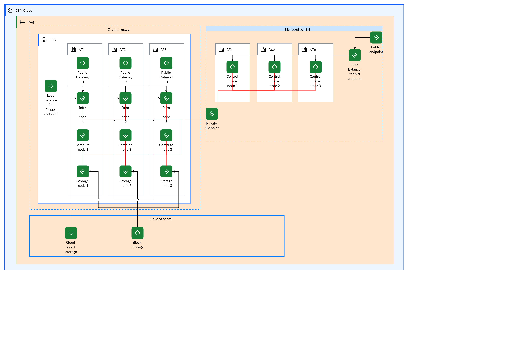

## Diagram

### Name

08 Red Hat OpenShift on IBM Cloud on VPC

### Description

Requirement: Higher availability solution.
 

<ul><li>Deploy cluster over availability zones (AZ).</li></ul>

Number of AZ: 3

 

This topology has been tested and validated on public cloud: Amazon Web Services (AWS), Microsoft® Azure®, Google Cloud Platform, and IBM Cloud®.

 

Nodes are spread over the 3 AZ.

 

Number of nodes:

<ul><li>3 master1 nodes</li><li>3 worker nodes</li><li>3 infrastructure nodes</li></ul>

Note: The number of nodes and their sizing can be adjusted depending on the workload target. See the capacity sizing chapter.

 

Typical use cases:

 

<ul><li>Development</li><li>Test</li><li>Integration</li><li>Production with limited SLA</li></ul>

## Element

[Expand all](#){ .md-button .diff-line }

### Actor

    

### Subsystem

    

Client managd

<table>
    <caption></caption>
    <thead>
        <tr>
            <th></th>
            <th></th>
        </tr>
    </thead>
    <tr>
        <td> <strong>Name</strong> </td>
        <td>Client managd</td>
    </tr>
    <tr>
        <td> <strong>Description</strong> </td>
        <td>
 
</td>
    </tr>
</table>

    

Cloud Services

<table>
    <caption></caption>
    <thead>
        <tr>
            <th></th>
            <th></th>
        </tr>
    </thead>
    <tr>
        <td> <strong>Name</strong> </td>
        <td>Cloud Services</td>
    </tr>
    <tr>
        <td> <strong>Description</strong> </td>
        <td></td>
    </tr>
</table>

    

Managed by IBM

<table>
    <caption></caption>
    <thead>
        <tr>
            <th></th>
            <th></th>
        </tr>
    </thead>
    <tr>
        <td> <strong>Name</strong> </td>
        <td>Managed by IBM</td>
    </tr>
    <tr>
        <td> <strong>Description</strong> </td>
        <td>
 
</td>
    </tr>
</table>

    

### Location

    

AZ1

<table>
    <caption></caption>
    <thead>
        <tr>
            <th></th>
            <th></th>
        </tr>
    </thead>
    <tr>
        <td> <strong>Name</strong> </td>
        <td>AZ1</td>
    </tr>
    <tr>
        <td> <strong>Description</strong> </td>
        <td>The requirement is a high-available solution.
Deploy cluster over availability zones (AZ).

Storage solution is managed by Cloud provider across AZ.

This topology has been tested and validated on public cloud, such as Amazon Web Services (AWS), Microsoft® Azure®, Google Cloud Platform (GCP), and IBM Cloud®.

Candidate storage solutions: IBM Cloud Storage, Amazon Elastic Block Store, Azure Files

<a href="https://www.ibm.com/cloud/architecture/articles/ibmaot-redhat-openshift/02-solutions-guide-solution-design-reference-architecture " target="_blank">https://www.ibm.com/cloud/architecture/articles/ibmaot-redhat-openshift/02-solutions-guide-solution-design-reference-architecture </a>

 
</td>
    </tr>
</table>

    

AZ2

<table>
    <caption></caption>
    <thead>
        <tr>
            <th></th>
            <th></th>
        </tr>
    </thead>
    <tr>
        <td> <strong>Name</strong> </td>
        <td>AZ2</td>
    </tr>
    <tr>
        <td> <strong>Description</strong> </td>
        <td>The requirement is a high-available solution.
Deploy cluster over availability zones (AZ).

Storage solution is managed by Cloud provider across AZ.

This topology has been tested and validated on public cloud, such as Amazon Web Services (AWS), Microsoft® Azure®, Google Cloud Platform (GCP), and IBM Cloud®.

Candidate storage solutions: IBM Cloud Storage, Amazon Elastic Block Store, Azure Files

<a href="https://www.ibm.com/cloud/architecture/articles/ibmaot-redhat-openshift/02-solutions-guide-solution-design-reference-architecture " target="_blank">https://www.ibm.com/cloud/architecture/articles/ibmaot-redhat-openshift/02-solutions-guide-solution-design-reference-architecture </a>

 
</td>
    </tr>
</table>

    

AZ3

<table>
    <caption></caption>
    <thead>
        <tr>
            <th></th>
            <th></th>
        </tr>
    </thead>
    <tr>
        <td> <strong>Name</strong> </td>
        <td>AZ3</td>
    </tr>
    <tr>
        <td> <strong>Description</strong> </td>
        <td>The requirement is a high-available solution.
Deploy cluster over availability zones (AZ).

Storage solution is managed by Cloud provider across AZ.

This topology has been tested and validated on public cloud, such as Amazon Web Services (AWS), Microsoft® Azure®, Google Cloud Platform (GCP), and IBM Cloud®.

Candidate storage solutions: IBM Cloud Storage, Amazon Elastic Block Store, Azure Files

<a href="https://www.ibm.com/cloud/architecture/articles/ibmaot-redhat-openshift/02-solutions-guide-solution-design-reference-architecture " target="_blank">https://www.ibm.com/cloud/architecture/articles/ibmaot-redhat-openshift/02-solutions-guide-solution-design-reference-architecture </a>

 
</td>
    </tr>
</table>

    

AZ4

<table>
    <caption></caption>
    <thead>
        <tr>
            <th></th>
            <th></th>
        </tr>
    </thead>
    <tr>
        <td> <strong>Name</strong> </td>
        <td>AZ4</td>
    </tr>
    <tr>
        <td> <strong>Description</strong> </td>
        <td>The requirement is a high-available solution.
Deploy cluster over availability zones (AZ).

Storage solution is managed by Cloud provider across AZ.

This topology has been tested and validated on public cloud, such as Amazon Web Services (AWS), Microsoft® Azure®, Google Cloud Platform (GCP), and IBM Cloud®.

Candidate storage solutions: IBM Cloud Storage, Amazon Elastic Block Store, Azure Files

<a href="https://www.ibm.com/cloud/architecture/articles/ibmaot-redhat-openshift/02-solutions-guide-solution-design-reference-architecture " target="_blank">https://www.ibm.com/cloud/architecture/articles/ibmaot-redhat-openshift/02-solutions-guide-solution-design-reference-architecture </a>

 
</td>
    </tr>
</table>

    

AZ5

<table>
    <caption></caption>
    <thead>
        <tr>
            <th></th>
            <th></th>
        </tr>
    </thead>
    <tr>
        <td> <strong>Name</strong> </td>
        <td>AZ5</td>
    </tr>
    <tr>
        <td> <strong>Description</strong> </td>
        <td>The requirement is a high-available solution.
Deploy cluster over availability zones (AZ).

Storage solution is managed by Cloud provider across AZ.

This topology has been tested and validated on public cloud, such as Amazon Web Services (AWS), Microsoft® Azure®, Google Cloud Platform (GCP), and IBM Cloud®.

Candidate storage solutions: IBM Cloud Storage, Amazon Elastic Block Store, Azure Files

<a href="https://www.ibm.com/cloud/architecture/articles/ibmaot-redhat-openshift/02-solutions-guide-solution-design-reference-architecture " target="_blank">https://www.ibm.com/cloud/architecture/articles/ibmaot-redhat-openshift/02-solutions-guide-solution-design-reference-architecture </a>

 
</td>
    </tr>
</table>

    

AZ6

<table>
    <caption></caption>
    <thead>
        <tr>
            <th></th>
            <th></th>
        </tr>
    </thead>
    <tr>
        <td> <strong>Name</strong> </td>
        <td>AZ6</td>
    </tr>
    <tr>
        <td> <strong>Description</strong> </td>
        <td>The requirement is a high-available solution.
Deploy cluster over availability zones (AZ).

Storage solution is managed by Cloud provider across AZ.

This topology has been tested and validated on public cloud, such as Amazon Web Services (AWS), Microsoft® Azure®, Google Cloud Platform (GCP), and IBM Cloud®.

Candidate storage solutions: IBM Cloud Storage, Amazon Elastic Block Store, Azure Files

<a href="https://www.ibm.com/cloud/architecture/articles/ibmaot-redhat-openshift/02-solutions-guide-solution-design-reference-architecture " target="_blank">https://www.ibm.com/cloud/architecture/articles/ibmaot-redhat-openshift/02-solutions-guide-solution-design-reference-architecture </a>

 
</td>
    </tr>
</table>

    

IBM Cloud

<table>
    <caption></caption>
    <thead>
        <tr>
            <th></th>
            <th></th>
        </tr>
    </thead>
    <tr>
        <td> <strong>Name</strong> </td>
        <td>IBM Cloud</td>
    </tr>
    <tr>
        <td> <strong>Description</strong> </td>
        <td></td>
    </tr>
</table>

    

Region

<table>
    <caption></caption>
    <thead>
        <tr>
            <th></th>
            <th></th>
        </tr>
    </thead>
    <tr>
        <td> <strong>Name</strong> </td>
        <td>Region</td>
    </tr>
    <tr>
        <td> <strong>Description</strong> </td>
        <td></td>
    </tr>
</table>

    

VPC

<table>
    <caption></caption>
    <thead>
        <tr>
            <th></th>
            <th></th>
        </tr>
    </thead>
    <tr>
        <td> <strong>Name</strong> </td>
        <td>VPC</td>
    </tr>
    <tr>
        <td> <strong>Description</strong> </td>
        <td></td>
    </tr>
</table>

    

### Logical Connection

    

<table>
    <caption></caption>
    <thead>
        <tr>
            <th></th>
            <th></th>
        </tr>
    </thead>
    <tr>
        <td> <strong>Name</strong> </td>
        <td></td>
    </tr>
    <tr>
        <td> <strong>Description</strong> </td>
        <td></td>
    </tr>
</table>

    

<table>
    <caption></caption>
    <thead>
        <tr>
            <th></th>
            <th></th>
        </tr>
    </thead>
    <tr>
        <td> <strong>Name</strong> </td>
        <td></td>
    </tr>
    <tr>
        <td> <strong>Description</strong> </td>
        <td></td>
    </tr>
</table>

    

<table>
    <caption></caption>
    <thead>
        <tr>
            <th></th>
            <th></th>
        </tr>
    </thead>
    <tr>
        <td> <strong>Name</strong> </td>
        <td></td>
    </tr>
    <tr>
        <td> <strong>Description</strong> </td>
        <td></td>
    </tr>
</table>

    

<table>
    <caption></caption>
    <thead>
        <tr>
            <th></th>
            <th></th>
        </tr>
    </thead>
    <tr>
        <td> <strong>Name</strong> </td>
        <td></td>
    </tr>
    <tr>
        <td> <strong>Description</strong> </td>
        <td></td>
    </tr>
</table>

    

<table>
    <caption></caption>
    <thead>
        <tr>
            <th></th>
            <th></th>
        </tr>
    </thead>
    <tr>
        <td> <strong>Name</strong> </td>
        <td></td>
    </tr>
    <tr>
        <td> <strong>Description</strong> </td>
        <td></td>
    </tr>
</table>

    

<table>
    <caption></caption>
    <thead>
        <tr>
            <th></th>
            <th></th>
        </tr>
    </thead>
    <tr>
        <td> <strong>Name</strong> </td>
        <td></td>
    </tr>
    <tr>
        <td> <strong>Description</strong> </td>
        <td></td>
    </tr>
</table>

    

<table>
    <caption></caption>
    <thead>
        <tr>
            <th></th>
            <th></th>
        </tr>
    </thead>
    <tr>
        <td> <strong>Name</strong> </td>
        <td></td>
    </tr>
    <tr>
        <td> <strong>Description</strong> </td>
        <td></td>
    </tr>
</table>

    

<table>
    <caption></caption>
    <thead>
        <tr>
            <th></th>
            <th></th>
        </tr>
    </thead>
    <tr>
        <td> <strong>Name</strong> </td>
        <td></td>
    </tr>
    <tr>
        <td> <strong>Description</strong> </td>
        <td></td>
    </tr>
</table>

    

<table>
    <caption></caption>
    <thead>
        <tr>
            <th></th>
            <th></th>
        </tr>
    </thead>
    <tr>
        <td> <strong>Name</strong> </td>
        <td></td>
    </tr>
    <tr>
        <td> <strong>Description</strong> </td>
        <td></td>
    </tr>
</table>

    

<table>
    <caption></caption>
    <thead>
        <tr>
            <th></th>
            <th></th>
        </tr>
    </thead>
    <tr>
        <td> <strong>Name</strong> </td>
        <td></td>
    </tr>
    <tr>
        <td> <strong>Description</strong> </td>
        <td></td>
    </tr>
</table>

    

<table>
    <caption></caption>
    <thead>
        <tr>
            <th></th>
            <th></th>
        </tr>
    </thead>
    <tr>
        <td> <strong>Name</strong> </td>
        <td></td>
    </tr>
    <tr>
        <td> <strong>Description</strong> </td>
        <td></td>
    </tr>
</table>

    

<table>
    <caption></caption>
    <thead>
        <tr>
            <th></th>
            <th></th>
        </tr>
    </thead>
    <tr>
        <td> <strong>Name</strong> </td>
        <td></td>
    </tr>
    <tr>
        <td> <strong>Description</strong> </td>
        <td></td>
    </tr>
</table>

    

<table>
    <caption></caption>
    <thead>
        <tr>
            <th></th>
            <th></th>
        </tr>
    </thead>
    <tr>
        <td> <strong>Name</strong> </td>
        <td></td>
    </tr>
    <tr>
        <td> <strong>Description</strong> </td>
        <td></td>
    </tr>
</table>

    

<table>
    <caption></caption>
    <thead>
        <tr>
            <th></th>
            <th></th>
        </tr>
    </thead>
    <tr>
        <td> <strong>Name</strong> </td>
        <td></td>
    </tr>
    <tr>
        <td> <strong>Description</strong> </td>
        <td></td>
    </tr>
</table>

    

<table>
    <caption></caption>
    <thead>
        <tr>
            <th></th>
            <th></th>
        </tr>
    </thead>
    <tr>
        <td> <strong>Name</strong> </td>
        <td></td>
    </tr>
    <tr>
        <td> <strong>Description</strong> </td>
        <td></td>
    </tr>
</table>

    

<table>
    <caption></caption>
    <thead>
        <tr>
            <th></th>
            <th></th>
        </tr>
    </thead>
    <tr>
        <td> <strong>Name</strong> </td>
        <td></td>
    </tr>
    <tr>
        <td> <strong>Description</strong> </td>
        <td></td>
    </tr>
</table>

    

<table>
    <caption></caption>
    <thead>
        <tr>
            <th></th>
            <th></th>
        </tr>
    </thead>
    <tr>
        <td> <strong>Name</strong> </td>
        <td></td>
    </tr>
    <tr>
        <td> <strong>Description</strong> </td>
        <td></td>
    </tr>
</table>

    

<table>
    <caption></caption>
    <thead>
        <tr>
            <th></th>
            <th></th>
        </tr>
    </thead>
    <tr>
        <td> <strong>Name</strong> </td>
        <td></td>
    </tr>
    <tr>
        <td> <strong>Description</strong> </td>
        <td></td>
    </tr>
</table>

    

<table>
    <caption></caption>
    <thead>
        <tr>
            <th></th>
            <th></th>
        </tr>
    </thead>
    <tr>
        <td> <strong>Name</strong> </td>
        <td></td>
    </tr>
    <tr>
        <td> <strong>Description</strong> </td>
        <td></td>
    </tr>
</table>

    

<table>
    <caption></caption>
    <thead>
        <tr>
            <th></th>
            <th></th>
        </tr>
    </thead>
    <tr>
        <td> <strong>Name</strong> </td>
        <td></td>
    </tr>
    <tr>
        <td> <strong>Description</strong> </td>
        <td></td>
    </tr>
</table>

    

### Logical Node

    

Block Storage

<table>
    <caption></caption>
    <thead>
        <tr>
            <th></th>
            <th></th>
        </tr>
    </thead>
    <tr>
        <td> <strong>Name</strong> </td>
        <td>Block Storage</td>
    </tr>
    <tr>
        <td> <strong>Description</strong> </td>
        <td>Block storage, sometimes referred to as block-level storage, is a technology that is used to store data files on Storage Area Networks (SANs) or cloud-based storage environments. Developers favor block storage for computing situations where they require fast, efficient, and reliable data transportation.
Block storage breaks up data into blocks and then stores those blocks as separate pieces, each with a unique identifier. The SAN places those blocks of data wherever it is most efficient. That means it can store those blocks across different systems and each block can be configured (or partitioned) to work with different operating systems.
Block storage also decouples data from user environments, allowing that data to be spread across multiple environments. This creates multiple paths to the data and allows the user to retrieve it quickly. When a user or application requests data from a block storage system, the underlying storage system reassembles the data blocks and presents the data to the user or application.

https://www.ibm.com/cloud/learn/block-storage</td>
    </tr>
    <tr>
        <td> <strong>Type</strong> </td>
        <td></td>
    </tr>
    <tr>
        <td> <strong>Primary Capability</strong> </td>
        <td>
            
                
data lake

            
        </td>
    </tr>
    <tr>
        <td> <strong>Implementation</strong> </td>
        <td>
            
        </td>
    </tr>
    <tr>
        <td> <strong>Architectural Decision</strong> </td>
        <td>
            
        </td>
    </tr>
    <tr>
        <td> <strong>Non Functional Requirement</strong> </td>
        <td>
            
        </td>
    </tr>
    <tr>
        <td> <strong>Generic Group</strong> </td>
        <td></td>
    </tr>
    <tr>
        <td> <strong>Sub-level Diagram</strong> </td>
        <td></td>
    </tr>
    <tr>
        <td> <strong>Related Diagrams</strong> </td>
        <td>
            
                
<a href="../../IT System View/aoditsystem_HJ4nuWvtF">08 Red Hat OpenShift on IBM Cloud on VPC</a>

            
        </td>
    </tr>
    <tr>
        <td> <strong>Related Elements</strong> </td>
        <td>
            
            
        </td>
    </tr>
</table>

    

Cloud object storage

<table>
    <caption></caption>
    <thead>
        <tr>
            <th></th>
            <th></th>
        </tr>
    </thead>
    <tr>
        <td> <strong>Name</strong> </td>
        <td>Cloud object storage</td>
    </tr>
    <tr>
        <td> <strong>Description</strong> </td>
        <td>Object storage, often referred to as object-based storage, is a data storage architecture for handling large amounts of unstructured data. This is data that does not conform to, or cannot be organized easily into, a traditional relational database with rows and columns. Today’s Internet communications data is largely unstructured. This includes email, videos, photos, web pages, audio files, sensor data, and other types of media and web content (textual or non-textual). This content streams continuously from social media, search engines, mobile, and “smart” devices.

https://www.ibm.com/cloud/learn/object-storage</td>
    </tr>
    <tr>
        <td> <strong>Type</strong> </td>
        <td></td>
    </tr>
    <tr>
        <td> <strong>Primary Capability</strong> </td>
        <td>
            
                
object store

            
        </td>
    </tr>
    <tr>
        <td> <strong>Implementation</strong> </td>
        <td>
            
        </td>
    </tr>
    <tr>
        <td> <strong>Architectural Decision</strong> </td>
        <td>
            
        </td>
    </tr>
    <tr>
        <td> <strong>Non Functional Requirement</strong> </td>
        <td>
            
        </td>
    </tr>
    <tr>
        <td> <strong>Generic Group</strong> </td>
        <td></td>
    </tr>
    <tr>
        <td> <strong>Sub-level Diagram</strong> </td>
        <td></td>
    </tr>
    <tr>
        <td> <strong>Related Diagrams</strong> </td>
        <td>
            
                
<a href="../../IT System View/aoditsystem_HJ4nuWvtF">08 Red Hat OpenShift on IBM Cloud on VPC</a>

            
        </td>
    </tr>
    <tr>
        <td> <strong>Related Elements</strong> </td>
        <td>
            
            
        </td>
    </tr>
</table>

    

Compute node 1

<table>
    <caption></caption>
    <thead>
        <tr>
            <th></th>
            <th></th>
        </tr>
    </thead>
    <tr>
        <td> <strong>Name</strong> </td>
        <td>Compute node 1</td>
    </tr>
    <tr>
        <td> <strong>Description</strong> </td>
        <td>Compute nodes are responsible for running virtual machine instances after they are launched. Compute nodes require bare metal systems that support hardware virtualization. Compute nodes must also have enough memory and disk space to support the requirements of the virtual machine instances that they host.

https://access.redhat.com/documentation/en-us/red_hat_openstack_platform/10/html/director_installation_and_usage/chap-requirements</td>
    </tr>
    <tr>
        <td> <strong>Type</strong> </td>
        <td></td>
    </tr>
    <tr>
        <td> <strong>Primary Capability</strong> </td>
        <td>
            
                
container image

            
        </td>
    </tr>
    <tr>
        <td> <strong>Implementation</strong> </td>
        <td>
            
        </td>
    </tr>
    <tr>
        <td> <strong>Architectural Decision</strong> </td>
        <td>
            
        </td>
    </tr>
    <tr>
        <td> <strong>Non Functional Requirement</strong> </td>
        <td>
            
        </td>
    </tr>
    <tr>
        <td> <strong>Generic Group</strong> </td>
        <td></td>
    </tr>
    <tr>
        <td> <strong>Sub-level Diagram</strong> </td>
        <td></td>
    </tr>
    <tr>
        <td> <strong>Related Diagrams</strong> </td>
        <td>
            
                
<a href="../../IT System View/aoditsystem_HJ4nuWvtF">08 Red Hat OpenShift on IBM Cloud on VPC</a>

            
                
<a href="../../IT System View/aoditsystem_rkfCxWPYY">09 Azure</a>

            
                
<a href="../../IT System View/aoditsystem_HkaCNxvtF">07 AWS</a>

            
                
<a href="../../IT System View/aoditsystem_Sy-F43rKt">06 Two clusters on two regions</a>

            
                
<a href="../../IT System View/aoditsystem_rk9c-3BtF">05 Two clusters on-premises</a>

            
                
<a href="../../IT System View/aoditsystem_ByreAoBFK">04 Cloud cluster</a>

            
                
<a href="../../IT System View/aoditsystem_B1r5OjHFF">03 On-premises cluster</a>

            
                
<a href="../../IT System View/aoditsystem_r18uxVqXsBFK">01 Starter environment</a>

            
        </td>
    </tr>
    <tr>
        <td> <strong>Related Elements</strong> </td>
        <td>
            
            
                
container image

                
            
        </td>
    </tr>
</table>

    

Compute node 2

<table>
    <caption></caption>
    <thead>
        <tr>
            <th></th>
            <th></th>
        </tr>
    </thead>
    <tr>
        <td> <strong>Name</strong> </td>
        <td>Compute node 2</td>
    </tr>
    <tr>
        <td> <strong>Description</strong> </td>
        <td>Compute nodes are responsible for running virtual machine instances after they are launched. Compute nodes require bare metal systems that support hardware virtualization. Compute nodes must also have enough memory and disk space to support the requirements of the virtual machine instances that they host.

https://access.redhat.com/documentation/en-us/red_hat_openstack_platform/10/html/director_installation_and_usage/chap-requirements</td>
    </tr>
    <tr>
        <td> <strong>Type</strong> </td>
        <td></td>
    </tr>
    <tr>
        <td> <strong>Primary Capability</strong> </td>
        <td>
            
                
container image

            
        </td>
    </tr>
    <tr>
        <td> <strong>Implementation</strong> </td>
        <td>
            
        </td>
    </tr>
    <tr>
        <td> <strong>Architectural Decision</strong> </td>
        <td>
            
        </td>
    </tr>
    <tr>
        <td> <strong>Non Functional Requirement</strong> </td>
        <td>
            
        </td>
    </tr>
    <tr>
        <td> <strong>Generic Group</strong> </td>
        <td></td>
    </tr>
    <tr>
        <td> <strong>Sub-level Diagram</strong> </td>
        <td></td>
    </tr>
    <tr>
        <td> <strong>Related Diagrams</strong> </td>
        <td>
            
                
<a href="../../IT System View/aoditsystem_HJ4nuWvtF">08 Red Hat OpenShift on IBM Cloud on VPC</a>

            
                
<a href="../../IT System View/aoditsystem_rkfCxWPYY">09 Azure</a>

            
                
<a href="../../IT System View/aoditsystem_HkaCNxvtF">07 AWS</a>

            
                
<a href="../../IT System View/aoditsystem_Sy-F43rKt">06 Two clusters on two regions</a>

            
                
<a href="../../IT System View/aoditsystem_rk9c-3BtF">05 Two clusters on-premises</a>

            
                
<a href="../../IT System View/aoditsystem_ByreAoBFK">04 Cloud cluster</a>

            
                
<a href="../../IT System View/aoditsystem_B1r5OjHFF">03 On-premises cluster</a>

            
                
<a href="../../IT System View/aoditsystem_r18uxVqXsBFK">01 Starter environment</a>

            
        </td>
    </tr>
    <tr>
        <td> <strong>Related Elements</strong> </td>
        <td>
            
            
                
container image

                
            
        </td>
    </tr>
</table>

    

Compute node 3

<table>
    <caption></caption>
    <thead>
        <tr>
            <th></th>
            <th></th>
        </tr>
    </thead>
    <tr>
        <td> <strong>Name</strong> </td>
        <td>Compute node 3</td>
    </tr>
    <tr>
        <td> <strong>Description</strong> </td>
        <td>Compute nodes are responsible for running virtual machine instances after they are launched. Compute nodes require bare metal systems that support hardware virtualization. Compute nodes must also have enough memory and disk space to support the requirements of the virtual machine instances that they host.

https://access.redhat.com/documentation/en-us/red_hat_openstack_platform/10/html/director_installation_and_usage/chap-requirements</td>
    </tr>
    <tr>
        <td> <strong>Type</strong> </td>
        <td></td>
    </tr>
    <tr>
        <td> <strong>Primary Capability</strong> </td>
        <td>
            
                
container image

            
        </td>
    </tr>
    <tr>
        <td> <strong>Implementation</strong> </td>
        <td>
            
        </td>
    </tr>
    <tr>
        <td> <strong>Architectural Decision</strong> </td>
        <td>
            
        </td>
    </tr>
    <tr>
        <td> <strong>Non Functional Requirement</strong> </td>
        <td>
            
        </td>
    </tr>
    <tr>
        <td> <strong>Generic Group</strong> </td>
        <td></td>
    </tr>
    <tr>
        <td> <strong>Sub-level Diagram</strong> </td>
        <td></td>
    </tr>
    <tr>
        <td> <strong>Related Diagrams</strong> </td>
        <td>
            
                
<a href="../../IT System View/aoditsystem_HJ4nuWvtF">08 Red Hat OpenShift on IBM Cloud on VPC</a>

            
                
<a href="../../IT System View/aoditsystem_rkfCxWPYY">09 Azure</a>

            
                
<a href="../../IT System View/aoditsystem_HkaCNxvtF">07 AWS</a>

            
                
<a href="../../IT System View/aoditsystem_Sy-F43rKt">06 Two clusters on two regions</a>

            
                
<a href="../../IT System View/aoditsystem_rk9c-3BtF">05 Two clusters on-premises</a>

            
                
<a href="../../IT System View/aoditsystem_ByreAoBFK">04 Cloud cluster</a>

            
                
<a href="../../IT System View/aoditsystem_B1r5OjHFF">03 On-premises cluster</a>

            
        </td>
    </tr>
    <tr>
        <td> <strong>Related Elements</strong> </td>
        <td>
            
            
                
container image

                
            
        </td>
    </tr>
</table>

    

Control Plane node 1

<table>
    <caption></caption>
    <thead>
        <tr>
            <th></th>
            <th></th>
        </tr>
    </thead>
    <tr>
        <td> <strong>Name</strong> </td>
        <td>Control Plane node 1</td>
    </tr>
    <tr>
        <td> <strong>Description</strong> </td>
        <td>In a Kubernetes cluster, the control plane nodes run services that are required to control the Kubernetes cluster. They contain more than just the Kubernetes services for managing the OpenShift Container Platform cluster. Instead of being grouped into a MachineSet, control plane machines are defined by a series of standalone machine API resources. Extra controls apply to control plane machines to prevent you from deleting all control plane machines and breaking your cluster.

https://docs.openshift.com/container-platform/4.9/architecture/control-plane.html</td>
    </tr>
    <tr>
        <td> <strong>Type</strong> </td>
        <td></td>
    </tr>
    <tr>
        <td> <strong>Primary Capability</strong> </td>
        <td>
            
                
container platform

            
        </td>
    </tr>
    <tr>
        <td> <strong>Implementation</strong> </td>
        <td>
            
        </td>
    </tr>
    <tr>
        <td> <strong>Architectural Decision</strong> </td>
        <td>
            
                
<a href="../../Architectural Decisions/architecturaldecision_H1sTQ49miHKt">Control plane node sizing</a>

            
                
<a href="../../Architectural Decisions/architecturaldecision_Hk0F7VcXjrYY">Control Plane Deployment Topology</a>

            
        </td>
    </tr>
    <tr>
        <td> <strong>Non Functional Requirement</strong> </td>
        <td>
            
        </td>
    </tr>
    <tr>
        <td> <strong>Generic Group</strong> </td>
        <td></td>
    </tr>
    <tr>
        <td> <strong>Sub-level Diagram</strong> </td>
        <td></td>
    </tr>
    <tr>
        <td> <strong>Related Diagrams</strong> </td>
        <td>
            
                
<a href="../../IT System View/aoditsystem_HJ4nuWvtF">08 Red Hat OpenShift on IBM Cloud on VPC</a>

            
                
<a href="../../IT System View/aoditsystem_rkfCxWPYY">09 Azure</a>

            
                
<a href="../../IT System View/aoditsystem_HkaCNxvtF">07 AWS</a>

            
                
<a href="../../IT System View/aoditsystem_Sy-F43rKt">06 Two clusters on two regions</a>

            
                
<a href="../../IT System View/aoditsystem_rk9c-3BtF">05 Two clusters on-premises</a>

            
                
<a href="../../IT System View/aoditsystem_ByreAoBFK">04 Cloud cluster</a>

            
                
<a href="../../IT System View/aoditsystem_B1r5OjHFF">03 On-premises cluster</a>

            
                
<a href="../../IT System View/aoditsystem_r18uxVqXsBFK">01 Starter environment</a>

            
        </td>
    </tr>
    <tr>
        <td> <strong>Related Elements</strong> </td>
        <td>
            
                
Control plane node sizing

                
                    
                    <li><a href="../../IT System View/aoditsystem_HJ4nuWvtF">08 Red Hat OpenShift on IBM Cloud on VPC</a></li>
                    
                    <li><a href="../../IT System View/aoditsystem_rkfCxWPYY">09 Azure</a></li>
                    
                    <li><a href="../../IT System View/aoditsystem_HkaCNxvtF">07 AWS</a></li>
                    
                    <li><a href="../../IT System View/aoditsystem_Sy-F43rKt">06 Two clusters on two regions</a></li>
                    
                    <li><a href="../../IT System View/aoditsystem_rk9c-3BtF">05 Two clusters on-premises</a></li>
                    
                    <li><a href="../../IT System View/aoditsystem_ByreAoBFK">04 Cloud cluster</a></li>
                    
                    <li><a href="../../IT System View/aoditsystem_B1r5OjHFF">03 On-premises cluster</a></li>
                    
                    <li><a href="../../IT System View/aoditsystem_r18uxVqXsBFK">01 Starter environment</a></li>
                    
                
            
                
Control Plane Deployment Topology

                
                    
                    <li><a href="../../IT System View/aoditsystem_HJ4nuWvtF">08 Red Hat OpenShift on IBM Cloud on VPC</a></li>
                    
                    <li><a href="../../IT System View/aoditsystem_rkfCxWPYY">09 Azure</a></li>
                    
                    <li><a href="../../IT System View/aoditsystem_HkaCNxvtF">07 AWS</a></li>
                    
                    <li><a href="../../IT System View/aoditsystem_Sy-F43rKt">06 Two clusters on two regions</a></li>
                    
                    <li><a href="../../IT System View/aoditsystem_rk9c-3BtF">05 Two clusters on-premises</a></li>
                    
                    <li><a href="../../IT System View/aoditsystem_ByreAoBFK">04 Cloud cluster</a></li>
                    
                    <li><a href="../../IT System View/aoditsystem_B1r5OjHFF">03 On-premises cluster</a></li>
                    
                    <li><a href="../../IT System View/aoditsystem_r18uxVqXsBFK">01 Starter environment</a></li>
                    
                
            
            
                
container platform

                
            
        </td>
    </tr>
</table>

    

Control Plane node 2

<table>
    <caption></caption>
    <thead>
        <tr>
            <th></th>
            <th></th>
        </tr>
    </thead>
    <tr>
        <td> <strong>Name</strong> </td>
        <td>Control Plane node 2</td>
    </tr>
    <tr>
        <td> <strong>Description</strong> </td>
        <td>In a Kubernetes cluster, the control plane nodes run services that are required to control the Kubernetes cluster. They contain more than just the Kubernetes services for managing the OpenShift Container Platform cluster. Instead of being grouped into a MachineSet, control plane machines are defined by a series of standalone machine API resources. Extra controls apply to control plane machines to prevent you from deleting all control plane machines and breaking your cluster.   https://docs.openshift.com/container-platform/4.9/architecture/control-plane.html</td>
    </tr>
    <tr>
        <td> <strong>Type</strong> </td>
        <td></td>
    </tr>
    <tr>
        <td> <strong>Primary Capability</strong> </td>
        <td>
            
                
container platform

            
        </td>
    </tr>
    <tr>
        <td> <strong>Implementation</strong> </td>
        <td>
            
        </td>
    </tr>
    <tr>
        <td> <strong>Architectural Decision</strong> </td>
        <td>
            
                
<a href="../../Architectural Decisions/architecturaldecision_Hk0F7VcXjrYY">Control Plane Deployment Topology</a>

            
                
<a href="../../Architectural Decisions/architecturaldecision_SJ3uX4qQjBYK">Hosting Platform and Managed or Self-Managed Service</a>

            
                
<a href="../../Architectural Decisions/architecturaldecision_H1sTQ49miHKt">Control plane node sizing</a>

            
        </td>
    </tr>
    <tr>
        <td> <strong>Non Functional Requirement</strong> </td>
        <td>
            
        </td>
    </tr>
    <tr>
        <td> <strong>Generic Group</strong> </td>
        <td></td>
    </tr>
    <tr>
        <td> <strong>Sub-level Diagram</strong> </td>
        <td></td>
    </tr>
    <tr>
        <td> <strong>Related Diagrams</strong> </td>
        <td>
            
                
<a href="../../IT System View/aoditsystem_HJ4nuWvtF">08 Red Hat OpenShift on IBM Cloud on VPC</a>

            
                
<a href="../../IT System View/aoditsystem_rkfCxWPYY">09 Azure</a>

            
                
<a href="../../IT System View/aoditsystem_HkaCNxvtF">07 AWS</a>

            
                
<a href="../../IT System View/aoditsystem_Sy-F43rKt">06 Two clusters on two regions</a>

            
                
<a href="../../IT System View/aoditsystem_rk9c-3BtF">05 Two clusters on-premises</a>

            
                
<a href="../../IT System View/aoditsystem_ByreAoBFK">04 Cloud cluster</a>

            
                
<a href="../../IT System View/aoditsystem_B1r5OjHFF">03 On-premises cluster</a>

            
                
<a href="../../IT System View/aoditsystem_r18uxVqXsBFK">01 Starter environment</a>

            
        </td>
    </tr>
    <tr>
        <td> <strong>Related Elements</strong> </td>
        <td>
            
                
Control Plane Deployment Topology

                
                    
                    <li><a href="../../IT System View/aoditsystem_HJ4nuWvtF">08 Red Hat OpenShift on IBM Cloud on VPC</a></li>
                    
                    <li><a href="../../IT System View/aoditsystem_rkfCxWPYY">09 Azure</a></li>
                    
                    <li><a href="../../IT System View/aoditsystem_HkaCNxvtF">07 AWS</a></li>
                    
                    <li><a href="../../IT System View/aoditsystem_Sy-F43rKt">06 Two clusters on two regions</a></li>
                    
                    <li><a href="../../IT System View/aoditsystem_rk9c-3BtF">05 Two clusters on-premises</a></li>
                    
                    <li><a href="../../IT System View/aoditsystem_ByreAoBFK">04 Cloud cluster</a></li>
                    
                    <li><a href="../../IT System View/aoditsystem_B1r5OjHFF">03 On-premises cluster</a></li>
                    
                    <li><a href="../../IT System View/aoditsystem_r18uxVqXsBFK">01 Starter environment</a></li>
                    
                
            
                
Hosting Platform and Managed or Self-Managed Service

                
                    
                    <li><a href="../../IT System View/aoditsystem_HJ4nuWvtF">08 Red Hat OpenShift on IBM Cloud on VPC</a></li>
                    
                    <li><a href="../../IT System View/aoditsystem_rkfCxWPYY">09 Azure</a></li>
                    
                    <li><a href="../../IT System View/aoditsystem_HkaCNxvtF">07 AWS</a></li>
                    
                    <li><a href="../../IT System View/aoditsystem_Sy-F43rKt">06 Two clusters on two regions</a></li>
                    
                    <li><a href="../../IT System View/aoditsystem_rk9c-3BtF">05 Two clusters on-premises</a></li>
                    
                    <li><a href="../../IT System View/aoditsystem_ByreAoBFK">04 Cloud cluster</a></li>
                    
                    <li><a href="../../IT System View/aoditsystem_B1r5OjHFF">03 On-premises cluster</a></li>
                    
                    <li><a href="../../IT System View/aoditsystem_r18uxVqXsBFK">01 Starter environment</a></li>
                    
                
            
                
Control plane node sizing

                
                    
                    <li><a href="../../IT System View/aoditsystem_HJ4nuWvtF">08 Red Hat OpenShift on IBM Cloud on VPC</a></li>
                    
                    <li><a href="../../IT System View/aoditsystem_rkfCxWPYY">09 Azure</a></li>
                    
                    <li><a href="../../IT System View/aoditsystem_HkaCNxvtF">07 AWS</a></li>
                    
                    <li><a href="../../IT System View/aoditsystem_Sy-F43rKt">06 Two clusters on two regions</a></li>
                    
                    <li><a href="../../IT System View/aoditsystem_rk9c-3BtF">05 Two clusters on-premises</a></li>
                    
                    <li><a href="../../IT System View/aoditsystem_ByreAoBFK">04 Cloud cluster</a></li>
                    
                    <li><a href="../../IT System View/aoditsystem_B1r5OjHFF">03 On-premises cluster</a></li>
                    
                    <li><a href="../../IT System View/aoditsystem_r18uxVqXsBFK">01 Starter environment</a></li>
                    
                
            
            
                
container platform

                
            
        </td>
    </tr>
</table>

    

Control Plane node 3

<table>
    <caption></caption>
    <thead>
        <tr>
            <th></th>
            <th></th>
        </tr>
    </thead>
    <tr>
        <td> <strong>Name</strong> </td>
        <td>Control Plane node 3</td>
    </tr>
    <tr>
        <td> <strong>Description</strong> </td>
        <td>In a Kubernetes cluster, the control plane nodes run services that are required to control the Kubernetes cluster. They contain more than just the Kubernetes services for managing the OpenShift Container Platform cluster. Instead of being grouped into a MachineSet, control plane machines are defined by a series of standalone machine API resources. Extra controls apply to control plane machines to prevent you from deleting all control plane machines and breaking your cluster.   https://docs.openshift.com/container-platform/4.9/architecture/control-plane.html</td>
    </tr>
    <tr>
        <td> <strong>Type</strong> </td>
        <td></td>
    </tr>
    <tr>
        <td> <strong>Primary Capability</strong> </td>
        <td>
            
                
application runtime

            
        </td>
    </tr>
    <tr>
        <td> <strong>Implementation</strong> </td>
        <td>
            
        </td>
    </tr>
    <tr>
        <td> <strong>Architectural Decision</strong> </td>
        <td>
            
                
<a href="../../Architectural Decisions/architecturaldecision_Hk0F7VcXjrYY">Control Plane Deployment Topology</a>

            
                
<a href="../../Architectural Decisions/architecturaldecision_SJ3uX4qQjBYK">Hosting Platform and Managed or Self-Managed Service</a>

            
                
<a href="../../Architectural Decisions/architecturaldecision_H1sTQ49miHKt">Control plane node sizing</a>

            
        </td>
    </tr>
    <tr>
        <td> <strong>Non Functional Requirement</strong> </td>
        <td>
            
        </td>
    </tr>
    <tr>
        <td> <strong>Generic Group</strong> </td>
        <td></td>
    </tr>
    <tr>
        <td> <strong>Sub-level Diagram</strong> </td>
        <td></td>
    </tr>
    <tr>
        <td> <strong>Related Diagrams</strong> </td>
        <td>
            
                
<a href="../../IT System View/aoditsystem_HJ4nuWvtF">08 Red Hat OpenShift on IBM Cloud on VPC</a>

            
                
<a href="../../IT System View/aoditsystem_rkfCxWPYY">09 Azure</a>

            
                
<a href="../../IT System View/aoditsystem_HkaCNxvtF">07 AWS</a>

            
                
<a href="../../IT System View/aoditsystem_Sy-F43rKt">06 Two clusters on two regions</a>

            
                
<a href="../../IT System View/aoditsystem_rk9c-3BtF">05 Two clusters on-premises</a>

            
                
<a href="../../IT System View/aoditsystem_ByreAoBFK">04 Cloud cluster</a>

            
                
<a href="../../IT System View/aoditsystem_B1r5OjHFF">03 On-premises cluster</a>

            
                
<a href="../../IT System View/aoditsystem_r18uxVqXsBFK">01 Starter environment</a>

            
        </td>
    </tr>
    <tr>
        <td> <strong>Related Elements</strong> </td>
        <td>
            
                
Control Plane Deployment Topology

                
                    
                    <li><a href="../../IT System View/aoditsystem_HJ4nuWvtF">08 Red Hat OpenShift on IBM Cloud on VPC</a></li>
                    
                    <li><a href="../../IT System View/aoditsystem_rkfCxWPYY">09 Azure</a></li>
                    
                    <li><a href="../../IT System View/aoditsystem_HkaCNxvtF">07 AWS</a></li>
                    
                    <li><a href="../../IT System View/aoditsystem_Sy-F43rKt">06 Two clusters on two regions</a></li>
                    
                    <li><a href="../../IT System View/aoditsystem_rk9c-3BtF">05 Two clusters on-premises</a></li>
                    
                    <li><a href="../../IT System View/aoditsystem_ByreAoBFK">04 Cloud cluster</a></li>
                    
                    <li><a href="../../IT System View/aoditsystem_B1r5OjHFF">03 On-premises cluster</a></li>
                    
                    <li><a href="../../IT System View/aoditsystem_r18uxVqXsBFK">01 Starter environment</a></li>
                    
                
            
                
Hosting Platform and Managed or Self-Managed Service

                
                    
                    <li><a href="../../IT System View/aoditsystem_HJ4nuWvtF">08 Red Hat OpenShift on IBM Cloud on VPC</a></li>
                    
                    <li><a href="../../IT System View/aoditsystem_rkfCxWPYY">09 Azure</a></li>
                    
                    <li><a href="../../IT System View/aoditsystem_HkaCNxvtF">07 AWS</a></li>
                    
                    <li><a href="../../IT System View/aoditsystem_Sy-F43rKt">06 Two clusters on two regions</a></li>
                    
                    <li><a href="../../IT System View/aoditsystem_rk9c-3BtF">05 Two clusters on-premises</a></li>
                    
                    <li><a href="../../IT System View/aoditsystem_ByreAoBFK">04 Cloud cluster</a></li>
                    
                    <li><a href="../../IT System View/aoditsystem_B1r5OjHFF">03 On-premises cluster</a></li>
                    
                    <li><a href="../../IT System View/aoditsystem_r18uxVqXsBFK">01 Starter environment</a></li>
                    
                
            
                
Control plane node sizing

                
                    
                    <li><a href="../../IT System View/aoditsystem_HJ4nuWvtF">08 Red Hat OpenShift on IBM Cloud on VPC</a></li>
                    
                    <li><a href="../../IT System View/aoditsystem_rkfCxWPYY">09 Azure</a></li>
                    
                    <li><a href="../../IT System View/aoditsystem_HkaCNxvtF">07 AWS</a></li>
                    
                    <li><a href="../../IT System View/aoditsystem_Sy-F43rKt">06 Two clusters on two regions</a></li>
                    
                    <li><a href="../../IT System View/aoditsystem_rk9c-3BtF">05 Two clusters on-premises</a></li>
                    
                    <li><a href="../../IT System View/aoditsystem_ByreAoBFK">04 Cloud cluster</a></li>
                    
                    <li><a href="../../IT System View/aoditsystem_B1r5OjHFF">03 On-premises cluster</a></li>
                    
                    <li><a href="../../IT System View/aoditsystem_r18uxVqXsBFK">01 Starter environment</a></li>
                    
                
            
            
        </td>
    </tr>
</table>

    

Infra node 1

<table>
    <caption></caption>
    <thead>
        <tr>
            <th></th>
            <th></th>
        </tr>
    </thead>
    <tr>
        <td> <strong>Name</strong> </td>
        <td>Infra node 1</td>
    </tr>
    <tr>
        <td> <strong>Description</strong> </td>
        <td>It is recommended to separate the infrastructure nodes for monitoring, logging, metrics, registry, and router components. Therefore, the recommendation is to dedicate three infrastructure nodes for these functionalities. See this link from Red Hat Documentation for more details about Creating Infrastructure Machine Set.

Separating these functionalities in a dedicated infrastructure machine set will free up more space in your worker nodes for your workload to run.

Additionally, these infrastructure nodes don't consume from the customer's Red Hat OpenShift subscription, which is why you should consider having them separated.

Collocating management functions may be feasible when performance is not required, such as in Dev/Test environments, to save the infrastructure-related costs.

https://www.ibm.com/cloud/architecture/articles/ibmaot-redhat-openshift/02-solutions-guide-solution-design-solution-architecture</td>
    </tr>
    <tr>
        <td> <strong>Type</strong> </td>
        <td></td>
    </tr>
    <tr>
        <td> <strong>Primary Capability</strong> </td>
        <td>
            
                
container platform

            
        </td>
    </tr>
    <tr>
        <td> <strong>Implementation</strong> </td>
        <td>
            
        </td>
    </tr>
    <tr>
        <td> <strong>Architectural Decision</strong> </td>
        <td>
            
                
<a href="../../Architectural Decisions/architecturaldecision_Sy1j7VqQoHFt">Management Service Placement</a>

            
        </td>
    </tr>
    <tr>
        <td> <strong>Non Functional Requirement</strong> </td>
        <td>
            
        </td>
    </tr>
    <tr>
        <td> <strong>Generic Group</strong> </td>
        <td></td>
    </tr>
    <tr>
        <td> <strong>Sub-level Diagram</strong> </td>
        <td></td>
    </tr>
    <tr>
        <td> <strong>Related Diagrams</strong> </td>
        <td>
            
                
<a href="../../IT System View/aoditsystem_HJ4nuWvtF">08 Red Hat OpenShift on IBM Cloud on VPC</a>

            
                
<a href="../../IT System View/aoditsystem_rkfCxWPYY">09 Azure</a>

            
                
<a href="../../IT System View/aoditsystem_HkaCNxvtF">07 AWS</a>

            
                
<a href="../../IT System View/aoditsystem_Sy-F43rKt">06 Two clusters on two regions</a>

            
                
<a href="../../IT System View/aoditsystem_rk9c-3BtF">05 Two clusters on-premises</a>

            
                
<a href="../../IT System View/aoditsystem_ByreAoBFK">04 Cloud cluster</a>

            
                
<a href="../../IT System View/aoditsystem_B1r5OjHFF">03 On-premises cluster</a>

            
        </td>
    </tr>
    <tr>
        <td> <strong>Related Elements</strong> </td>
        <td>
            
                
Management Service Placement

                
                    
                    <li><a href="../../IT System View/aoditsystem_HJ4nuWvtF">08 Red Hat OpenShift on IBM Cloud on VPC</a></li>
                    
                    <li><a href="../../IT System View/aoditsystem_rkfCxWPYY">09 Azure</a></li>
                    
                    <li><a href="../../IT System View/aoditsystem_HkaCNxvtF">07 AWS</a></li>
                    
                    <li><a href="../../IT System View/aoditsystem_Sy-F43rKt">06 Two clusters on two regions</a></li>
                    
                    <li><a href="../../IT System View/aoditsystem_rk9c-3BtF">05 Two clusters on-premises</a></li>
                    
                    <li><a href="../../IT System View/aoditsystem_ByreAoBFK">04 Cloud cluster</a></li>
                    
                    <li><a href="../../IT System View/aoditsystem_B1r5OjHFF">03 On-premises cluster</a></li>
                    
                
            
            
                
container platform

                
            
        </td>
    </tr>
</table>

    

Infra node 2

<table>
    <caption></caption>
    <thead>
        <tr>
            <th></th>
            <th></th>
        </tr>
    </thead>
    <tr>
        <td> <strong>Name</strong> </td>
        <td>Infra node 2</td>
    </tr>
    <tr>
        <td> <strong>Description</strong> </td>
        <td>It is recommended to separate the infrastructure nodes for monitoring, logging, metrics, registry, and router components. Therefore, the recommendation is to dedicate three infrastructure nodes for these functionalities. See this link from Red Hat Documentation for more details about Creating Infrastructure Machine Set.

Separating these functionalities in a dedicated infrastructure machine set will free up more space in your worker nodes for your workload to run.

Additionally, these infrastructure nodes don't consume from the customer's Red Hat OpenShift subscription, which is why you should consider having them separated.

Collocating management functions may be feasible when performance is not required, such as in Dev/Test environments, to save the infrastructure-related costs.

https://www.ibm.com/cloud/architecture/articles/ibmaot-redhat-openshift/02-solutions-guide-solution-design-solution-architecture</td>
    </tr>
    <tr>
        <td> <strong>Type</strong> </td>
        <td></td>
    </tr>
    <tr>
        <td> <strong>Primary Capability</strong> </td>
        <td>
            
                
container platform

            
        </td>
    </tr>
    <tr>
        <td> <strong>Implementation</strong> </td>
        <td>
            
        </td>
    </tr>
    <tr>
        <td> <strong>Architectural Decision</strong> </td>
        <td>
            
                
<a href="../../Architectural Decisions/architecturaldecision_Sy1j7VqQoHFt">Management Service Placement</a>

            
        </td>
    </tr>
    <tr>
        <td> <strong>Non Functional Requirement</strong> </td>
        <td>
            
        </td>
    </tr>
    <tr>
        <td> <strong>Generic Group</strong> </td>
        <td></td>
    </tr>
    <tr>
        <td> <strong>Sub-level Diagram</strong> </td>
        <td></td>
    </tr>
    <tr>
        <td> <strong>Related Diagrams</strong> </td>
        <td>
            
                
<a href="../../IT System View/aoditsystem_HJ4nuWvtF">08 Red Hat OpenShift on IBM Cloud on VPC</a>

            
                
<a href="../../IT System View/aoditsystem_rkfCxWPYY">09 Azure</a>

            
                
<a href="../../IT System View/aoditsystem_HkaCNxvtF">07 AWS</a>

            
                
<a href="../../IT System View/aoditsystem_Sy-F43rKt">06 Two clusters on two regions</a>

            
                
<a href="../../IT System View/aoditsystem_rk9c-3BtF">05 Two clusters on-premises</a>

            
                
<a href="../../IT System View/aoditsystem_ByreAoBFK">04 Cloud cluster</a>

            
                
<a href="../../IT System View/aoditsystem_B1r5OjHFF">03 On-premises cluster</a>

            
        </td>
    </tr>
    <tr>
        <td> <strong>Related Elements</strong> </td>
        <td>
            
                
Management Service Placement

                
                    
                    <li><a href="../../IT System View/aoditsystem_HJ4nuWvtF">08 Red Hat OpenShift on IBM Cloud on VPC</a></li>
                    
                    <li><a href="../../IT System View/aoditsystem_rkfCxWPYY">09 Azure</a></li>
                    
                    <li><a href="../../IT System View/aoditsystem_HkaCNxvtF">07 AWS</a></li>
                    
                    <li><a href="../../IT System View/aoditsystem_Sy-F43rKt">06 Two clusters on two regions</a></li>
                    
                    <li><a href="../../IT System View/aoditsystem_rk9c-3BtF">05 Two clusters on-premises</a></li>
                    
                    <li><a href="../../IT System View/aoditsystem_ByreAoBFK">04 Cloud cluster</a></li>
                    
                    <li><a href="../../IT System View/aoditsystem_B1r5OjHFF">03 On-premises cluster</a></li>
                    
                
            
            
                
container platform

                
            
        </td>
    </tr>
</table>

    

Infra node 3

<table>
    <caption></caption>
    <thead>
        <tr>
            <th></th>
            <th></th>
        </tr>
    </thead>
    <tr>
        <td> <strong>Name</strong> </td>
        <td>Infra node 3</td>
    </tr>
    <tr>
        <td> <strong>Description</strong> </td>
        <td>It is recommended to separate the infrastructure nodes for monitoring, logging, metrics, registry, and router components. Therefore, the recommendation is to dedicate three infrastructure nodes for these functionalities. See this link from Red Hat Documentation for more details about Creating Infrastructure Machine Set.

Separating these functionalities in a dedicated infrastructure machine set will free up more space in your worker nodes for your workload to run.

Additionally, these infrastructure nodes don't consume from the customer's Red Hat OpenShift subscription, which is why you should consider having them separated.

Collocating management functions may be feasible when performance is not required, such as in Dev/Test environments, to save the infrastructure-related costs.

https://www.ibm.com/cloud/architecture/articles/ibmaot-redhat-openshift/02-solutions-guide-solution-design-solution-architecture</td>
    </tr>
    <tr>
        <td> <strong>Type</strong> </td>
        <td></td>
    </tr>
    <tr>
        <td> <strong>Primary Capability</strong> </td>
        <td>
            
                
container platform

            
        </td>
    </tr>
    <tr>
        <td> <strong>Implementation</strong> </td>
        <td>
            
        </td>
    </tr>
    <tr>
        <td> <strong>Architectural Decision</strong> </td>
        <td>
            
                
<a href="../../Architectural Decisions/architecturaldecision_Sy1j7VqQoHFt">Management Service Placement</a>

            
        </td>
    </tr>
    <tr>
        <td> <strong>Non Functional Requirement</strong> </td>
        <td>
            
        </td>
    </tr>
    <tr>
        <td> <strong>Generic Group</strong> </td>
        <td></td>
    </tr>
    <tr>
        <td> <strong>Sub-level Diagram</strong> </td>
        <td></td>
    </tr>
    <tr>
        <td> <strong>Related Diagrams</strong> </td>
        <td>
            
                
<a href="../../IT System View/aoditsystem_HJ4nuWvtF">08 Red Hat OpenShift on IBM Cloud on VPC</a>

            
                
<a href="../../IT System View/aoditsystem_rkfCxWPYY">09 Azure</a>

            
                
<a href="../../IT System View/aoditsystem_HkaCNxvtF">07 AWS</a>

            
                
<a href="../../IT System View/aoditsystem_Sy-F43rKt">06 Two clusters on two regions</a>

            
                
<a href="../../IT System View/aoditsystem_rk9c-3BtF">05 Two clusters on-premises</a>

            
                
<a href="../../IT System View/aoditsystem_ByreAoBFK">04 Cloud cluster</a>

            
                
<a href="../../IT System View/aoditsystem_B1r5OjHFF">03 On-premises cluster</a>

            
        </td>
    </tr>
    <tr>
        <td> <strong>Related Elements</strong> </td>
        <td>
            
                
Management Service Placement

                
                    
                    <li><a href="../../IT System View/aoditsystem_HJ4nuWvtF">08 Red Hat OpenShift on IBM Cloud on VPC</a></li>
                    
                    <li><a href="../../IT System View/aoditsystem_rkfCxWPYY">09 Azure</a></li>
                    
                    <li><a href="../../IT System View/aoditsystem_HkaCNxvtF">07 AWS</a></li>
                    
                    <li><a href="../../IT System View/aoditsystem_Sy-F43rKt">06 Two clusters on two regions</a></li>
                    
                    <li><a href="../../IT System View/aoditsystem_rk9c-3BtF">05 Two clusters on-premises</a></li>
                    
                    <li><a href="../../IT System View/aoditsystem_ByreAoBFK">04 Cloud cluster</a></li>
                    
                    <li><a href="../../IT System View/aoditsystem_B1r5OjHFF">03 On-premises cluster</a></li>
                    
                
            
            
                
container platform

                
            
        </td>
    </tr>
</table>

    

Load Balance for *.apps endpoint

<table>
    <caption></caption>
    <thead>
        <tr>
            <th></th>
            <th></th>
        </tr>
    </thead>
    <tr>
        <td> <strong>Name</strong> </td>
        <td>Load Balance for *.apps endpoint</td>
    </tr>
    <tr>
        <td> <strong>Description</strong> </td>
        <td>Use a load balancer service to distribute traffic among your application servers residing locally within data center.

https://cloud.ibm.com/catalog/infrastructure/load-balancer-group</td>
    </tr>
    <tr>
        <td> <strong>Type</strong> </td>
        <td></td>
    </tr>
    <tr>
        <td> <strong>Primary Capability</strong> </td>
        <td>
            
                
network routing

            
        </td>
    </tr>
    <tr>
        <td> <strong>Implementation</strong> </td>
        <td>
            
                
<a href="https://www.ibm.com/cloud/load-balancer"> IBM Cloud Load Balancers</a>

            
        </td>
    </tr>
    <tr>
        <td> <strong>Architectural Decision</strong> </td>
        <td>
            
                
<a href="../../Architectural Decisions/architecturaldecision_SJB57N57srKF">Load Balancer Selection</a>

            
        </td>
    </tr>
    <tr>
        <td> <strong>Non Functional Requirement</strong> </td>
        <td>
            
        </td>
    </tr>
    <tr>
        <td> <strong>Generic Group</strong> </td>
        <td></td>
    </tr>
    <tr>
        <td> <strong>Sub-level Diagram</strong> </td>
        <td></td>
    </tr>
    <tr>
        <td> <strong>Related Diagrams</strong> </td>
        <td>
            
                
<a href="../../IT System View/aoditsystem_HJ4nuWvtF">08 Red Hat OpenShift on IBM Cloud on VPC</a>

            
        </td>
    </tr>
    <tr>
        <td> <strong>Related Elements</strong> </td>
        <td>
            
                
Load Balancer Selection

                
                    
                    <li><a href="../../IT System View/aoditsystem_HJ4nuWvtF">08 Red Hat OpenShift on IBM Cloud on VPC</a></li>
                    
                    <li><a href="../../IT System View/aoditsystem_HkaCNxvtF">07 AWS</a></li>
                    
                    <li><a href="../../IT System View/aoditsystem_Sy-F43rKt">06 Two clusters on two regions</a></li>
                    
                    <li><a href="../../IT System View/aoditsystem_rk9c-3BtF">05 Two clusters on-premises</a></li>
                    
                    <li><a href="../../IT System View/aoditsystem_ByreAoBFK">04 Cloud cluster</a></li>
                    
                    <li><a href="../../IT System View/aoditsystem_B1r5OjHFF">03 On-premises cluster</a></li>
                    
                    <li><a href="../../IT System View/aoditsystem_By7NIorFt">02 Three nodes cluster</a></li>
                    
                    <li><a href="../../IT System View/aoditsystem_r18uxVqXsBFK">01 Starter environment</a></li>
                    
                
            
            
                
network routing

                
            
                
SYS_DU_38v4HSo3KHC

                
            
        </td>
    </tr>
</table>

    

Load Balancer for API endpoint

<table>
    <caption></caption>
    <thead>
        <tr>
            <th></th>
            <th></th>
        </tr>
    </thead>
    <tr>
        <td> <strong>Name</strong> </td>
        <td>Load Balancer for API endpoint</td>
    </tr>
    <tr>
        <td> <strong>Description</strong> </td>
        <td>Use a load balancer service to distribute traffic among your application servers residing locally within data center.

https://cloud.ibm.com/catalog/infrastructure/load-balancer-group</td>
    </tr>
    <tr>
        <td> <strong>Type</strong> </td>
        <td></td>
    </tr>
    <tr>
        <td> <strong>Primary Capability</strong> </td>
        <td>
            
                
network routing

            
        </td>
    </tr>
    <tr>
        <td> <strong>Implementation</strong> </td>
        <td>
            
                
<a href="https://www.ibm.com/cloud/load-balancer"> IBM Cloud Load Balancers</a>

            
        </td>
    </tr>
    <tr>
        <td> <strong>Architectural Decision</strong> </td>
        <td>
            
                
<a href="../../Architectural Decisions/architecturaldecision_SJB57N57srKF">Load Balancer Selection</a>

            
        </td>
    </tr>
    <tr>
        <td> <strong>Non Functional Requirement</strong> </td>
        <td>
            
        </td>
    </tr>
    <tr>
        <td> <strong>Generic Group</strong> </td>
        <td></td>
    </tr>
    <tr>
        <td> <strong>Sub-level Diagram</strong> </td>
        <td></td>
    </tr>
    <tr>
        <td> <strong>Related Diagrams</strong> </td>
        <td>
            
                
<a href="../../IT System View/aoditsystem_HJ4nuWvtF">08 Red Hat OpenShift on IBM Cloud on VPC</a>

            
        </td>
    </tr>
    <tr>
        <td> <strong>Related Elements</strong> </td>
        <td>
            
                
Load Balancer Selection

                
                    
                    <li><a href="../../IT System View/aoditsystem_HJ4nuWvtF">08 Red Hat OpenShift on IBM Cloud on VPC</a></li>
                    
                    <li><a href="../../IT System View/aoditsystem_HkaCNxvtF">07 AWS</a></li>
                    
                    <li><a href="../../IT System View/aoditsystem_Sy-F43rKt">06 Two clusters on two regions</a></li>
                    
                    <li><a href="../../IT System View/aoditsystem_rk9c-3BtF">05 Two clusters on-premises</a></li>
                    
                    <li><a href="../../IT System View/aoditsystem_ByreAoBFK">04 Cloud cluster</a></li>
                    
                    <li><a href="../../IT System View/aoditsystem_B1r5OjHFF">03 On-premises cluster</a></li>
                    
                    <li><a href="../../IT System View/aoditsystem_By7NIorFt">02 Three nodes cluster</a></li>
                    
                    <li><a href="../../IT System View/aoditsystem_r18uxVqXsBFK">01 Starter environment</a></li>
                    
                
            
            
                
network routing

                
            
                
SYS_DU_38v4NekGlHK

                
            
        </td>
    </tr>
</table>

    

Private endpoint

<table>
    <caption></caption>
    <thead>
        <tr>
            <th></th>
            <th></th>
        </tr>
    </thead>
    <tr>
        <td> <strong>Name</strong> </td>
        <td>Private endpoint</td>
    </tr>
    <tr>
        <td> <strong>Description</strong> </td>
        <td>A deployment with a service endpoint on the private network gets an endpoint that is not accessible from the public internet. All traffic is routed to hardware dedicated to Cloud Databases deployments and remains on the IBM Cloud Private network. All traffic to and from this endpoint is free and unmetered on the condition that the traffic remains in IBM Cloud. After your environment has access to the IBM Cloud Private network, an internet connection is not required to connect to your deployment.

https://cloud.ibm.com/docs/cloud-databases?topic=cloud-databases-service-endpoints</td>
    </tr>
    <tr>
        <td> <strong>Type</strong> </td>
        <td></td>
    </tr>
    <tr>
        <td> <strong>Primary Capability</strong> </td>
        <td>
            
                
network routing

            
        </td>
    </tr>
    <tr>
        <td> <strong>Implementation</strong> </td>
        <td>
            
        </td>
    </tr>
    <tr>
        <td> <strong>Architectural Decision</strong> </td>
        <td>
            
        </td>
    </tr>
    <tr>
        <td> <strong>Non Functional Requirement</strong> </td>
        <td>
            
        </td>
    </tr>
    <tr>
        <td> <strong>Generic Group</strong> </td>
        <td></td>
    </tr>
    <tr>
        <td> <strong>Sub-level Diagram</strong> </td>
        <td></td>
    </tr>
    <tr>
        <td> <strong>Related Diagrams</strong> </td>
        <td>
            
                
<a href="../../IT System View/aoditsystem_HJ4nuWvtF">08 Red Hat OpenShift on IBM Cloud on VPC</a>

            
        </td>
    </tr>
    <tr>
        <td> <strong>Related Elements</strong> </td>
        <td>
            
            
                
network routing

                
            
        </td>
    </tr>
</table>

    

Public endpoint

<table>
    <caption></caption>
    <thead>
        <tr>
            <th></th>
            <th></th>
        </tr>
    </thead>
    <tr>
        <td> <strong>Name</strong> </td>
        <td>Public endpoint</td>
    </tr>
    <tr>
        <td> <strong>Description</strong> </td>
        <td>Public endpoints provide a connection to your deployment on the public network. At provision time, a public endpoint is the default option for all deployments. Your environment needs to have internet access to connect to a deployment.

https://cloud.ibm.com/docs/cloud-databases?topic=cloud-databases-service-endpoints</td>
    </tr>
    <tr>
        <td> <strong>Type</strong> </td>
        <td></td>
    </tr>
    <tr>
        <td> <strong>Primary Capability</strong> </td>
        <td>
            
                
network routing

            
        </td>
    </tr>
    <tr>
        <td> <strong>Implementation</strong> </td>
        <td>
            
                
<a href="https://www.ibm.com/cloud/load-balancer"> IBM Cloud Load Balancers</a>

            
        </td>
    </tr>
    <tr>
        <td> <strong>Architectural Decision</strong> </td>
        <td>
            
                
<a href="../../Architectural Decisions/architecturaldecision_SJB57N57srKF">Load Balancer Selection</a>

            
        </td>
    </tr>
    <tr>
        <td> <strong>Non Functional Requirement</strong> </td>
        <td>
            
        </td>
    </tr>
    <tr>
        <td> <strong>Generic Group</strong> </td>
        <td></td>
    </tr>
    <tr>
        <td> <strong>Sub-level Diagram</strong> </td>
        <td></td>
    </tr>
    <tr>
        <td> <strong>Related Diagrams</strong> </td>
        <td>
            
                
<a href="../../IT System View/aoditsystem_HJ4nuWvtF">08 Red Hat OpenShift on IBM Cloud on VPC</a>

            
        </td>
    </tr>
    <tr>
        <td> <strong>Related Elements</strong> </td>
        <td>
            
                
Load Balancer Selection

                
                    
                    <li><a href="../../IT System View/aoditsystem_HJ4nuWvtF">08 Red Hat OpenShift on IBM Cloud on VPC</a></li>
                    
                    <li><a href="../../IT System View/aoditsystem_HkaCNxvtF">07 AWS</a></li>
                    
                    <li><a href="../../IT System View/aoditsystem_Sy-F43rKt">06 Two clusters on two regions</a></li>
                    
                    <li><a href="../../IT System View/aoditsystem_rk9c-3BtF">05 Two clusters on-premises</a></li>
                    
                    <li><a href="../../IT System View/aoditsystem_ByreAoBFK">04 Cloud cluster</a></li>
                    
                    <li><a href="../../IT System View/aoditsystem_B1r5OjHFF">03 On-premises cluster</a></li>
                    
                    <li><a href="../../IT System View/aoditsystem_By7NIorFt">02 Three nodes cluster</a></li>
                    
                    <li><a href="../../IT System View/aoditsystem_r18uxVqXsBFK">01 Starter environment</a></li>
                    
                
            
            
                
network routing

                
            
                
SYS_DU_38v4OttZ8X7

                
            
        </td>
    </tr>
</table>

    

Public Gateway 1

<table>
    <caption></caption>
    <thead>
        <tr>
            <th></th>
            <th></th>
        </tr>
    </thead>
    <tr>
        <td> <strong>Name</strong> </td>
        <td>Public Gateway 1</td>
    </tr>
    <tr>
        <td> <strong>Description</strong> </td>
        <td></td>
    </tr>
    <tr>
        <td> <strong>Type</strong> </td>
        <td></td>
    </tr>
    <tr>
        <td> <strong>Primary Capability</strong> </td>
        <td>
            
                
network routing

            
        </td>
    </tr>
    <tr>
        <td> <strong>Implementation</strong> </td>
        <td>
            
                
<a href="https://www.ibm.com/cloud/load-balancer"> IBM Cloud Load Balancers</a>

            
        </td>
    </tr>
    <tr>
        <td> <strong>Architectural Decision</strong> </td>
        <td>
            
                
<a href="../../Architectural Decisions/architecturaldecision_SJB57N57srKF">Load Balancer Selection</a>

            
        </td>
    </tr>
    <tr>
        <td> <strong>Non Functional Requirement</strong> </td>
        <td>
            
        </td>
    </tr>
    <tr>
        <td> <strong>Generic Group</strong> </td>
        <td></td>
    </tr>
    <tr>
        <td> <strong>Sub-level Diagram</strong> </td>
        <td></td>
    </tr>
    <tr>
        <td> <strong>Related Diagrams</strong> </td>
        <td>
            
                
<a href="../../IT System View/aoditsystem_HJ4nuWvtF">08 Red Hat OpenShift on IBM Cloud on VPC</a>

            
        </td>
    </tr>
    <tr>
        <td> <strong>Related Elements</strong> </td>
        <td>
            
                
Load Balancer Selection

                
                    
                    <li><a href="../../IT System View/aoditsystem_HJ4nuWvtF">08 Red Hat OpenShift on IBM Cloud on VPC</a></li>
                    
                    <li><a href="../../IT System View/aoditsystem_HkaCNxvtF">07 AWS</a></li>
                    
                    <li><a href="../../IT System View/aoditsystem_Sy-F43rKt">06 Two clusters on two regions</a></li>
                    
                    <li><a href="../../IT System View/aoditsystem_rk9c-3BtF">05 Two clusters on-premises</a></li>
                    
                    <li><a href="../../IT System View/aoditsystem_ByreAoBFK">04 Cloud cluster</a></li>
                    
                    <li><a href="../../IT System View/aoditsystem_B1r5OjHFF">03 On-premises cluster</a></li>
                    
                    <li><a href="../../IT System View/aoditsystem_By7NIorFt">02 Three nodes cluster</a></li>
                    
                    <li><a href="../../IT System View/aoditsystem_r18uxVqXsBFK">01 Starter environment</a></li>
                    
                
            
            
                
network routing

                
            
                
SYS_DU_38v57pMSlMf

                
            
        </td>
    </tr>
</table>

    

Public Gateway 2

<table>
    <caption></caption>
    <thead>
        <tr>
            <th></th>
            <th></th>
        </tr>
    </thead>
    <tr>
        <td> <strong>Name</strong> </td>
        <td>Public Gateway 2</td>
    </tr>
    <tr>
        <td> <strong>Description</strong> </td>
        <td></td>
    </tr>
    <tr>
        <td> <strong>Type</strong> </td>
        <td></td>
    </tr>
    <tr>
        <td> <strong>Primary Capability</strong> </td>
        <td>
            
                
network routing

            
        </td>
    </tr>
    <tr>
        <td> <strong>Implementation</strong> </td>
        <td>
            
                
<a href="https://www.ibm.com/cloud/load-balancer"> IBM Cloud Load Balancers</a>

            
        </td>
    </tr>
    <tr>
        <td> <strong>Architectural Decision</strong> </td>
        <td>
            
                
<a href="../../Architectural Decisions/architecturaldecision_SJB57N57srKF">Load Balancer Selection</a>

            
        </td>
    </tr>
    <tr>
        <td> <strong>Non Functional Requirement</strong> </td>
        <td>
            
        </td>
    </tr>
    <tr>
        <td> <strong>Generic Group</strong> </td>
        <td></td>
    </tr>
    <tr>
        <td> <strong>Sub-level Diagram</strong> </td>
        <td></td>
    </tr>
    <tr>
        <td> <strong>Related Diagrams</strong> </td>
        <td>
            
                
<a href="../../IT System View/aoditsystem_HJ4nuWvtF">08 Red Hat OpenShift on IBM Cloud on VPC</a>

            
        </td>
    </tr>
    <tr>
        <td> <strong>Related Elements</strong> </td>
        <td>
            
                
Load Balancer Selection

                
                    
                    <li><a href="../../IT System View/aoditsystem_HJ4nuWvtF">08 Red Hat OpenShift on IBM Cloud on VPC</a></li>
                    
                    <li><a href="../../IT System View/aoditsystem_HkaCNxvtF">07 AWS</a></li>
                    
                    <li><a href="../../IT System View/aoditsystem_Sy-F43rKt">06 Two clusters on two regions</a></li>
                    
                    <li><a href="../../IT System View/aoditsystem_rk9c-3BtF">05 Two clusters on-premises</a></li>
                    
                    <li><a href="../../IT System View/aoditsystem_ByreAoBFK">04 Cloud cluster</a></li>
                    
                    <li><a href="../../IT System View/aoditsystem_B1r5OjHFF">03 On-premises cluster</a></li>
                    
                    <li><a href="../../IT System View/aoditsystem_By7NIorFt">02 Three nodes cluster</a></li>
                    
                    <li><a href="../../IT System View/aoditsystem_r18uxVqXsBFK">01 Starter environment</a></li>
                    
                
            
            
                
network routing

                
            
                
SYS_DU_38v58Kl6GAD

                
            
        </td>
    </tr>
</table>

    

Public Gateway 3

<table>
    <caption></caption>
    <thead>
        <tr>
            <th></th>
            <th></th>
        </tr>
    </thead>
    <tr>
        <td> <strong>Name</strong> </td>
        <td>Public Gateway 3</td>
    </tr>
    <tr>
        <td> <strong>Description</strong> </td>
        <td></td>
    </tr>
    <tr>
        <td> <strong>Type</strong> </td>
        <td></td>
    </tr>
    <tr>
        <td> <strong>Primary Capability</strong> </td>
        <td>
            
                
network routing

            
        </td>
    </tr>
    <tr>
        <td> <strong>Implementation</strong> </td>
        <td>
            
                
<a href="https://www.ibm.com/cloud/load-balancer"> IBM Cloud Load Balancers</a>

            
        </td>
    </tr>
    <tr>
        <td> <strong>Architectural Decision</strong> </td>
        <td>
            
                
<a href="../../Architectural Decisions/architecturaldecision_SJB57N57srKF">Load Balancer Selection</a>

            
        </td>
    </tr>
    <tr>
        <td> <strong>Non Functional Requirement</strong> </td>
        <td>
            
        </td>
    </tr>
    <tr>
        <td> <strong>Generic Group</strong> </td>
        <td></td>
    </tr>
    <tr>
        <td> <strong>Sub-level Diagram</strong> </td>
        <td></td>
    </tr>
    <tr>
        <td> <strong>Related Diagrams</strong> </td>
        <td>
            
                
<a href="../../IT System View/aoditsystem_HJ4nuWvtF">08 Red Hat OpenShift on IBM Cloud on VPC</a>

            
        </td>
    </tr>
    <tr>
        <td> <strong>Related Elements</strong> </td>
        <td>
            
                
Load Balancer Selection

                
                    
                    <li><a href="../../IT System View/aoditsystem_HJ4nuWvtF">08 Red Hat OpenShift on IBM Cloud on VPC</a></li>
                    
                    <li><a href="../../IT System View/aoditsystem_HkaCNxvtF">07 AWS</a></li>
                    
                    <li><a href="../../IT System View/aoditsystem_Sy-F43rKt">06 Two clusters on two regions</a></li>
                    
                    <li><a href="../../IT System View/aoditsystem_rk9c-3BtF">05 Two clusters on-premises</a></li>
                    
                    <li><a href="../../IT System View/aoditsystem_ByreAoBFK">04 Cloud cluster</a></li>
                    
                    <li><a href="../../IT System View/aoditsystem_B1r5OjHFF">03 On-premises cluster</a></li>
                    
                    <li><a href="../../IT System View/aoditsystem_By7NIorFt">02 Three nodes cluster</a></li>
                    
                    <li><a href="../../IT System View/aoditsystem_r18uxVqXsBFK">01 Starter environment</a></li>
                    
                
            
            
                
network routing

                
            
                
SYS_DU_38v59UaV9p8

                
            
        </td>
    </tr>
</table>

    

Storage node 1

<table>
    <caption></caption>
    <thead>
        <tr>
            <th></th>
            <th></th>
        </tr>
    </thead>
    <tr>
        <td> <strong>Name</strong> </td>
        <td>Storage node 1</td>
    </tr>
    <tr>
        <td> <strong>Description</strong> </td>
        <td>Storage for persistent volumes is embedded into the cluster and managed as containers. Some examples are:

Rook Ceph
Red Hat OpenShift Data Foundation   
Portworx

Dedication of storage nodes. Isolate storage workload on specific nodes. There are pods, deployed on the cluster that are managing access to storage resource. Alternative: storage nodes could be merged with compute nodes (min 3 worker nodes) but it could have impacts on performance.</td>
    </tr>
    <tr>
        <td> <strong>Type</strong> </td>
        <td></td>
    </tr>
    <tr>
        <td> <strong>Primary Capability</strong> </td>
        <td>
            
                
container platform

            
        </td>
    </tr>
    <tr>
        <td> <strong>Implementation</strong> </td>
        <td>
            
        </td>
    </tr>
    <tr>
        <td> <strong>Architectural Decision</strong> </td>
        <td>
            
                
<a href="../../Architectural Decisions/architecturaldecision_ByJ2Q4q7jBKt">Storage Technology for Metrics & Logging</a>

            
                
<a href="../../Architectural Decisions/architecturaldecision_ByisXEcmoSKK">Storage Technology for Red Hat OpenShift Cluster Platform Registry</a>

            
                
<a href="../../Architectural Decisions/architecturaldecision_ryf2QV5mjSYF">Persistent Storage Options for Applications</a>

            
        </td>
    </tr>
    <tr>
        <td> <strong>Non Functional Requirement</strong> </td>
        <td>
            
        </td>
    </tr>
    <tr>
        <td> <strong>Generic Group</strong> </td>
        <td></td>
    </tr>
    <tr>
        <td> <strong>Sub-level Diagram</strong> </td>
        <td></td>
    </tr>
    <tr>
        <td> <strong>Related Diagrams</strong> </td>
        <td>
            
                
<a href="../../IT System View/aoditsystem_HJ4nuWvtF">08 Red Hat OpenShift on IBM Cloud on VPC</a>

            
                
<a href="../../IT System View/aoditsystem_rkfCxWPYY">09 Azure</a>

            
                
<a href="../../IT System View/aoditsystem_HkaCNxvtF">07 AWS</a>

            
                
<a href="../../IT System View/aoditsystem_Sy-F43rKt">06 Two clusters on two regions</a>

            
                
<a href="../../IT System View/aoditsystem_rk9c-3BtF">05 Two clusters on-premises</a>

            
                
<a href="../../IT System View/aoditsystem_ByreAoBFK">04 Cloud cluster</a>

            
                
<a href="../../IT System View/aoditsystem_B1r5OjHFF">03 On-premises cluster</a>

            
        </td>
    </tr>
    <tr>
        <td> <strong>Related Elements</strong> </td>
        <td>
            
                
Storage Technology for Metrics & Logging

                
                    
                    <li><a href="../../IT System View/aoditsystem_HJ4nuWvtF">08 Red Hat OpenShift on IBM Cloud on VPC</a></li>
                    
                    <li><a href="../../IT System View/aoditsystem_rkfCxWPYY">09 Azure</a></li>
                    
                    <li><a href="../../IT System View/aoditsystem_HkaCNxvtF">07 AWS</a></li>
                    
                    <li><a href="../../IT System View/aoditsystem_Sy-F43rKt">06 Two clusters on two regions</a></li>
                    
                    <li><a href="../../IT System View/aoditsystem_rk9c-3BtF">05 Two clusters on-premises</a></li>
                    
                    <li><a href="../../IT System View/aoditsystem_ByreAoBFK">04 Cloud cluster</a></li>
                    
                    <li><a href="../../IT System View/aoditsystem_B1r5OjHFF">03 On-premises cluster</a></li>
                    
                
            
                
Storage Technology for Red Hat OpenShift Cluster Platform Registry

                
                    
                    <li><a href="../../IT System View/aoditsystem_HJ4nuWvtF">08 Red Hat OpenShift on IBM Cloud on VPC</a></li>
                    
                    <li><a href="../../IT System View/aoditsystem_rkfCxWPYY">09 Azure</a></li>
                    
                    <li><a href="../../IT System View/aoditsystem_HkaCNxvtF">07 AWS</a></li>
                    
                    <li><a href="../../IT System View/aoditsystem_Sy-F43rKt">06 Two clusters on two regions</a></li>
                    
                    <li><a href="../../IT System View/aoditsystem_rk9c-3BtF">05 Two clusters on-premises</a></li>
                    
                    <li><a href="../../IT System View/aoditsystem_ByreAoBFK">04 Cloud cluster</a></li>
                    
                    <li><a href="../../IT System View/aoditsystem_B1r5OjHFF">03 On-premises cluster</a></li>
                    
                
            
                
Persistent Storage Options for Applications

                
                    
                    <li><a href="../../IT System View/aoditsystem_HJ4nuWvtF">08 Red Hat OpenShift on IBM Cloud on VPC</a></li>
                    
                    <li><a href="../../IT System View/aoditsystem_rkfCxWPYY">09 Azure</a></li>
                    
                    <li><a href="../../IT System View/aoditsystem_HkaCNxvtF">07 AWS</a></li>
                    
                    <li><a href="../../IT System View/aoditsystem_Sy-F43rKt">06 Two clusters on two regions</a></li>
                    
                    <li><a href="../../IT System View/aoditsystem_rk9c-3BtF">05 Two clusters on-premises</a></li>
                    
                    <li><a href="../../IT System View/aoditsystem_ByreAoBFK">04 Cloud cluster</a></li>
                    
                    <li><a href="../../IT System View/aoditsystem_B1r5OjHFF">03 On-premises cluster</a></li>
                    
                
            
            
                
container platform

                
            
        </td>
    </tr>
</table>

    

Storage node 2

<table>
    <caption></caption>
    <thead>
        <tr>
            <th></th>
            <th></th>
        </tr>
    </thead>
    <tr>
        <td> <strong>Name</strong> </td>
        <td>Storage node 2</td>
    </tr>
    <tr>
        <td> <strong>Description</strong> </td>
        <td>Storage for persistent volumes is embedded into the cluster and managed as containers. Some examples are:

 Rook Ceph
 Red Hat OpenShift Data Foundation   
 Portworx
Dedication of storage nodes. Isolate storage workload on specific nodes. There are pods, deployed on the cluster that are managing access to storage resource. Alternative: storage nodes could be merged with compute nodes (min 3 worker nodes) but it could have impacts on performance.</td>
    </tr>
    <tr>
        <td> <strong>Type</strong> </td>
        <td></td>
    </tr>
    <tr>
        <td> <strong>Primary Capability</strong> </td>
        <td>
            
                
container platform

            
        </td>
    </tr>
    <tr>
        <td> <strong>Implementation</strong> </td>
        <td>
            
        </td>
    </tr>
    <tr>
        <td> <strong>Architectural Decision</strong> </td>
        <td>
            
                
<a href="../../Architectural Decisions/architecturaldecision_ryf2QV5mjSYF">Persistent Storage Options for Applications</a>

            
                
<a href="../../Architectural Decisions/architecturaldecision_ByJ2Q4q7jBKt">Storage Technology for Metrics & Logging</a>

            
                
<a href="../../Architectural Decisions/architecturaldecision_ByisXEcmoSKK">Storage Technology for Red Hat OpenShift Cluster Platform Registry</a>

            
        </td>
    </tr>
    <tr>
        <td> <strong>Non Functional Requirement</strong> </td>
        <td>
            
        </td>
    </tr>
    <tr>
        <td> <strong>Generic Group</strong> </td>
        <td></td>
    </tr>
    <tr>
        <td> <strong>Sub-level Diagram</strong> </td>
        <td></td>
    </tr>
    <tr>
        <td> <strong>Related Diagrams</strong> </td>
        <td>
            
                
<a href="../../IT System View/aoditsystem_HJ4nuWvtF">08 Red Hat OpenShift on IBM Cloud on VPC</a>

            
                
<a href="../../IT System View/aoditsystem_rkfCxWPYY">09 Azure</a>

            
                
<a href="../../IT System View/aoditsystem_HkaCNxvtF">07 AWS</a>

            
                
<a href="../../IT System View/aoditsystem_Sy-F43rKt">06 Two clusters on two regions</a>

            
                
<a href="../../IT System View/aoditsystem_rk9c-3BtF">05 Two clusters on-premises</a>

            
                
<a href="../../IT System View/aoditsystem_ByreAoBFK">04 Cloud cluster</a>

            
                
<a href="../../IT System View/aoditsystem_B1r5OjHFF">03 On-premises cluster</a>

            
        </td>
    </tr>
    <tr>
        <td> <strong>Related Elements</strong> </td>
        <td>
            
                
Persistent Storage Options for Applications

                
                    
                    <li><a href="../../IT System View/aoditsystem_HJ4nuWvtF">08 Red Hat OpenShift on IBM Cloud on VPC</a></li>
                    
                    <li><a href="../../IT System View/aoditsystem_rkfCxWPYY">09 Azure</a></li>
                    
                    <li><a href="../../IT System View/aoditsystem_HkaCNxvtF">07 AWS</a></li>
                    
                    <li><a href="../../IT System View/aoditsystem_Sy-F43rKt">06 Two clusters on two regions</a></li>
                    
                    <li><a href="../../IT System View/aoditsystem_rk9c-3BtF">05 Two clusters on-premises</a></li>
                    
                    <li><a href="../../IT System View/aoditsystem_ByreAoBFK">04 Cloud cluster</a></li>
                    
                    <li><a href="../../IT System View/aoditsystem_B1r5OjHFF">03 On-premises cluster</a></li>
                    
                
            
                
Storage Technology for Metrics & Logging

                
                    
                    <li><a href="../../IT System View/aoditsystem_HJ4nuWvtF">08 Red Hat OpenShift on IBM Cloud on VPC</a></li>
                    
                    <li><a href="../../IT System View/aoditsystem_rkfCxWPYY">09 Azure</a></li>
                    
                    <li><a href="../../IT System View/aoditsystem_HkaCNxvtF">07 AWS</a></li>
                    
                    <li><a href="../../IT System View/aoditsystem_Sy-F43rKt">06 Two clusters on two regions</a></li>
                    
                    <li><a href="../../IT System View/aoditsystem_rk9c-3BtF">05 Two clusters on-premises</a></li>
                    
                    <li><a href="../../IT System View/aoditsystem_ByreAoBFK">04 Cloud cluster</a></li>
                    
                    <li><a href="../../IT System View/aoditsystem_B1r5OjHFF">03 On-premises cluster</a></li>
                    
                
            
                
Storage Technology for Red Hat OpenShift Cluster Platform Registry

                
                    
                    <li><a href="../../IT System View/aoditsystem_HJ4nuWvtF">08 Red Hat OpenShift on IBM Cloud on VPC</a></li>
                    
                    <li><a href="../../IT System View/aoditsystem_rkfCxWPYY">09 Azure</a></li>
                    
                    <li><a href="../../IT System View/aoditsystem_HkaCNxvtF">07 AWS</a></li>
                    
                    <li><a href="../../IT System View/aoditsystem_Sy-F43rKt">06 Two clusters on two regions</a></li>
                    
                    <li><a href="../../IT System View/aoditsystem_rk9c-3BtF">05 Two clusters on-premises</a></li>
                    
                    <li><a href="../../IT System View/aoditsystem_ByreAoBFK">04 Cloud cluster</a></li>
                    
                    <li><a href="../../IT System View/aoditsystem_B1r5OjHFF">03 On-premises cluster</a></li>
                    
                
            
            
                
container platform

                
            
        </td>
    </tr>
</table>

    

Storage node 3

<table>
    <caption></caption>
    <thead>
        <tr>
            <th></th>
            <th></th>
        </tr>
    </thead>
    <tr>
        <td> <strong>Name</strong> </td>
        <td>Storage node 3</td>
    </tr>
    <tr>
        <td> <strong>Description</strong> </td>
        <td>Storage for persistent volumes is embedded into the cluster and managed as containers. Some examples are:

Rook Ceph
Red Hat OpenShift Data Foundation   
Portworx

Dedication of storage nodes. Isolate storage workload on specific nodes. There are pods, deployed on the cluster that are managing access to storage resource. Alternative: storage nodes could be merged with compute nodes (min 3 worker nodes) but it could have impacts on performance.</td>
    </tr>
    <tr>
        <td> <strong>Type</strong> </td>
        <td></td>
    </tr>
    <tr>
        <td> <strong>Primary Capability</strong> </td>
        <td>
            
                
container platform

            
        </td>
    </tr>
    <tr>
        <td> <strong>Implementation</strong> </td>
        <td>
            
        </td>
    </tr>
    <tr>
        <td> <strong>Architectural Decision</strong> </td>
        <td>
            
                
<a href="../../Architectural Decisions/architecturaldecision_ByisXEcmoSKK">Storage Technology for Red Hat OpenShift Cluster Platform Registry</a>

            
                
<a href="../../Architectural Decisions/architecturaldecision_ryf2QV5mjSYF">Persistent Storage Options for Applications</a>

            
                
<a href="../../Architectural Decisions/architecturaldecision_ByJ2Q4q7jBKt">Storage Technology for Metrics & Logging</a>

            
        </td>
    </tr>
    <tr>
        <td> <strong>Non Functional Requirement</strong> </td>
        <td>
            
        </td>
    </tr>
    <tr>
        <td> <strong>Generic Group</strong> </td>
        <td></td>
    </tr>
    <tr>
        <td> <strong>Sub-level Diagram</strong> </td>
        <td></td>
    </tr>
    <tr>
        <td> <strong>Related Diagrams</strong> </td>
        <td>
            
                
<a href="../../IT System View/aoditsystem_HJ4nuWvtF">08 Red Hat OpenShift on IBM Cloud on VPC</a>

            
                
<a href="../../IT System View/aoditsystem_rkfCxWPYY">09 Azure</a>

            
                
<a href="../../IT System View/aoditsystem_HkaCNxvtF">07 AWS</a>

            
                
<a href="../../IT System View/aoditsystem_Sy-F43rKt">06 Two clusters on two regions</a>

            
                
<a href="../../IT System View/aoditsystem_rk9c-3BtF">05 Two clusters on-premises</a>

            
                
<a href="../../IT System View/aoditsystem_ByreAoBFK">04 Cloud cluster</a>

            
                
<a href="../../IT System View/aoditsystem_B1r5OjHFF">03 On-premises cluster</a>

            
        </td>
    </tr>
    <tr>
        <td> <strong>Related Elements</strong> </td>
        <td>
            
                
Storage Technology for Red Hat OpenShift Cluster Platform Registry

                
                    
                    <li><a href="../../IT System View/aoditsystem_HJ4nuWvtF">08 Red Hat OpenShift on IBM Cloud on VPC</a></li>
                    
                    <li><a href="../../IT System View/aoditsystem_rkfCxWPYY">09 Azure</a></li>
                    
                    <li><a href="../../IT System View/aoditsystem_HkaCNxvtF">07 AWS</a></li>
                    
                    <li><a href="../../IT System View/aoditsystem_Sy-F43rKt">06 Two clusters on two regions</a></li>
                    
                    <li><a href="../../IT System View/aoditsystem_rk9c-3BtF">05 Two clusters on-premises</a></li>
                    
                    <li><a href="../../IT System View/aoditsystem_ByreAoBFK">04 Cloud cluster</a></li>
                    
                    <li><a href="../../IT System View/aoditsystem_B1r5OjHFF">03 On-premises cluster</a></li>
                    
                
            
                
Persistent Storage Options for Applications

                
                    
                    <li><a href="../../IT System View/aoditsystem_HJ4nuWvtF">08 Red Hat OpenShift on IBM Cloud on VPC</a></li>
                    
                    <li><a href="../../IT System View/aoditsystem_rkfCxWPYY">09 Azure</a></li>
                    
                    <li><a href="../../IT System View/aoditsystem_HkaCNxvtF">07 AWS</a></li>
                    
                    <li><a href="../../IT System View/aoditsystem_Sy-F43rKt">06 Two clusters on two regions</a></li>
                    
                    <li><a href="../../IT System View/aoditsystem_rk9c-3BtF">05 Two clusters on-premises</a></li>
                    
                    <li><a href="../../IT System View/aoditsystem_ByreAoBFK">04 Cloud cluster</a></li>
                    
                    <li><a href="../../IT System View/aoditsystem_B1r5OjHFF">03 On-premises cluster</a></li>
                    
                
            
                
Storage Technology for Metrics & Logging

                
                    
                    <li><a href="../../IT System View/aoditsystem_HJ4nuWvtF">08 Red Hat OpenShift on IBM Cloud on VPC</a></li>
                    
                    <li><a href="../../IT System View/aoditsystem_rkfCxWPYY">09 Azure</a></li>
                    
                    <li><a href="../../IT System View/aoditsystem_HkaCNxvtF">07 AWS</a></li>
                    
                    <li><a href="../../IT System View/aoditsystem_Sy-F43rKt">06 Two clusters on two regions</a></li>
                    
                    <li><a href="../../IT System View/aoditsystem_rk9c-3BtF">05 Two clusters on-premises</a></li>
                    
                    <li><a href="../../IT System View/aoditsystem_ByreAoBFK">04 Cloud cluster</a></li>
                    
                    <li><a href="../../IT System View/aoditsystem_B1r5OjHFF">03 On-premises cluster</a></li>
                    
                
            
            
                
container platform

                
            
        </td>
    </tr>
</table>

    

