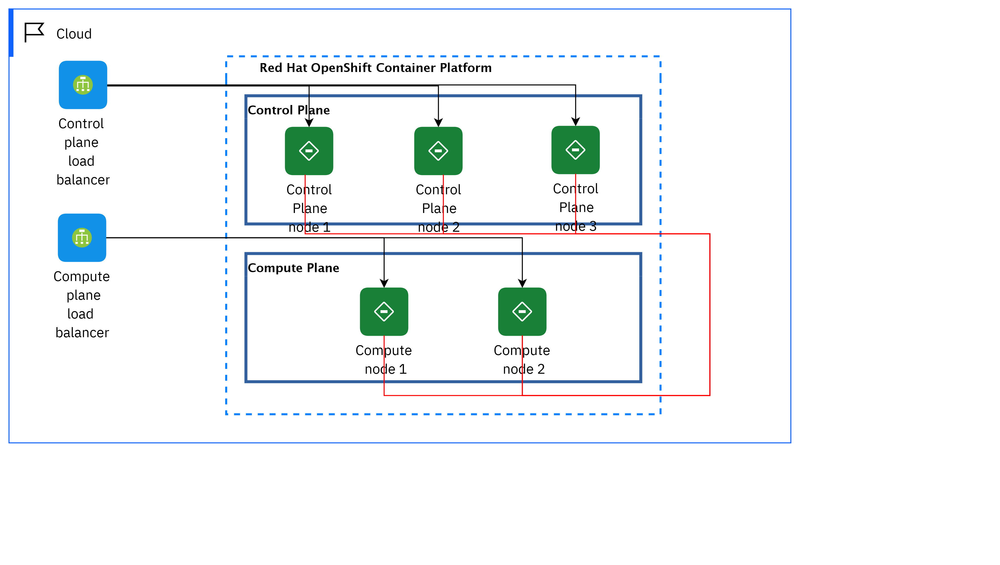

## Diagram

### Name

01 Starter environment

### Description

This is the minimal topology for a Red Hat® OpenShift® Container Platform v4.x:
 

<ul><li>3 master1 nodes</li><li>2 worker nodes</li></ul>

There is no persistent storage solution, as this is focused on stateless and ephemeral workloads.

 

The typical use cases are:

 

<ul><li>Development</li><li>Test</li></ul>

## Element

[Expand all](#){ .md-button .diff-line }

### Actor

    

### Subsystem

    

Compute Plane

<table>
    <caption></caption>
    <thead>
        <tr>
            <th></th>
            <th></th>
        </tr>
    </thead>
    <tr>
        <td> <strong>Name</strong> </td>
        <td>Compute Plane</td>
    </tr>
    <tr>
        <td> <strong>Description</strong> </td>
        <td>A physical server that acts as a hypervisor and contains the processing capabilities required to run virtual machines in the environment. A basic RHOSP environment requires at least one Compute node. 
 

<a href="https://access.redhat.com/documentation/en-us/red_hat_openstack_platform/16.0/html/director_installation_and_usage/planning-your-overcloud " target="_blank">https://access.redhat.com/documentation/en-us/red_hat_openstack_platform/16.0/html/director_installation_and_usage/planning-your-overcloud </a>

 
</td>
    </tr>
</table>

    

Control Plane

<table>
    <caption></caption>
    <thead>
        <tr>
            <th></th>
            <th></th>
        </tr>
    </thead>
    <tr>
        <td> <strong>Name</strong> </td>
        <td>Control Plane</td>
    </tr>
    <tr>
        <td> <strong>Description</strong> </td>
        <td>The control plane, which is composed of control plane machines, manages the OpenShift Container Platform cluster. The control plane machines manage workloads on the compute machines, which are also known as worker machines. The cluster itself manages all upgrades to the machines by the actions of the Cluster Version Operator, the Machine Config Operator, and a set of individual Operators.  
<a href="https://docs.openshift.com/container-platform/4.1/architecture/control-plane.html " target="_blank">https://docs.openshift.com/container-platform/4.1/architecture/control-plane.html </a>

 
</td>
    </tr>
</table>

    

Red Hat OpenShift Container Platform

<table>
    <caption></caption>
    <thead>
        <tr>
            <th></th>
            <th></th>
        </tr>
    </thead>
    <tr>
        <td> <strong>Name</strong> </td>
        <td>Red Hat OpenShift Container Platform</td>
    </tr>
    <tr>
        <td> <strong>Description</strong> </td>
        <td>Red Hat® OpenShift® offers a consistent hybrid cloud foundation for building and scaling containerized applications. Benefit from streamlined platform installation and upgrades from one of the enterprise Kubernetes leaders.
 

<a href="https://cloud.redhat.com/products/container-platform" target="_blank">https://cloud.redhat.com/products/container-platform</a>
</td>
    </tr>
</table>

    

### Location

    

Cloud

<table>
    <caption></caption>
    <thead>
        <tr>
            <th></th>
            <th></th>
        </tr>
    </thead>
    <tr>
        <td> <strong>Name</strong> </td>
        <td>Cloud</td>
    </tr>
    <tr>
        <td> <strong>Description</strong> </td>
        <td></td>
    </tr>
</table>

    

### Logical Connection

    

<table>
    <caption></caption>
    <thead>
        <tr>
            <th></th>
            <th></th>
        </tr>
    </thead>
    <tr>
        <td> <strong>Name</strong> </td>
        <td></td>
    </tr>
    <tr>
        <td> <strong>Description</strong> </td>
        <td></td>
    </tr>
</table>

    

<table>
    <caption></caption>
    <thead>
        <tr>
            <th></th>
            <th></th>
        </tr>
    </thead>
    <tr>
        <td> <strong>Name</strong> </td>
        <td></td>
    </tr>
    <tr>
        <td> <strong>Description</strong> </td>
        <td></td>
    </tr>
</table>

    

<table>
    <caption></caption>
    <thead>
        <tr>
            <th></th>
            <th></th>
        </tr>
    </thead>
    <tr>
        <td> <strong>Name</strong> </td>
        <td></td>
    </tr>
    <tr>
        <td> <strong>Description</strong> </td>
        <td></td>
    </tr>
</table>

    

<table>
    <caption></caption>
    <thead>
        <tr>
            <th></th>
            <th></th>
        </tr>
    </thead>
    <tr>
        <td> <strong>Name</strong> </td>
        <td></td>
    </tr>
    <tr>
        <td> <strong>Description</strong> </td>
        <td></td>
    </tr>
</table>

    

<table>
    <caption></caption>
    <thead>
        <tr>
            <th></th>
            <th></th>
        </tr>
    </thead>
    <tr>
        <td> <strong>Name</strong> </td>
        <td></td>
    </tr>
    <tr>
        <td> <strong>Description</strong> </td>
        <td></td>
    </tr>
</table>

    

<table>
    <caption></caption>
    <thead>
        <tr>
            <th></th>
            <th></th>
        </tr>
    </thead>
    <tr>
        <td> <strong>Name</strong> </td>
        <td></td>
    </tr>
    <tr>
        <td> <strong>Description</strong> </td>
        <td></td>
    </tr>
</table>

    

<table>
    <caption></caption>
    <thead>
        <tr>
            <th></th>
            <th></th>
        </tr>
    </thead>
    <tr>
        <td> <strong>Name</strong> </td>
        <td></td>
    </tr>
    <tr>
        <td> <strong>Description</strong> </td>
        <td></td>
    </tr>
</table>

    

<table>
    <caption></caption>
    <thead>
        <tr>
            <th></th>
            <th></th>
        </tr>
    </thead>
    <tr>
        <td> <strong>Name</strong> </td>
        <td></td>
    </tr>
    <tr>
        <td> <strong>Description</strong> </td>
        <td></td>
    </tr>
</table>

    

### Logical Node

    

Compute node 1

<table>
    <caption></caption>
    <thead>
        <tr>
            <th></th>
            <th></th>
        </tr>
    </thead>
    <tr>
        <td> <strong>Name</strong> </td>
        <td>Compute node 1</td>
    </tr>
    <tr>
        <td> <strong>Description</strong> </td>
        <td>Compute nodes are responsible for running virtual machine instances after they are launched. Compute nodes require bare metal systems that support hardware virtualization. Compute nodes must also have enough memory and disk space to support the requirements of the virtual machine instances that they host.

https://access.redhat.com/documentation/en-us/red_hat_openstack_platform/10/html/director_installation_and_usage/chap-requirements</td>
    </tr>
    <tr>
        <td> <strong>Type</strong> </td>
        <td></td>
    </tr>
    <tr>
        <td> <strong>Primary Capability</strong> </td>
        <td>
            
                
container image

            
        </td>
    </tr>
    <tr>
        <td> <strong>Implementation</strong> </td>
        <td>
            
        </td>
    </tr>
    <tr>
        <td> <strong>Architectural Decision</strong> </td>
        <td>
            
        </td>
    </tr>
    <tr>
        <td> <strong>Non Functional Requirement</strong> </td>
        <td>
            
        </td>
    </tr>
    <tr>
        <td> <strong>Generic Group</strong> </td>
        <td></td>
    </tr>
    <tr>
        <td> <strong>Sub-level Diagram</strong> </td>
        <td></td>
    </tr>
    <tr>
        <td> <strong>Related Diagrams</strong> </td>
        <td>
            
                
<a href="../../IT System View/aoditsystem_HJ4nuWvtF">08 Red Hat OpenShift on IBM Cloud on VPC</a>

            
                
<a href="../../IT System View/aoditsystem_rkfCxWPYY">09 Azure</a>

            
                
<a href="../../IT System View/aoditsystem_HkaCNxvtF">07 AWS</a>

            
                
<a href="../../IT System View/aoditsystem_Sy-F43rKt">06 Two clusters on two regions</a>

            
                
<a href="../../IT System View/aoditsystem_rk9c-3BtF">05 Two clusters on-premises</a>

            
                
<a href="../../IT System View/aoditsystem_ByreAoBFK">04 Cloud cluster</a>

            
                
<a href="../../IT System View/aoditsystem_B1r5OjHFF">03 On-premises cluster</a>

            
                
<a href="../../IT System View/aoditsystem_r18uxVqXsBFK">01 Starter environment</a>

            
        </td>
    </tr>
    <tr>
        <td> <strong>Related Elements</strong> </td>
        <td>
            
            
                
container image

                
            
        </td>
    </tr>
</table>

    

Compute node 2

<table>
    <caption></caption>
    <thead>
        <tr>
            <th></th>
            <th></th>
        </tr>
    </thead>
    <tr>
        <td> <strong>Name</strong> </td>
        <td>Compute node 2</td>
    </tr>
    <tr>
        <td> <strong>Description</strong> </td>
        <td>Compute nodes are responsible for running virtual machine instances after they are launched. Compute nodes require bare metal systems that support hardware virtualization. Compute nodes must also have enough memory and disk space to support the requirements of the virtual machine instances that they host.

https://access.redhat.com/documentation/en-us/red_hat_openstack_platform/10/html/director_installation_and_usage/chap-requirements</td>
    </tr>
    <tr>
        <td> <strong>Type</strong> </td>
        <td></td>
    </tr>
    <tr>
        <td> <strong>Primary Capability</strong> </td>
        <td>
            
                
container image

            
        </td>
    </tr>
    <tr>
        <td> <strong>Implementation</strong> </td>
        <td>
            
        </td>
    </tr>
    <tr>
        <td> <strong>Architectural Decision</strong> </td>
        <td>
            
        </td>
    </tr>
    <tr>
        <td> <strong>Non Functional Requirement</strong> </td>
        <td>
            
        </td>
    </tr>
    <tr>
        <td> <strong>Generic Group</strong> </td>
        <td></td>
    </tr>
    <tr>
        <td> <strong>Sub-level Diagram</strong> </td>
        <td></td>
    </tr>
    <tr>
        <td> <strong>Related Diagrams</strong> </td>
        <td>
            
                
<a href="../../IT System View/aoditsystem_HJ4nuWvtF">08 Red Hat OpenShift on IBM Cloud on VPC</a>

            
                
<a href="../../IT System View/aoditsystem_rkfCxWPYY">09 Azure</a>

            
                
<a href="../../IT System View/aoditsystem_HkaCNxvtF">07 AWS</a>

            
                
<a href="../../IT System View/aoditsystem_Sy-F43rKt">06 Two clusters on two regions</a>

            
                
<a href="../../IT System View/aoditsystem_rk9c-3BtF">05 Two clusters on-premises</a>

            
                
<a href="../../IT System View/aoditsystem_ByreAoBFK">04 Cloud cluster</a>

            
                
<a href="../../IT System View/aoditsystem_B1r5OjHFF">03 On-premises cluster</a>

            
                
<a href="../../IT System View/aoditsystem_r18uxVqXsBFK">01 Starter environment</a>

            
        </td>
    </tr>
    <tr>
        <td> <strong>Related Elements</strong> </td>
        <td>
            
            
                
container image

                
            
        </td>
    </tr>
</table>

    

Compute plane load balancer

<table>
    <caption></caption>
    <thead>
        <tr>
            <th></th>
            <th></th>
        </tr>
    </thead>
    <tr>
        <td> <strong>Name</strong> </td>
        <td>Compute plane load balancer</td>
    </tr>
    <tr>
        <td> <strong>Description</strong> </td>
        <td>Use a load balancer service to distribute traffic among your application servers residing locally within data center.
 

<a href="https://cloud.ibm.com/catalog/infrastructure/load-balancer-group" target="_blank">https://cloud.ibm.com/catalog/infrastructure/load-balancer-group</a>
</td>
    </tr>
    <tr>
        <td> <strong>Type</strong> </td>
        <td></td>
    </tr>
    <tr>
        <td> <strong>Primary Capability</strong> </td>
        <td>
            
                
network routing

            
        </td>
    </tr>
    <tr>
        <td> <strong>Implementation</strong> </td>
        <td>
            
                
<a href="https://www.ibm.com/cloud/load-balancer"> IBM Cloud Load Balancers</a>

            
        </td>
    </tr>
    <tr>
        <td> <strong>Architectural Decision</strong> </td>
        <td>
            
                
<a href="../../Architectural Decisions/architecturaldecision_SJB57N57srKF">Load Balancer Selection</a>

            
        </td>
    </tr>
    <tr>
        <td> <strong>Non Functional Requirement</strong> </td>
        <td>
            
                
<a href="../../Non Functional Requirements/nonfunctionalrequirement_H1es1ZgIFK">Load balancing</a>

            
        </td>
    </tr>
    <tr>
        <td> <strong>Generic Group</strong> </td>
        <td></td>
    </tr>
    <tr>
        <td> <strong>Sub-level Diagram</strong> </td>
        <td></td>
    </tr>
    <tr>
        <td> <strong>Related Diagrams</strong> </td>
        <td>
            
                
<a href="../../IT System View/aoditsystem_Sy-F43rKt">06 Two clusters on two regions</a>

            
                
<a href="../../IT System View/aoditsystem_rk9c-3BtF">05 Two clusters on-premises</a>

            
                
<a href="../../IT System View/aoditsystem_ByreAoBFK">04 Cloud cluster</a>

            
                
<a href="../../IT System View/aoditsystem_B1r5OjHFF">03 On-premises cluster</a>

            
                
<a href="../../IT System View/aoditsystem_r18uxVqXsBFK">01 Starter environment</a>

            
        </td>
    </tr>
    <tr>
        <td> <strong>Related Elements</strong> </td>
        <td>
            
                
Load balancing

                
                    
                    <li><a href="../../IT System View/aoditsystem_HkaCNxvtF">07 AWS</a></li>
                    
                    <li><a href="../../IT System View/aoditsystem_Sy-F43rKt">06 Two clusters on two regions</a></li>
                    
                    <li><a href="../../IT System View/aoditsystem_rk9c-3BtF">05 Two clusters on-premises</a></li>
                    
                    <li><a href="../../IT System View/aoditsystem_ByreAoBFK">04 Cloud cluster</a></li>
                    
                    <li><a href="../../IT System View/aoditsystem_B1r5OjHFF">03 On-premises cluster</a></li>
                    
                    <li><a href="../../IT System View/aoditsystem_r18uxVqXsBFK">01 Starter environment</a></li>
                    
                
            
                
Load Balancer Selection

                
                    
                    <li><a href="../../IT System View/aoditsystem_HJ4nuWvtF">08 Red Hat OpenShift on IBM Cloud on VPC</a></li>
                    
                    <li><a href="../../IT System View/aoditsystem_HkaCNxvtF">07 AWS</a></li>
                    
                    <li><a href="../../IT System View/aoditsystem_Sy-F43rKt">06 Two clusters on two regions</a></li>
                    
                    <li><a href="../../IT System View/aoditsystem_rk9c-3BtF">05 Two clusters on-premises</a></li>
                    
                    <li><a href="../../IT System View/aoditsystem_ByreAoBFK">04 Cloud cluster</a></li>
                    
                    <li><a href="../../IT System View/aoditsystem_B1r5OjHFF">03 On-premises cluster</a></li>
                    
                    <li><a href="../../IT System View/aoditsystem_By7NIorFt">02 Three nodes cluster</a></li>
                    
                    <li><a href="../../IT System View/aoditsystem_r18uxVqXsBFK">01 Starter environment</a></li>
                    
                
            
            
                
SYS_DU_38v3qxufxWL

                
            
                
network routing

                
            
        </td>
    </tr>
</table>

    

Control plane load balancer

<table>
    <caption></caption>
    <thead>
        <tr>
            <th></th>
            <th></th>
        </tr>
    </thead>
    <tr>
        <td> <strong>Name</strong> </td>
        <td>Control plane load balancer</td>
    </tr>
    <tr>
        <td> <strong>Description</strong> </td>
        <td>Use a load balancer service to distribute traffic among your application servers residing locally within data center.

https://cloud.ibm.com/catalog/infrastructure/load-balancer-group</td>
    </tr>
    <tr>
        <td> <strong>Type</strong> </td>
        <td></td>
    </tr>
    <tr>
        <td> <strong>Primary Capability</strong> </td>
        <td>
            
                
network routing

            
        </td>
    </tr>
    <tr>
        <td> <strong>Implementation</strong> </td>
        <td>
            
                
<a href="https://www.ibm.com/cloud/load-balancer"> IBM Cloud Load Balancers</a>

            
        </td>
    </tr>
    <tr>
        <td> <strong>Architectural Decision</strong> </td>
        <td>
            
                
<a href="../../Architectural Decisions/architecturaldecision_SJB57N57srKF">Load Balancer Selection</a>

            
        </td>
    </tr>
    <tr>
        <td> <strong>Non Functional Requirement</strong> </td>
        <td>
            
                
<a href="../../Non Functional Requirements/nonfunctionalrequirement_H1es1ZgIFK">Load balancing</a>

            
        </td>
    </tr>
    <tr>
        <td> <strong>Generic Group</strong> </td>
        <td></td>
    </tr>
    <tr>
        <td> <strong>Sub-level Diagram</strong> </td>
        <td></td>
    </tr>
    <tr>
        <td> <strong>Related Diagrams</strong> </td>
        <td>
            
                
<a href="../../IT System View/aoditsystem_HkaCNxvtF">07 AWS</a>

            
                
<a href="../../IT System View/aoditsystem_Sy-F43rKt">06 Two clusters on two regions</a>

            
                
<a href="../../IT System View/aoditsystem_rk9c-3BtF">05 Two clusters on-premises</a>

            
                
<a href="../../IT System View/aoditsystem_ByreAoBFK">04 Cloud cluster</a>

            
                
<a href="../../IT System View/aoditsystem_B1r5OjHFF">03 On-premises cluster</a>

            
                
<a href="../../IT System View/aoditsystem_r18uxVqXsBFK">01 Starter environment</a>

            
        </td>
    </tr>
    <tr>
        <td> <strong>Related Elements</strong> </td>
        <td>
            
                
Load balancing

                
                    
                    <li><a href="../../IT System View/aoditsystem_HkaCNxvtF">07 AWS</a></li>
                    
                    <li><a href="../../IT System View/aoditsystem_Sy-F43rKt">06 Two clusters on two regions</a></li>
                    
                    <li><a href="../../IT System View/aoditsystem_rk9c-3BtF">05 Two clusters on-premises</a></li>
                    
                    <li><a href="../../IT System View/aoditsystem_ByreAoBFK">04 Cloud cluster</a></li>
                    
                    <li><a href="../../IT System View/aoditsystem_B1r5OjHFF">03 On-premises cluster</a></li>
                    
                    <li><a href="../../IT System View/aoditsystem_r18uxVqXsBFK">01 Starter environment</a></li>
                    
                
            
                
Load Balancer Selection

                
                    
                    <li><a href="../../IT System View/aoditsystem_HJ4nuWvtF">08 Red Hat OpenShift on IBM Cloud on VPC</a></li>
                    
                    <li><a href="../../IT System View/aoditsystem_HkaCNxvtF">07 AWS</a></li>
                    
                    <li><a href="../../IT System View/aoditsystem_Sy-F43rKt">06 Two clusters on two regions</a></li>
                    
                    <li><a href="../../IT System View/aoditsystem_rk9c-3BtF">05 Two clusters on-premises</a></li>
                    
                    <li><a href="../../IT System View/aoditsystem_ByreAoBFK">04 Cloud cluster</a></li>
                    
                    <li><a href="../../IT System View/aoditsystem_B1r5OjHFF">03 On-premises cluster</a></li>
                    
                    <li><a href="../../IT System View/aoditsystem_By7NIorFt">02 Three nodes cluster</a></li>
                    
                    <li><a href="../../IT System View/aoditsystem_r18uxVqXsBFK">01 Starter environment</a></li>
                    
                
            
            
                
SYS_DU_37sFycoSa3m

                
            
                
network routing

                
            
        </td>
    </tr>
</table>

    

Control Plane node 1

<table>
    <caption></caption>
    <thead>
        <tr>
            <th></th>
            <th></th>
        </tr>
    </thead>
    <tr>
        <td> <strong>Name</strong> </td>
        <td>Control Plane node 1</td>
    </tr>
    <tr>
        <td> <strong>Description</strong> </td>
        <td>In a Kubernetes cluster, the control plane nodes run services that are required to control the Kubernetes cluster. They contain more than just the Kubernetes services for managing the OpenShift Container Platform cluster. Instead of being grouped into a MachineSet, control plane machines are defined by a series of standalone machine API resources. Extra controls apply to control plane machines to prevent you from deleting all control plane machines and breaking your cluster.

https://docs.openshift.com/container-platform/4.9/architecture/control-plane.html</td>
    </tr>
    <tr>
        <td> <strong>Type</strong> </td>
        <td></td>
    </tr>
    <tr>
        <td> <strong>Primary Capability</strong> </td>
        <td>
            
                
container platform

            
        </td>
    </tr>
    <tr>
        <td> <strong>Implementation</strong> </td>
        <td>
            
        </td>
    </tr>
    <tr>
        <td> <strong>Architectural Decision</strong> </td>
        <td>
            
                
<a href="../../Architectural Decisions/architecturaldecision_H1sTQ49miHKt">Control plane node sizing</a>

            
                
<a href="../../Architectural Decisions/architecturaldecision_Hk0F7VcXjrYY">Control Plane Deployment Topology</a>

            
        </td>
    </tr>
    <tr>
        <td> <strong>Non Functional Requirement</strong> </td>
        <td>
            
        </td>
    </tr>
    <tr>
        <td> <strong>Generic Group</strong> </td>
        <td></td>
    </tr>
    <tr>
        <td> <strong>Sub-level Diagram</strong> </td>
        <td></td>
    </tr>
    <tr>
        <td> <strong>Related Diagrams</strong> </td>
        <td>
            
                
<a href="../../IT System View/aoditsystem_HJ4nuWvtF">08 Red Hat OpenShift on IBM Cloud on VPC</a>

            
                
<a href="../../IT System View/aoditsystem_rkfCxWPYY">09 Azure</a>

            
                
<a href="../../IT System View/aoditsystem_HkaCNxvtF">07 AWS</a>

            
                
<a href="../../IT System View/aoditsystem_Sy-F43rKt">06 Two clusters on two regions</a>

            
                
<a href="../../IT System View/aoditsystem_rk9c-3BtF">05 Two clusters on-premises</a>

            
                
<a href="../../IT System View/aoditsystem_ByreAoBFK">04 Cloud cluster</a>

            
                
<a href="../../IT System View/aoditsystem_B1r5OjHFF">03 On-premises cluster</a>

            
                
<a href="../../IT System View/aoditsystem_r18uxVqXsBFK">01 Starter environment</a>

            
        </td>
    </tr>
    <tr>
        <td> <strong>Related Elements</strong> </td>
        <td>
            
                
Control plane node sizing

                
                    
                    <li><a href="../../IT System View/aoditsystem_HJ4nuWvtF">08 Red Hat OpenShift on IBM Cloud on VPC</a></li>
                    
                    <li><a href="../../IT System View/aoditsystem_rkfCxWPYY">09 Azure</a></li>
                    
                    <li><a href="../../IT System View/aoditsystem_HkaCNxvtF">07 AWS</a></li>
                    
                    <li><a href="../../IT System View/aoditsystem_Sy-F43rKt">06 Two clusters on two regions</a></li>
                    
                    <li><a href="../../IT System View/aoditsystem_rk9c-3BtF">05 Two clusters on-premises</a></li>
                    
                    <li><a href="../../IT System View/aoditsystem_ByreAoBFK">04 Cloud cluster</a></li>
                    
                    <li><a href="../../IT System View/aoditsystem_B1r5OjHFF">03 On-premises cluster</a></li>
                    
                    <li><a href="../../IT System View/aoditsystem_r18uxVqXsBFK">01 Starter environment</a></li>
                    
                
            
                
Control Plane Deployment Topology

                
                    
                    <li><a href="../../IT System View/aoditsystem_HJ4nuWvtF">08 Red Hat OpenShift on IBM Cloud on VPC</a></li>
                    
                    <li><a href="../../IT System View/aoditsystem_rkfCxWPYY">09 Azure</a></li>
                    
                    <li><a href="../../IT System View/aoditsystem_HkaCNxvtF">07 AWS</a></li>
                    
                    <li><a href="../../IT System View/aoditsystem_Sy-F43rKt">06 Two clusters on two regions</a></li>
                    
                    <li><a href="../../IT System View/aoditsystem_rk9c-3BtF">05 Two clusters on-premises</a></li>
                    
                    <li><a href="../../IT System View/aoditsystem_ByreAoBFK">04 Cloud cluster</a></li>
                    
                    <li><a href="../../IT System View/aoditsystem_B1r5OjHFF">03 On-premises cluster</a></li>
                    
                    <li><a href="../../IT System View/aoditsystem_r18uxVqXsBFK">01 Starter environment</a></li>
                    
                
            
            
                
container platform

                
            
        </td>
    </tr>
</table>

    

Control Plane node 2

<table>
    <caption></caption>
    <thead>
        <tr>
            <th></th>
            <th></th>
        </tr>
    </thead>
    <tr>
        <td> <strong>Name</strong> </td>
        <td>Control Plane node 2</td>
    </tr>
    <tr>
        <td> <strong>Description</strong> </td>
        <td>In a Kubernetes cluster, the control plane nodes run services that are required to control the Kubernetes cluster. They contain more than just the Kubernetes services for managing the OpenShift Container Platform cluster. Instead of being grouped into a MachineSet, control plane machines are defined by a series of standalone machine API resources. Extra controls apply to control plane machines to prevent you from deleting all control plane machines and breaking your cluster.   https://docs.openshift.com/container-platform/4.9/architecture/control-plane.html</td>
    </tr>
    <tr>
        <td> <strong>Type</strong> </td>
        <td></td>
    </tr>
    <tr>
        <td> <strong>Primary Capability</strong> </td>
        <td>
            
                
container platform

            
        </td>
    </tr>
    <tr>
        <td> <strong>Implementation</strong> </td>
        <td>
            
        </td>
    </tr>
    <tr>
        <td> <strong>Architectural Decision</strong> </td>
        <td>
            
                
<a href="../../Architectural Decisions/architecturaldecision_Hk0F7VcXjrYY">Control Plane Deployment Topology</a>

            
                
<a href="../../Architectural Decisions/architecturaldecision_SJ3uX4qQjBYK">Hosting Platform and Managed or Self-Managed Service</a>

            
                
<a href="../../Architectural Decisions/architecturaldecision_H1sTQ49miHKt">Control plane node sizing</a>

            
        </td>
    </tr>
    <tr>
        <td> <strong>Non Functional Requirement</strong> </td>
        <td>
            
        </td>
    </tr>
    <tr>
        <td> <strong>Generic Group</strong> </td>
        <td></td>
    </tr>
    <tr>
        <td> <strong>Sub-level Diagram</strong> </td>
        <td></td>
    </tr>
    <tr>
        <td> <strong>Related Diagrams</strong> </td>
        <td>
            
                
<a href="../../IT System View/aoditsystem_HJ4nuWvtF">08 Red Hat OpenShift on IBM Cloud on VPC</a>

            
                
<a href="../../IT System View/aoditsystem_rkfCxWPYY">09 Azure</a>

            
                
<a href="../../IT System View/aoditsystem_HkaCNxvtF">07 AWS</a>

            
                
<a href="../../IT System View/aoditsystem_Sy-F43rKt">06 Two clusters on two regions</a>

            
                
<a href="../../IT System View/aoditsystem_rk9c-3BtF">05 Two clusters on-premises</a>

            
                
<a href="../../IT System View/aoditsystem_ByreAoBFK">04 Cloud cluster</a>

            
                
<a href="../../IT System View/aoditsystem_B1r5OjHFF">03 On-premises cluster</a>

            
                
<a href="../../IT System View/aoditsystem_r18uxVqXsBFK">01 Starter environment</a>

            
        </td>
    </tr>
    <tr>
        <td> <strong>Related Elements</strong> </td>
        <td>
            
                
Control Plane Deployment Topology

                
                    
                    <li><a href="../../IT System View/aoditsystem_HJ4nuWvtF">08 Red Hat OpenShift on IBM Cloud on VPC</a></li>
                    
                    <li><a href="../../IT System View/aoditsystem_rkfCxWPYY">09 Azure</a></li>
                    
                    <li><a href="../../IT System View/aoditsystem_HkaCNxvtF">07 AWS</a></li>
                    
                    <li><a href="../../IT System View/aoditsystem_Sy-F43rKt">06 Two clusters on two regions</a></li>
                    
                    <li><a href="../../IT System View/aoditsystem_rk9c-3BtF">05 Two clusters on-premises</a></li>
                    
                    <li><a href="../../IT System View/aoditsystem_ByreAoBFK">04 Cloud cluster</a></li>
                    
                    <li><a href="../../IT System View/aoditsystem_B1r5OjHFF">03 On-premises cluster</a></li>
                    
                    <li><a href="../../IT System View/aoditsystem_r18uxVqXsBFK">01 Starter environment</a></li>
                    
                
            
                
Hosting Platform and Managed or Self-Managed Service

                
                    
                    <li><a href="../../IT System View/aoditsystem_HJ4nuWvtF">08 Red Hat OpenShift on IBM Cloud on VPC</a></li>
                    
                    <li><a href="../../IT System View/aoditsystem_rkfCxWPYY">09 Azure</a></li>
                    
                    <li><a href="../../IT System View/aoditsystem_HkaCNxvtF">07 AWS</a></li>
                    
                    <li><a href="../../IT System View/aoditsystem_Sy-F43rKt">06 Two clusters on two regions</a></li>
                    
                    <li><a href="../../IT System View/aoditsystem_rk9c-3BtF">05 Two clusters on-premises</a></li>
                    
                    <li><a href="../../IT System View/aoditsystem_ByreAoBFK">04 Cloud cluster</a></li>
                    
                    <li><a href="../../IT System View/aoditsystem_B1r5OjHFF">03 On-premises cluster</a></li>
                    
                    <li><a href="../../IT System View/aoditsystem_r18uxVqXsBFK">01 Starter environment</a></li>
                    
                
            
                
Control plane node sizing

                
                    
                    <li><a href="../../IT System View/aoditsystem_HJ4nuWvtF">08 Red Hat OpenShift on IBM Cloud on VPC</a></li>
                    
                    <li><a href="../../IT System View/aoditsystem_rkfCxWPYY">09 Azure</a></li>
                    
                    <li><a href="../../IT System View/aoditsystem_HkaCNxvtF">07 AWS</a></li>
                    
                    <li><a href="../../IT System View/aoditsystem_Sy-F43rKt">06 Two clusters on two regions</a></li>
                    
                    <li><a href="../../IT System View/aoditsystem_rk9c-3BtF">05 Two clusters on-premises</a></li>
                    
                    <li><a href="../../IT System View/aoditsystem_ByreAoBFK">04 Cloud cluster</a></li>
                    
                    <li><a href="../../IT System View/aoditsystem_B1r5OjHFF">03 On-premises cluster</a></li>
                    
                    <li><a href="../../IT System View/aoditsystem_r18uxVqXsBFK">01 Starter environment</a></li>
                    
                
            
            
                
container platform

                
            
        </td>
    </tr>
</table>

    

Control Plane node 3

<table>
    <caption></caption>
    <thead>
        <tr>
            <th></th>
            <th></th>
        </tr>
    </thead>
    <tr>
        <td> <strong>Name</strong> </td>
        <td>Control Plane node 3</td>
    </tr>
    <tr>
        <td> <strong>Description</strong> </td>
        <td>In a Kubernetes cluster, the control plane nodes run services that are required to control the Kubernetes cluster. They contain more than just the Kubernetes services for managing the OpenShift Container Platform cluster. Instead of being grouped into a MachineSet, control plane machines are defined by a series of standalone machine API resources. Extra controls apply to control plane machines to prevent you from deleting all control plane machines and breaking your cluster.   https://docs.openshift.com/container-platform/4.9/architecture/control-plane.html</td>
    </tr>
    <tr>
        <td> <strong>Type</strong> </td>
        <td></td>
    </tr>
    <tr>
        <td> <strong>Primary Capability</strong> </td>
        <td>
            
                
application runtime

            
        </td>
    </tr>
    <tr>
        <td> <strong>Implementation</strong> </td>
        <td>
            
        </td>
    </tr>
    <tr>
        <td> <strong>Architectural Decision</strong> </td>
        <td>
            
                
<a href="../../Architectural Decisions/architecturaldecision_Hk0F7VcXjrYY">Control Plane Deployment Topology</a>

            
                
<a href="../../Architectural Decisions/architecturaldecision_SJ3uX4qQjBYK">Hosting Platform and Managed or Self-Managed Service</a>

            
                
<a href="../../Architectural Decisions/architecturaldecision_H1sTQ49miHKt">Control plane node sizing</a>

            
        </td>
    </tr>
    <tr>
        <td> <strong>Non Functional Requirement</strong> </td>
        <td>
            
        </td>
    </tr>
    <tr>
        <td> <strong>Generic Group</strong> </td>
        <td></td>
    </tr>
    <tr>
        <td> <strong>Sub-level Diagram</strong> </td>
        <td></td>
    </tr>
    <tr>
        <td> <strong>Related Diagrams</strong> </td>
        <td>
            
                
<a href="../../IT System View/aoditsystem_HJ4nuWvtF">08 Red Hat OpenShift on IBM Cloud on VPC</a>

            
                
<a href="../../IT System View/aoditsystem_rkfCxWPYY">09 Azure</a>

            
                
<a href="../../IT System View/aoditsystem_HkaCNxvtF">07 AWS</a>

            
                
<a href="../../IT System View/aoditsystem_Sy-F43rKt">06 Two clusters on two regions</a>

            
                
<a href="../../IT System View/aoditsystem_rk9c-3BtF">05 Two clusters on-premises</a>

            
                
<a href="../../IT System View/aoditsystem_ByreAoBFK">04 Cloud cluster</a>

            
                
<a href="../../IT System View/aoditsystem_B1r5OjHFF">03 On-premises cluster</a>

            
                
<a href="../../IT System View/aoditsystem_r18uxVqXsBFK">01 Starter environment</a>

            
        </td>
    </tr>
    <tr>
        <td> <strong>Related Elements</strong> </td>
        <td>
            
                
Control Plane Deployment Topology

                
                    
                    <li><a href="../../IT System View/aoditsystem_HJ4nuWvtF">08 Red Hat OpenShift on IBM Cloud on VPC</a></li>
                    
                    <li><a href="../../IT System View/aoditsystem_rkfCxWPYY">09 Azure</a></li>
                    
                    <li><a href="../../IT System View/aoditsystem_HkaCNxvtF">07 AWS</a></li>
                    
                    <li><a href="../../IT System View/aoditsystem_Sy-F43rKt">06 Two clusters on two regions</a></li>
                    
                    <li><a href="../../IT System View/aoditsystem_rk9c-3BtF">05 Two clusters on-premises</a></li>
                    
                    <li><a href="../../IT System View/aoditsystem_ByreAoBFK">04 Cloud cluster</a></li>
                    
                    <li><a href="../../IT System View/aoditsystem_B1r5OjHFF">03 On-premises cluster</a></li>
                    
                    <li><a href="../../IT System View/aoditsystem_r18uxVqXsBFK">01 Starter environment</a></li>
                    
                
            
                
Hosting Platform and Managed or Self-Managed Service

                
                    
                    <li><a href="../../IT System View/aoditsystem_HJ4nuWvtF">08 Red Hat OpenShift on IBM Cloud on VPC</a></li>
                    
                    <li><a href="../../IT System View/aoditsystem_rkfCxWPYY">09 Azure</a></li>
                    
                    <li><a href="../../IT System View/aoditsystem_HkaCNxvtF">07 AWS</a></li>
                    
                    <li><a href="../../IT System View/aoditsystem_Sy-F43rKt">06 Two clusters on two regions</a></li>
                    
                    <li><a href="../../IT System View/aoditsystem_rk9c-3BtF">05 Two clusters on-premises</a></li>
                    
                    <li><a href="../../IT System View/aoditsystem_ByreAoBFK">04 Cloud cluster</a></li>
                    
                    <li><a href="../../IT System View/aoditsystem_B1r5OjHFF">03 On-premises cluster</a></li>
                    
                    <li><a href="../../IT System View/aoditsystem_r18uxVqXsBFK">01 Starter environment</a></li>
                    
                
            
                
Control plane node sizing

                
                    
                    <li><a href="../../IT System View/aoditsystem_HJ4nuWvtF">08 Red Hat OpenShift on IBM Cloud on VPC</a></li>
                    
                    <li><a href="../../IT System View/aoditsystem_rkfCxWPYY">09 Azure</a></li>
                    
                    <li><a href="../../IT System View/aoditsystem_HkaCNxvtF">07 AWS</a></li>
                    
                    <li><a href="../../IT System View/aoditsystem_Sy-F43rKt">06 Two clusters on two regions</a></li>
                    
                    <li><a href="../../IT System View/aoditsystem_rk9c-3BtF">05 Two clusters on-premises</a></li>
                    
                    <li><a href="../../IT System View/aoditsystem_ByreAoBFK">04 Cloud cluster</a></li>
                    
                    <li><a href="../../IT System View/aoditsystem_B1r5OjHFF">03 On-premises cluster</a></li>
                    
                    <li><a href="../../IT System View/aoditsystem_r18uxVqXsBFK">01 Starter environment</a></li>
                    
                
            
            
        </td>
    </tr>
</table>

    

