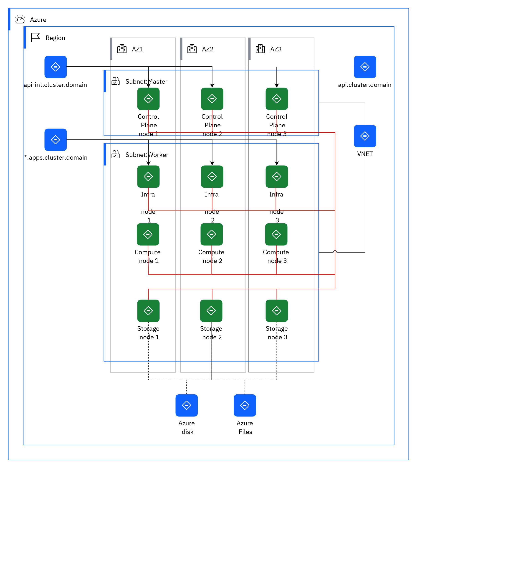

## Diagram

### Name

09 Azure

### Description

Requirement: Higher availability solution.
 

<ul><li>Deploy cluster over availability zones (AZ).</li></ul>

Number of AZ: 3

 

This topology has been tested and validated on public cloud: Amazon Web Services (AWS), Microsoft® Azure®, Google Cloud Platform, and IBM Cloud®.

 

Nodes are spread over the 3 AZ.

 

Number of nodes:

<ul><li>3 master1 nodes</li><li>3 worker nodes</li><li>3 infrastructure nodes</li></ul>

Note: The number of nodes and their sizing can be adjusted depending on the workload target. See the capacity sizing chapter.

 

Typical use cases:

 

<ul><li>Development</li><li>Test</li><li>Integration</li><li>Production with limited SLA</li></ul>

## Element

[Expand all](#){ .md-button .diff-line }

### Actor

    

### Subsystem

    

Subnet:Master

<table>
    <caption></caption>
    <thead>
        <tr>
            <th></th>
            <th></th>
        </tr>
    </thead>
    <tr>
        <td> <strong>Name</strong> </td>
        <td>Subnet:Master</td>
    </tr>
    <tr>
        <td> <strong>Description</strong> </td>
        <td>A subnet is a range of IP addresses in the virtual network. You can divide a virtual network into multiple subnets for organization and security.
 

<a href="https://docs.microsoft.com/en-us/azure/virtual-network/network-overview" target="_blank">https://docs.microsoft.com/en-us/azure/virtual-network/network-overview</a> 
</td>
    </tr>
</table>

    

Subnet:Worker

<table>
    <caption></caption>
    <thead>
        <tr>
            <th></th>
            <th></th>
        </tr>
    </thead>
    <tr>
        <td> <strong>Name</strong> </td>
        <td>Subnet:Worker</td>
    </tr>
    <tr>
        <td> <strong>Description</strong> </td>
        <td>A subnet is a range of IP addresses in the virtual network. You can divide a virtual network into multiple subnets for organization and security.
 

<a href="https://docs.microsoft.com/en-us/azure/virtual-network/network-overview" target="_blank">https://docs.microsoft.com/en-us/azure/virtual-network/network-overview</a>
</td>
    </tr>
</table>

    

### Location

    

AZ1

<table>
    <caption></caption>
    <thead>
        <tr>
            <th></th>
            <th></th>
        </tr>
    </thead>
    <tr>
        <td> <strong>Name</strong> </td>
        <td>AZ1</td>
    </tr>
    <tr>
        <td> <strong>Description</strong> </td>
        <td>The requirement is a high-available solution.
Deploy cluster over availability zones (AZ).

Storage solution is managed by Cloud provider across AZ.

This topology has been tested and validated on public cloud, such as Amazon Web Services (AWS), Microsoft® Azure®, Google Cloud Platform (GCP), and IBM Cloud®.

Candidate storage solutions: IBM Cloud Storage, Amazon Elastic Block Store, Azure Files

<a href="https://www.ibm.com/cloud/architecture/articles/ibmaot-redhat-openshift/02-solutions-guide-solution-design-reference-architecture " target="_blank">https://www.ibm.com/cloud/architecture/articles/ibmaot-redhat-openshift/02-solutions-guide-solution-design-reference-architecture </a>

 
</td>
    </tr>
</table>

    

AZ2

<table>
    <caption></caption>
    <thead>
        <tr>
            <th></th>
            <th></th>
        </tr>
    </thead>
    <tr>
        <td> <strong>Name</strong> </td>
        <td>AZ2</td>
    </tr>
    <tr>
        <td> <strong>Description</strong> </td>
        <td>The requirement is a high-available solution.
Deploy cluster over availability zones (AZ).

Storage solution is managed by Cloud provider across AZ.

This topology has been tested and validated on public cloud, such as Amazon Web Services (AWS), Microsoft® Azure®, Google Cloud Platform (GCP), and IBM Cloud®.

Candidate storage solutions: IBM Cloud Storage, Amazon Elastic Block Store, Azure Files

<a href="https://www.ibm.com/cloud/architecture/articles/ibmaot-redhat-openshift/02-solutions-guide-solution-design-reference-architecture " target="_blank">https://www.ibm.com/cloud/architecture/articles/ibmaot-redhat-openshift/02-solutions-guide-solution-design-reference-architecture </a>

 
</td>
    </tr>
</table>

    

AZ3

<table>
    <caption></caption>
    <thead>
        <tr>
            <th></th>
            <th></th>
        </tr>
    </thead>
    <tr>
        <td> <strong>Name</strong> </td>
        <td>AZ3</td>
    </tr>
    <tr>
        <td> <strong>Description</strong> </td>
        <td>The requirement is a high-available solution.
Deploy cluster over availability zones (AZ).

Storage solution is managed by Cloud provider across AZ.

This topology has been tested and validated on public cloud, such as Amazon Web Services (AWS), Microsoft® Azure®, Google Cloud Platform (GCP), and IBM Cloud®.

Candidate storage solutions: IBM Cloud Storage, Amazon Elastic Block Store, Azure Files

<a href="https://www.ibm.com/cloud/architecture/articles/ibmaot-redhat-openshift/02-solutions-guide-solution-design-reference-architecture " target="_blank">https://www.ibm.com/cloud/architecture/articles/ibmaot-redhat-openshift/02-solutions-guide-solution-design-reference-architecture </a>

 
</td>
    </tr>
</table>

    

Azure

<table>
    <caption></caption>
    <thead>
        <tr>
            <th></th>
            <th></th>
        </tr>
    </thead>
    <tr>
        <td> <strong>Name</strong> </td>
        <td>Azure</td>
    </tr>
    <tr>
        <td> <strong>Description</strong> </td>
        <td></td>
    </tr>
</table>

    

Region

<table>
    <caption></caption>
    <thead>
        <tr>
            <th></th>
            <th></th>
        </tr>
    </thead>
    <tr>
        <td> <strong>Name</strong> </td>
        <td>Region</td>
    </tr>
    <tr>
        <td> <strong>Description</strong> </td>
        <td></td>
    </tr>
</table>

    

### Logical Connection

    

<table>
    <caption></caption>
    <thead>
        <tr>
            <th></th>
            <th></th>
        </tr>
    </thead>
    <tr>
        <td> <strong>Name</strong> </td>
        <td></td>
    </tr>
    <tr>
        <td> <strong>Description</strong> </td>
        <td></td>
    </tr>
</table>

    

<table>
    <caption></caption>
    <thead>
        <tr>
            <th></th>
            <th></th>
        </tr>
    </thead>
    <tr>
        <td> <strong>Name</strong> </td>
        <td></td>
    </tr>
    <tr>
        <td> <strong>Description</strong> </td>
        <td></td>
    </tr>
</table>

    

<table>
    <caption></caption>
    <thead>
        <tr>
            <th></th>
            <th></th>
        </tr>
    </thead>
    <tr>
        <td> <strong>Name</strong> </td>
        <td></td>
    </tr>
    <tr>
        <td> <strong>Description</strong> </td>
        <td></td>
    </tr>
</table>

    

<table>
    <caption></caption>
    <thead>
        <tr>
            <th></th>
            <th></th>
        </tr>
    </thead>
    <tr>
        <td> <strong>Name</strong> </td>
        <td></td>
    </tr>
    <tr>
        <td> <strong>Description</strong> </td>
        <td></td>
    </tr>
</table>

    

<table>
    <caption></caption>
    <thead>
        <tr>
            <th></th>
            <th></th>
        </tr>
    </thead>
    <tr>
        <td> <strong>Name</strong> </td>
        <td></td>
    </tr>
    <tr>
        <td> <strong>Description</strong> </td>
        <td></td>
    </tr>
</table>

    

<table>
    <caption></caption>
    <thead>
        <tr>
            <th></th>
            <th></th>
        </tr>
    </thead>
    <tr>
        <td> <strong>Name</strong> </td>
        <td></td>
    </tr>
    <tr>
        <td> <strong>Description</strong> </td>
        <td></td>
    </tr>
</table>

    

<table>
    <caption></caption>
    <thead>
        <tr>
            <th></th>
            <th></th>
        </tr>
    </thead>
    <tr>
        <td> <strong>Name</strong> </td>
        <td></td>
    </tr>
    <tr>
        <td> <strong>Description</strong> </td>
        <td></td>
    </tr>
</table>

    

<table>
    <caption></caption>
    <thead>
        <tr>
            <th></th>
            <th></th>
        </tr>
    </thead>
    <tr>
        <td> <strong>Name</strong> </td>
        <td></td>
    </tr>
    <tr>
        <td> <strong>Description</strong> </td>
        <td></td>
    </tr>
</table>

    

<table>
    <caption></caption>
    <thead>
        <tr>
            <th></th>
            <th></th>
        </tr>
    </thead>
    <tr>
        <td> <strong>Name</strong> </td>
        <td></td>
    </tr>
    <tr>
        <td> <strong>Description</strong> </td>
        <td></td>
    </tr>
</table>

    

<table>
    <caption></caption>
    <thead>
        <tr>
            <th></th>
            <th></th>
        </tr>
    </thead>
    <tr>
        <td> <strong>Name</strong> </td>
        <td></td>
    </tr>
    <tr>
        <td> <strong>Description</strong> </td>
        <td></td>
    </tr>
</table>

    

<table>
    <caption></caption>
    <thead>
        <tr>
            <th></th>
            <th></th>
        </tr>
    </thead>
    <tr>
        <td> <strong>Name</strong> </td>
        <td></td>
    </tr>
    <tr>
        <td> <strong>Description</strong> </td>
        <td></td>
    </tr>
</table>

    

<table>
    <caption></caption>
    <thead>
        <tr>
            <th></th>
            <th></th>
        </tr>
    </thead>
    <tr>
        <td> <strong>Name</strong> </td>
        <td></td>
    </tr>
    <tr>
        <td> <strong>Description</strong> </td>
        <td></td>
    </tr>
</table>

    

<table>
    <caption></caption>
    <thead>
        <tr>
            <th></th>
            <th></th>
        </tr>
    </thead>
    <tr>
        <td> <strong>Name</strong> </td>
        <td></td>
    </tr>
    <tr>
        <td> <strong>Description</strong> </td>
        <td></td>
    </tr>
</table>

    

<table>
    <caption></caption>
    <thead>
        <tr>
            <th></th>
            <th></th>
        </tr>
    </thead>
    <tr>
        <td> <strong>Name</strong> </td>
        <td></td>
    </tr>
    <tr>
        <td> <strong>Description</strong> </td>
        <td></td>
    </tr>
</table>

    

<table>
    <caption></caption>
    <thead>
        <tr>
            <th></th>
            <th></th>
        </tr>
    </thead>
    <tr>
        <td> <strong>Name</strong> </td>
        <td></td>
    </tr>
    <tr>
        <td> <strong>Description</strong> </td>
        <td></td>
    </tr>
</table>

    

<table>
    <caption></caption>
    <thead>
        <tr>
            <th></th>
            <th></th>
        </tr>
    </thead>
    <tr>
        <td> <strong>Name</strong> </td>
        <td></td>
    </tr>
    <tr>
        <td> <strong>Description</strong> </td>
        <td></td>
    </tr>
</table>

    

<table>
    <caption></caption>
    <thead>
        <tr>
            <th></th>
            <th></th>
        </tr>
    </thead>
    <tr>
        <td> <strong>Name</strong> </td>
        <td></td>
    </tr>
    <tr>
        <td> <strong>Description</strong> </td>
        <td></td>
    </tr>
</table>

    

<table>
    <caption></caption>
    <thead>
        <tr>
            <th></th>
            <th></th>
        </tr>
    </thead>
    <tr>
        <td> <strong>Name</strong> </td>
        <td></td>
    </tr>
    <tr>
        <td> <strong>Description</strong> </td>
        <td></td>
    </tr>
</table>

    

<table>
    <caption></caption>
    <thead>
        <tr>
            <th></th>
            <th></th>
        </tr>
    </thead>
    <tr>
        <td> <strong>Name</strong> </td>
        <td></td>
    </tr>
    <tr>
        <td> <strong>Description</strong> </td>
        <td></td>
    </tr>
</table>

    

<table>
    <caption></caption>
    <thead>
        <tr>
            <th></th>
            <th></th>
        </tr>
    </thead>
    <tr>
        <td> <strong>Name</strong> </td>
        <td></td>
    </tr>
    <tr>
        <td> <strong>Description</strong> </td>
        <td></td>
    </tr>
</table>

    

### Logical Node

    

*.apps.cluster.domain

<table>
    <caption></caption>
    <thead>
        <tr>
            <th></th>
            <th></th>
        </tr>
    </thead>
    <tr>
        <td> <strong>Name</strong> </td>
        <td>*.apps.cluster.domain</td>
    </tr>
    <tr>
        <td> <strong>Description</strong> </td>
        <td></td>
    </tr>
    <tr>
        <td> <strong>Type</strong> </td>
        <td></td>
    </tr>
    <tr>
        <td> <strong>Primary Capability</strong> </td>
        <td>
            
                
network routing

            
        </td>
    </tr>
    <tr>
        <td> <strong>Implementation</strong> </td>
        <td>
            
        </td>
    </tr>
    <tr>
        <td> <strong>Architectural Decision</strong> </td>
        <td>
            
        </td>
    </tr>
    <tr>
        <td> <strong>Non Functional Requirement</strong> </td>
        <td>
            
        </td>
    </tr>
    <tr>
        <td> <strong>Generic Group</strong> </td>
        <td></td>
    </tr>
    <tr>
        <td> <strong>Sub-level Diagram</strong> </td>
        <td></td>
    </tr>
    <tr>
        <td> <strong>Related Diagrams</strong> </td>
        <td>
            
                
<a href="../../IT System View/aoditsystem_rkfCxWPYY">09 Azure</a>

            
        </td>
    </tr>
    <tr>
        <td> <strong>Related Elements</strong> </td>
        <td>
            
            
                
network routing

                
            
        </td>
    </tr>
</table>

    

api-int.cluster.domain

<table>
    <caption></caption>
    <thead>
        <tr>
            <th></th>
            <th></th>
        </tr>
    </thead>
    <tr>
        <td> <strong>Name</strong> </td>
        <td>api-int.cluster.domain</td>
    </tr>
    <tr>
        <td> <strong>Description</strong> </td>
        <td></td>
    </tr>
    <tr>
        <td> <strong>Type</strong> </td>
        <td></td>
    </tr>
    <tr>
        <td> <strong>Primary Capability</strong> </td>
        <td>
            
                
network routing

            
        </td>
    </tr>
    <tr>
        <td> <strong>Implementation</strong> </td>
        <td>
            
        </td>
    </tr>
    <tr>
        <td> <strong>Architectural Decision</strong> </td>
        <td>
            
        </td>
    </tr>
    <tr>
        <td> <strong>Non Functional Requirement</strong> </td>
        <td>
            
        </td>
    </tr>
    <tr>
        <td> <strong>Generic Group</strong> </td>
        <td></td>
    </tr>
    <tr>
        <td> <strong>Sub-level Diagram</strong> </td>
        <td></td>
    </tr>
    <tr>
        <td> <strong>Related Diagrams</strong> </td>
        <td>
            
                
<a href="../../IT System View/aoditsystem_rkfCxWPYY">09 Azure</a>

            
        </td>
    </tr>
    <tr>
        <td> <strong>Related Elements</strong> </td>
        <td>
            
            
                
network routing

                
            
        </td>
    </tr>
</table>

    

api.cluster.domain

<table>
    <caption></caption>
    <thead>
        <tr>
            <th></th>
            <th></th>
        </tr>
    </thead>
    <tr>
        <td> <strong>Name</strong> </td>
        <td>api.cluster.domain</td>
    </tr>
    <tr>
        <td> <strong>Description</strong> </td>
        <td></td>
    </tr>
    <tr>
        <td> <strong>Type</strong> </td>
        <td></td>
    </tr>
    <tr>
        <td> <strong>Primary Capability</strong> </td>
        <td>
            
                
network routing

            
        </td>
    </tr>
    <tr>
        <td> <strong>Implementation</strong> </td>
        <td>
            
        </td>
    </tr>
    <tr>
        <td> <strong>Architectural Decision</strong> </td>
        <td>
            
        </td>
    </tr>
    <tr>
        <td> <strong>Non Functional Requirement</strong> </td>
        <td>
            
        </td>
    </tr>
    <tr>
        <td> <strong>Generic Group</strong> </td>
        <td></td>
    </tr>
    <tr>
        <td> <strong>Sub-level Diagram</strong> </td>
        <td></td>
    </tr>
    <tr>
        <td> <strong>Related Diagrams</strong> </td>
        <td>
            
                
<a href="../../IT System View/aoditsystem_rkfCxWPYY">09 Azure</a>

            
        </td>
    </tr>
    <tr>
        <td> <strong>Related Elements</strong> </td>
        <td>
            
            
                
network routing

                
            
        </td>
    </tr>
</table>

    

Azure disk

<table>
    <caption></caption>
    <thead>
        <tr>
            <th></th>
            <th></th>
        </tr>
    </thead>
    <tr>
        <td> <strong>Name</strong> </td>
        <td>Azure disk</td>
    </tr>
    <tr>
        <td> <strong>Description</strong> </td>
        <td>Azure managed disks are block-level storage volumes that are managed by Azure and used with Azure Virtual Machines. Managed disks are like a physical disk in an on-premises server but, virtualized. With managed disks, all you have to do is specify the disk size, the disk type, and provision the disk. Once you provision the disk, Azure handles the rest.

The available types of disks are ultra disks, premium solid-state drives (SSD), standard SSDs, and standard hard disk drives (HDD).

https://docs.microsoft.com/en-us/azure/virtual-machines/managed-disks-overview</td>
    </tr>
    <tr>
        <td> <strong>Type</strong> </td>
        <td></td>
    </tr>
    <tr>
        <td> <strong>Primary Capability</strong> </td>
        <td>
            
                
virtualization

            
        </td>
    </tr>
    <tr>
        <td> <strong>Implementation</strong> </td>
        <td>
            
        </td>
    </tr>
    <tr>
        <td> <strong>Architectural Decision</strong> </td>
        <td>
            
        </td>
    </tr>
    <tr>
        <td> <strong>Non Functional Requirement</strong> </td>
        <td>
            
        </td>
    </tr>
    <tr>
        <td> <strong>Generic Group</strong> </td>
        <td></td>
    </tr>
    <tr>
        <td> <strong>Sub-level Diagram</strong> </td>
        <td></td>
    </tr>
    <tr>
        <td> <strong>Related Diagrams</strong> </td>
        <td>
            
                
<a href="../../IT System View/aoditsystem_rkfCxWPYY">09 Azure</a>

            
        </td>
    </tr>
    <tr>
        <td> <strong>Related Elements</strong> </td>
        <td>
            
            
        </td>
    </tr>
</table>

    

Azure Files

<table>
    <caption></caption>
    <thead>
        <tr>
            <th></th>
            <th></th>
        </tr>
    </thead>
    <tr>
        <td> <strong>Name</strong> </td>
        <td>Azure Files</td>
    </tr>
    <tr>
        <td> <strong>Description</strong> </td>
        <td>Azure Files offers fully managed file shares in the cloud that are accessible via the industry standard Server Message Block (SMB) protocol or Network File System (NFS) protocol. Azure Files file shares can be mounted concurrently by cloud or on-premises deployments. SMB Azure file shares are accessible from Windows, Linux, and macOS clients. NFS Azure Files shares are accessible from Linux or macOS clients. Additionally, SMB Azure file shares can be cached on Windows Servers with Azure File Sync for fast access near where the data is being used.

https://docs.microsoft.com/en-us/azure/storage/files/storage-files-introduction</td>
    </tr>
    <tr>
        <td> <strong>Type</strong> </td>
        <td></td>
    </tr>
    <tr>
        <td> <strong>Primary Capability</strong> </td>
        <td>
            
                
collect

            
        </td>
    </tr>
    <tr>
        <td> <strong>Implementation</strong> </td>
        <td>
            
        </td>
    </tr>
    <tr>
        <td> <strong>Architectural Decision</strong> </td>
        <td>
            
        </td>
    </tr>
    <tr>
        <td> <strong>Non Functional Requirement</strong> </td>
        <td>
            
        </td>
    </tr>
    <tr>
        <td> <strong>Generic Group</strong> </td>
        <td></td>
    </tr>
    <tr>
        <td> <strong>Sub-level Diagram</strong> </td>
        <td></td>
    </tr>
    <tr>
        <td> <strong>Related Diagrams</strong> </td>
        <td>
            
                
<a href="../../IT System View/aoditsystem_rkfCxWPYY">09 Azure</a>

            
        </td>
    </tr>
    <tr>
        <td> <strong>Related Elements</strong> </td>
        <td>
            
            
        </td>
    </tr>
</table>

    

Compute node 1

<table>
    <caption></caption>
    <thead>
        <tr>
            <th></th>
            <th></th>
        </tr>
    </thead>
    <tr>
        <td> <strong>Name</strong> </td>
        <td>Compute node 1</td>
    </tr>
    <tr>
        <td> <strong>Description</strong> </td>
        <td>Compute nodes are responsible for running virtual machine instances after they are launched. Compute nodes require bare metal systems that support hardware virtualization. Compute nodes must also have enough memory and disk space to support the requirements of the virtual machine instances that they host.

https://access.redhat.com/documentation/en-us/red_hat_openstack_platform/10/html/director_installation_and_usage/chap-requirements</td>
    </tr>
    <tr>
        <td> <strong>Type</strong> </td>
        <td></td>
    </tr>
    <tr>
        <td> <strong>Primary Capability</strong> </td>
        <td>
            
                
container image

            
        </td>
    </tr>
    <tr>
        <td> <strong>Implementation</strong> </td>
        <td>
            
        </td>
    </tr>
    <tr>
        <td> <strong>Architectural Decision</strong> </td>
        <td>
            
        </td>
    </tr>
    <tr>
        <td> <strong>Non Functional Requirement</strong> </td>
        <td>
            
        </td>
    </tr>
    <tr>
        <td> <strong>Generic Group</strong> </td>
        <td></td>
    </tr>
    <tr>
        <td> <strong>Sub-level Diagram</strong> </td>
        <td></td>
    </tr>
    <tr>
        <td> <strong>Related Diagrams</strong> </td>
        <td>
            
                
<a href="../../IT System View/aoditsystem_HJ4nuWvtF">08 Red Hat OpenShift on IBM Cloud on VPC</a>

            
                
<a href="../../IT System View/aoditsystem_rkfCxWPYY">09 Azure</a>

            
                
<a href="../../IT System View/aoditsystem_HkaCNxvtF">07 AWS</a>

            
                
<a href="../../IT System View/aoditsystem_Sy-F43rKt">06 Two clusters on two regions</a>

            
                
<a href="../../IT System View/aoditsystem_rk9c-3BtF">05 Two clusters on-premises</a>

            
                
<a href="../../IT System View/aoditsystem_ByreAoBFK">04 Cloud cluster</a>

            
                
<a href="../../IT System View/aoditsystem_B1r5OjHFF">03 On-premises cluster</a>

            
                
<a href="../../IT System View/aoditsystem_r18uxVqXsBFK">01 Starter environment</a>

            
        </td>
    </tr>
    <tr>
        <td> <strong>Related Elements</strong> </td>
        <td>
            
            
                
container image

                
            
        </td>
    </tr>
</table>

    

Compute node 2

<table>
    <caption></caption>
    <thead>
        <tr>
            <th></th>
            <th></th>
        </tr>
    </thead>
    <tr>
        <td> <strong>Name</strong> </td>
        <td>Compute node 2</td>
    </tr>
    <tr>
        <td> <strong>Description</strong> </td>
        <td>Compute nodes are responsible for running virtual machine instances after they are launched. Compute nodes require bare metal systems that support hardware virtualization. Compute nodes must also have enough memory and disk space to support the requirements of the virtual machine instances that they host.

https://access.redhat.com/documentation/en-us/red_hat_openstack_platform/10/html/director_installation_and_usage/chap-requirements</td>
    </tr>
    <tr>
        <td> <strong>Type</strong> </td>
        <td></td>
    </tr>
    <tr>
        <td> <strong>Primary Capability</strong> </td>
        <td>
            
                
container image

            
        </td>
    </tr>
    <tr>
        <td> <strong>Implementation</strong> </td>
        <td>
            
        </td>
    </tr>
    <tr>
        <td> <strong>Architectural Decision</strong> </td>
        <td>
            
        </td>
    </tr>
    <tr>
        <td> <strong>Non Functional Requirement</strong> </td>
        <td>
            
        </td>
    </tr>
    <tr>
        <td> <strong>Generic Group</strong> </td>
        <td></td>
    </tr>
    <tr>
        <td> <strong>Sub-level Diagram</strong> </td>
        <td></td>
    </tr>
    <tr>
        <td> <strong>Related Diagrams</strong> </td>
        <td>
            
                
<a href="../../IT System View/aoditsystem_HJ4nuWvtF">08 Red Hat OpenShift on IBM Cloud on VPC</a>

            
                
<a href="../../IT System View/aoditsystem_rkfCxWPYY">09 Azure</a>

            
                
<a href="../../IT System View/aoditsystem_HkaCNxvtF">07 AWS</a>

            
                
<a href="../../IT System View/aoditsystem_Sy-F43rKt">06 Two clusters on two regions</a>

            
                
<a href="../../IT System View/aoditsystem_rk9c-3BtF">05 Two clusters on-premises</a>

            
                
<a href="../../IT System View/aoditsystem_ByreAoBFK">04 Cloud cluster</a>

            
                
<a href="../../IT System View/aoditsystem_B1r5OjHFF">03 On-premises cluster</a>

            
                
<a href="../../IT System View/aoditsystem_r18uxVqXsBFK">01 Starter environment</a>

            
        </td>
    </tr>
    <tr>
        <td> <strong>Related Elements</strong> </td>
        <td>
            
            
                
container image

                
            
        </td>
    </tr>
</table>

    

Compute node 3

<table>
    <caption></caption>
    <thead>
        <tr>
            <th></th>
            <th></th>
        </tr>
    </thead>
    <tr>
        <td> <strong>Name</strong> </td>
        <td>Compute node 3</td>
    </tr>
    <tr>
        <td> <strong>Description</strong> </td>
        <td>Compute nodes are responsible for running virtual machine instances after they are launched. Compute nodes require bare metal systems that support hardware virtualization. Compute nodes must also have enough memory and disk space to support the requirements of the virtual machine instances that they host.

https://access.redhat.com/documentation/en-us/red_hat_openstack_platform/10/html/director_installation_and_usage/chap-requirements</td>
    </tr>
    <tr>
        <td> <strong>Type</strong> </td>
        <td></td>
    </tr>
    <tr>
        <td> <strong>Primary Capability</strong> </td>
        <td>
            
                
container image

            
        </td>
    </tr>
    <tr>
        <td> <strong>Implementation</strong> </td>
        <td>
            
        </td>
    </tr>
    <tr>
        <td> <strong>Architectural Decision</strong> </td>
        <td>
            
        </td>
    </tr>
    <tr>
        <td> <strong>Non Functional Requirement</strong> </td>
        <td>
            
        </td>
    </tr>
    <tr>
        <td> <strong>Generic Group</strong> </td>
        <td></td>
    </tr>
    <tr>
        <td> <strong>Sub-level Diagram</strong> </td>
        <td></td>
    </tr>
    <tr>
        <td> <strong>Related Diagrams</strong> </td>
        <td>
            
                
<a href="../../IT System View/aoditsystem_HJ4nuWvtF">08 Red Hat OpenShift on IBM Cloud on VPC</a>

            
                
<a href="../../IT System View/aoditsystem_rkfCxWPYY">09 Azure</a>

            
                
<a href="../../IT System View/aoditsystem_HkaCNxvtF">07 AWS</a>

            
                
<a href="../../IT System View/aoditsystem_Sy-F43rKt">06 Two clusters on two regions</a>

            
                
<a href="../../IT System View/aoditsystem_rk9c-3BtF">05 Two clusters on-premises</a>

            
                
<a href="../../IT System View/aoditsystem_ByreAoBFK">04 Cloud cluster</a>

            
                
<a href="../../IT System View/aoditsystem_B1r5OjHFF">03 On-premises cluster</a>

            
        </td>
    </tr>
    <tr>
        <td> <strong>Related Elements</strong> </td>
        <td>
            
            
                
container image

                
            
        </td>
    </tr>
</table>

    

Control Plane node 1

<table>
    <caption></caption>
    <thead>
        <tr>
            <th></th>
            <th></th>
        </tr>
    </thead>
    <tr>
        <td> <strong>Name</strong> </td>
        <td>Control Plane node 1</td>
    </tr>
    <tr>
        <td> <strong>Description</strong> </td>
        <td>In a Kubernetes cluster, the control plane nodes run services that are required to control the Kubernetes cluster. They contain more than just the Kubernetes services for managing the OpenShift Container Platform cluster. Instead of being grouped into a MachineSet, control plane machines are defined by a series of standalone machine API resources. Extra controls apply to control plane machines to prevent you from deleting all control plane machines and breaking your cluster.

https://docs.openshift.com/container-platform/4.9/architecture/control-plane.html</td>
    </tr>
    <tr>
        <td> <strong>Type</strong> </td>
        <td></td>
    </tr>
    <tr>
        <td> <strong>Primary Capability</strong> </td>
        <td>
            
                
container platform

            
        </td>
    </tr>
    <tr>
        <td> <strong>Implementation</strong> </td>
        <td>
            
        </td>
    </tr>
    <tr>
        <td> <strong>Architectural Decision</strong> </td>
        <td>
            
                
<a href="../../Architectural Decisions/architecturaldecision_H1sTQ49miHKt">Control plane node sizing</a>

            
                
<a href="../../Architectural Decisions/architecturaldecision_Hk0F7VcXjrYY">Control Plane Deployment Topology</a>

            
        </td>
    </tr>
    <tr>
        <td> <strong>Non Functional Requirement</strong> </td>
        <td>
            
        </td>
    </tr>
    <tr>
        <td> <strong>Generic Group</strong> </td>
        <td></td>
    </tr>
    <tr>
        <td> <strong>Sub-level Diagram</strong> </td>
        <td></td>
    </tr>
    <tr>
        <td> <strong>Related Diagrams</strong> </td>
        <td>
            
                
<a href="../../IT System View/aoditsystem_HJ4nuWvtF">08 Red Hat OpenShift on IBM Cloud on VPC</a>

            
                
<a href="../../IT System View/aoditsystem_rkfCxWPYY">09 Azure</a>

            
                
<a href="../../IT System View/aoditsystem_HkaCNxvtF">07 AWS</a>

            
                
<a href="../../IT System View/aoditsystem_Sy-F43rKt">06 Two clusters on two regions</a>

            
                
<a href="../../IT System View/aoditsystem_rk9c-3BtF">05 Two clusters on-premises</a>

            
                
<a href="../../IT System View/aoditsystem_ByreAoBFK">04 Cloud cluster</a>

            
                
<a href="../../IT System View/aoditsystem_B1r5OjHFF">03 On-premises cluster</a>

            
                
<a href="../../IT System View/aoditsystem_r18uxVqXsBFK">01 Starter environment</a>

            
        </td>
    </tr>
    <tr>
        <td> <strong>Related Elements</strong> </td>
        <td>
            
                
Control plane node sizing

                
                    
                    <li><a href="../../IT System View/aoditsystem_HJ4nuWvtF">08 Red Hat OpenShift on IBM Cloud on VPC</a></li>
                    
                    <li><a href="../../IT System View/aoditsystem_rkfCxWPYY">09 Azure</a></li>
                    
                    <li><a href="../../IT System View/aoditsystem_HkaCNxvtF">07 AWS</a></li>
                    
                    <li><a href="../../IT System View/aoditsystem_Sy-F43rKt">06 Two clusters on two regions</a></li>
                    
                    <li><a href="../../IT System View/aoditsystem_rk9c-3BtF">05 Two clusters on-premises</a></li>
                    
                    <li><a href="../../IT System View/aoditsystem_ByreAoBFK">04 Cloud cluster</a></li>
                    
                    <li><a href="../../IT System View/aoditsystem_B1r5OjHFF">03 On-premises cluster</a></li>
                    
                    <li><a href="../../IT System View/aoditsystem_r18uxVqXsBFK">01 Starter environment</a></li>
                    
                
            
                
Control Plane Deployment Topology

                
                    
                    <li><a href="../../IT System View/aoditsystem_HJ4nuWvtF">08 Red Hat OpenShift on IBM Cloud on VPC</a></li>
                    
                    <li><a href="../../IT System View/aoditsystem_rkfCxWPYY">09 Azure</a></li>
                    
                    <li><a href="../../IT System View/aoditsystem_HkaCNxvtF">07 AWS</a></li>
                    
                    <li><a href="../../IT System View/aoditsystem_Sy-F43rKt">06 Two clusters on two regions</a></li>
                    
                    <li><a href="../../IT System View/aoditsystem_rk9c-3BtF">05 Two clusters on-premises</a></li>
                    
                    <li><a href="../../IT System View/aoditsystem_ByreAoBFK">04 Cloud cluster</a></li>
                    
                    <li><a href="../../IT System View/aoditsystem_B1r5OjHFF">03 On-premises cluster</a></li>
                    
                    <li><a href="../../IT System View/aoditsystem_r18uxVqXsBFK">01 Starter environment</a></li>
                    
                
            
            
                
container platform

                
            
        </td>
    </tr>
</table>

    

Control Plane node 2

<table>
    <caption></caption>
    <thead>
        <tr>
            <th></th>
            <th></th>
        </tr>
    </thead>
    <tr>
        <td> <strong>Name</strong> </td>
        <td>Control Plane node 2</td>
    </tr>
    <tr>
        <td> <strong>Description</strong> </td>
        <td>In a Kubernetes cluster, the control plane nodes run services that are required to control the Kubernetes cluster. They contain more than just the Kubernetes services for managing the OpenShift Container Platform cluster. Instead of being grouped into a MachineSet, control plane machines are defined by a series of standalone machine API resources. Extra controls apply to control plane machines to prevent you from deleting all control plane machines and breaking your cluster.   https://docs.openshift.com/container-platform/4.9/architecture/control-plane.html</td>
    </tr>
    <tr>
        <td> <strong>Type</strong> </td>
        <td></td>
    </tr>
    <tr>
        <td> <strong>Primary Capability</strong> </td>
        <td>
            
                
container platform

            
        </td>
    </tr>
    <tr>
        <td> <strong>Implementation</strong> </td>
        <td>
            
        </td>
    </tr>
    <tr>
        <td> <strong>Architectural Decision</strong> </td>
        <td>
            
                
<a href="../../Architectural Decisions/architecturaldecision_Hk0F7VcXjrYY">Control Plane Deployment Topology</a>

            
                
<a href="../../Architectural Decisions/architecturaldecision_SJ3uX4qQjBYK">Hosting Platform and Managed or Self-Managed Service</a>

            
                
<a href="../../Architectural Decisions/architecturaldecision_H1sTQ49miHKt">Control plane node sizing</a>

            
        </td>
    </tr>
    <tr>
        <td> <strong>Non Functional Requirement</strong> </td>
        <td>
            
        </td>
    </tr>
    <tr>
        <td> <strong>Generic Group</strong> </td>
        <td></td>
    </tr>
    <tr>
        <td> <strong>Sub-level Diagram</strong> </td>
        <td></td>
    </tr>
    <tr>
        <td> <strong>Related Diagrams</strong> </td>
        <td>
            
                
<a href="../../IT System View/aoditsystem_HJ4nuWvtF">08 Red Hat OpenShift on IBM Cloud on VPC</a>

            
                
<a href="../../IT System View/aoditsystem_rkfCxWPYY">09 Azure</a>

            
                
<a href="../../IT System View/aoditsystem_HkaCNxvtF">07 AWS</a>

            
                
<a href="../../IT System View/aoditsystem_Sy-F43rKt">06 Two clusters on two regions</a>

            
                
<a href="../../IT System View/aoditsystem_rk9c-3BtF">05 Two clusters on-premises</a>

            
                
<a href="../../IT System View/aoditsystem_ByreAoBFK">04 Cloud cluster</a>

            
                
<a href="../../IT System View/aoditsystem_B1r5OjHFF">03 On-premises cluster</a>

            
                
<a href="../../IT System View/aoditsystem_r18uxVqXsBFK">01 Starter environment</a>

            
        </td>
    </tr>
    <tr>
        <td> <strong>Related Elements</strong> </td>
        <td>
            
                
Control Plane Deployment Topology

                
                    
                    <li><a href="../../IT System View/aoditsystem_HJ4nuWvtF">08 Red Hat OpenShift on IBM Cloud on VPC</a></li>
                    
                    <li><a href="../../IT System View/aoditsystem_rkfCxWPYY">09 Azure</a></li>
                    
                    <li><a href="../../IT System View/aoditsystem_HkaCNxvtF">07 AWS</a></li>
                    
                    <li><a href="../../IT System View/aoditsystem_Sy-F43rKt">06 Two clusters on two regions</a></li>
                    
                    <li><a href="../../IT System View/aoditsystem_rk9c-3BtF">05 Two clusters on-premises</a></li>
                    
                    <li><a href="../../IT System View/aoditsystem_ByreAoBFK">04 Cloud cluster</a></li>
                    
                    <li><a href="../../IT System View/aoditsystem_B1r5OjHFF">03 On-premises cluster</a></li>
                    
                    <li><a href="../../IT System View/aoditsystem_r18uxVqXsBFK">01 Starter environment</a></li>
                    
                
            
                
Hosting Platform and Managed or Self-Managed Service

                
                    
                    <li><a href="../../IT System View/aoditsystem_HJ4nuWvtF">08 Red Hat OpenShift on IBM Cloud on VPC</a></li>
                    
                    <li><a href="../../IT System View/aoditsystem_rkfCxWPYY">09 Azure</a></li>
                    
                    <li><a href="../../IT System View/aoditsystem_HkaCNxvtF">07 AWS</a></li>
                    
                    <li><a href="../../IT System View/aoditsystem_Sy-F43rKt">06 Two clusters on two regions</a></li>
                    
                    <li><a href="../../IT System View/aoditsystem_rk9c-3BtF">05 Two clusters on-premises</a></li>
                    
                    <li><a href="../../IT System View/aoditsystem_ByreAoBFK">04 Cloud cluster</a></li>
                    
                    <li><a href="../../IT System View/aoditsystem_B1r5OjHFF">03 On-premises cluster</a></li>
                    
                    <li><a href="../../IT System View/aoditsystem_r18uxVqXsBFK">01 Starter environment</a></li>
                    
                
            
                
Control plane node sizing

                
                    
                    <li><a href="../../IT System View/aoditsystem_HJ4nuWvtF">08 Red Hat OpenShift on IBM Cloud on VPC</a></li>
                    
                    <li><a href="../../IT System View/aoditsystem_rkfCxWPYY">09 Azure</a></li>
                    
                    <li><a href="../../IT System View/aoditsystem_HkaCNxvtF">07 AWS</a></li>
                    
                    <li><a href="../../IT System View/aoditsystem_Sy-F43rKt">06 Two clusters on two regions</a></li>
                    
                    <li><a href="../../IT System View/aoditsystem_rk9c-3BtF">05 Two clusters on-premises</a></li>
                    
                    <li><a href="../../IT System View/aoditsystem_ByreAoBFK">04 Cloud cluster</a></li>
                    
                    <li><a href="../../IT System View/aoditsystem_B1r5OjHFF">03 On-premises cluster</a></li>
                    
                    <li><a href="../../IT System View/aoditsystem_r18uxVqXsBFK">01 Starter environment</a></li>
                    
                
            
            
                
container platform

                
            
        </td>
    </tr>
</table>

    

Control Plane node 3

<table>
    <caption></caption>
    <thead>
        <tr>
            <th></th>
            <th></th>
        </tr>
    </thead>
    <tr>
        <td> <strong>Name</strong> </td>
        <td>Control Plane node 3</td>
    </tr>
    <tr>
        <td> <strong>Description</strong> </td>
        <td>In a Kubernetes cluster, the control plane nodes run services that are required to control the Kubernetes cluster. They contain more than just the Kubernetes services for managing the OpenShift Container Platform cluster. Instead of being grouped into a MachineSet, control plane machines are defined by a series of standalone machine API resources. Extra controls apply to control plane machines to prevent you from deleting all control plane machines and breaking your cluster.   https://docs.openshift.com/container-platform/4.9/architecture/control-plane.html</td>
    </tr>
    <tr>
        <td> <strong>Type</strong> </td>
        <td></td>
    </tr>
    <tr>
        <td> <strong>Primary Capability</strong> </td>
        <td>
            
                
application runtime

            
        </td>
    </tr>
    <tr>
        <td> <strong>Implementation</strong> </td>
        <td>
            
        </td>
    </tr>
    <tr>
        <td> <strong>Architectural Decision</strong> </td>
        <td>
            
                
<a href="../../Architectural Decisions/architecturaldecision_Hk0F7VcXjrYY">Control Plane Deployment Topology</a>

            
                
<a href="../../Architectural Decisions/architecturaldecision_SJ3uX4qQjBYK">Hosting Platform and Managed or Self-Managed Service</a>

            
                
<a href="../../Architectural Decisions/architecturaldecision_H1sTQ49miHKt">Control plane node sizing</a>

            
        </td>
    </tr>
    <tr>
        <td> <strong>Non Functional Requirement</strong> </td>
        <td>
            
        </td>
    </tr>
    <tr>
        <td> <strong>Generic Group</strong> </td>
        <td></td>
    </tr>
    <tr>
        <td> <strong>Sub-level Diagram</strong> </td>
        <td></td>
    </tr>
    <tr>
        <td> <strong>Related Diagrams</strong> </td>
        <td>
            
                
<a href="../../IT System View/aoditsystem_HJ4nuWvtF">08 Red Hat OpenShift on IBM Cloud on VPC</a>

            
                
<a href="../../IT System View/aoditsystem_rkfCxWPYY">09 Azure</a>

            
                
<a href="../../IT System View/aoditsystem_HkaCNxvtF">07 AWS</a>

            
                
<a href="../../IT System View/aoditsystem_Sy-F43rKt">06 Two clusters on two regions</a>

            
                
<a href="../../IT System View/aoditsystem_rk9c-3BtF">05 Two clusters on-premises</a>

            
                
<a href="../../IT System View/aoditsystem_ByreAoBFK">04 Cloud cluster</a>

            
                
<a href="../../IT System View/aoditsystem_B1r5OjHFF">03 On-premises cluster</a>

            
                
<a href="../../IT System View/aoditsystem_r18uxVqXsBFK">01 Starter environment</a>

            
        </td>
    </tr>
    <tr>
        <td> <strong>Related Elements</strong> </td>
        <td>
            
                
Control Plane Deployment Topology

                
                    
                    <li><a href="../../IT System View/aoditsystem_HJ4nuWvtF">08 Red Hat OpenShift on IBM Cloud on VPC</a></li>
                    
                    <li><a href="../../IT System View/aoditsystem_rkfCxWPYY">09 Azure</a></li>
                    
                    <li><a href="../../IT System View/aoditsystem_HkaCNxvtF">07 AWS</a></li>
                    
                    <li><a href="../../IT System View/aoditsystem_Sy-F43rKt">06 Two clusters on two regions</a></li>
                    
                    <li><a href="../../IT System View/aoditsystem_rk9c-3BtF">05 Two clusters on-premises</a></li>
                    
                    <li><a href="../../IT System View/aoditsystem_ByreAoBFK">04 Cloud cluster</a></li>
                    
                    <li><a href="../../IT System View/aoditsystem_B1r5OjHFF">03 On-premises cluster</a></li>
                    
                    <li><a href="../../IT System View/aoditsystem_r18uxVqXsBFK">01 Starter environment</a></li>
                    
                
            
                
Hosting Platform and Managed or Self-Managed Service

                
                    
                    <li><a href="../../IT System View/aoditsystem_HJ4nuWvtF">08 Red Hat OpenShift on IBM Cloud on VPC</a></li>
                    
                    <li><a href="../../IT System View/aoditsystem_rkfCxWPYY">09 Azure</a></li>
                    
                    <li><a href="../../IT System View/aoditsystem_HkaCNxvtF">07 AWS</a></li>
                    
                    <li><a href="../../IT System View/aoditsystem_Sy-F43rKt">06 Two clusters on two regions</a></li>
                    
                    <li><a href="../../IT System View/aoditsystem_rk9c-3BtF">05 Two clusters on-premises</a></li>
                    
                    <li><a href="../../IT System View/aoditsystem_ByreAoBFK">04 Cloud cluster</a></li>
                    
                    <li><a href="../../IT System View/aoditsystem_B1r5OjHFF">03 On-premises cluster</a></li>
                    
                    <li><a href="../../IT System View/aoditsystem_r18uxVqXsBFK">01 Starter environment</a></li>
                    
                
            
                
Control plane node sizing

                
                    
                    <li><a href="../../IT System View/aoditsystem_HJ4nuWvtF">08 Red Hat OpenShift on IBM Cloud on VPC</a></li>
                    
                    <li><a href="../../IT System View/aoditsystem_rkfCxWPYY">09 Azure</a></li>
                    
                    <li><a href="../../IT System View/aoditsystem_HkaCNxvtF">07 AWS</a></li>
                    
                    <li><a href="../../IT System View/aoditsystem_Sy-F43rKt">06 Two clusters on two regions</a></li>
                    
                    <li><a href="../../IT System View/aoditsystem_rk9c-3BtF">05 Two clusters on-premises</a></li>
                    
                    <li><a href="../../IT System View/aoditsystem_ByreAoBFK">04 Cloud cluster</a></li>
                    
                    <li><a href="../../IT System View/aoditsystem_B1r5OjHFF">03 On-premises cluster</a></li>
                    
                    <li><a href="../../IT System View/aoditsystem_r18uxVqXsBFK">01 Starter environment</a></li>
                    
                
            
            
        </td>
    </tr>
</table>

    

Infra node 1

<table>
    <caption></caption>
    <thead>
        <tr>
            <th></th>
            <th></th>
        </tr>
    </thead>
    <tr>
        <td> <strong>Name</strong> </td>
        <td>Infra node 1</td>
    </tr>
    <tr>
        <td> <strong>Description</strong> </td>
        <td>It is recommended to separate the infrastructure nodes for monitoring, logging, metrics, registry, and router components. Therefore, the recommendation is to dedicate three infrastructure nodes for these functionalities. See this link from Red Hat Documentation for more details about Creating Infrastructure Machine Set.

Separating these functionalities in a dedicated infrastructure machine set will free up more space in your worker nodes for your workload to run.

Additionally, these infrastructure nodes don't consume from the customer's Red Hat OpenShift subscription, which is why you should consider having them separated.

Collocating management functions may be feasible when performance is not required, such as in Dev/Test environments, to save the infrastructure-related costs.

https://www.ibm.com/cloud/architecture/articles/ibmaot-redhat-openshift/02-solutions-guide-solution-design-solution-architecture</td>
    </tr>
    <tr>
        <td> <strong>Type</strong> </td>
        <td></td>
    </tr>
    <tr>
        <td> <strong>Primary Capability</strong> </td>
        <td>
            
                
container platform

            
        </td>
    </tr>
    <tr>
        <td> <strong>Implementation</strong> </td>
        <td>
            
        </td>
    </tr>
    <tr>
        <td> <strong>Architectural Decision</strong> </td>
        <td>
            
                
<a href="../../Architectural Decisions/architecturaldecision_Sy1j7VqQoHFt">Management Service Placement</a>

            
        </td>
    </tr>
    <tr>
        <td> <strong>Non Functional Requirement</strong> </td>
        <td>
            
        </td>
    </tr>
    <tr>
        <td> <strong>Generic Group</strong> </td>
        <td></td>
    </tr>
    <tr>
        <td> <strong>Sub-level Diagram</strong> </td>
        <td></td>
    </tr>
    <tr>
        <td> <strong>Related Diagrams</strong> </td>
        <td>
            
                
<a href="../../IT System View/aoditsystem_HJ4nuWvtF">08 Red Hat OpenShift on IBM Cloud on VPC</a>

            
                
<a href="../../IT System View/aoditsystem_rkfCxWPYY">09 Azure</a>

            
                
<a href="../../IT System View/aoditsystem_HkaCNxvtF">07 AWS</a>

            
                
<a href="../../IT System View/aoditsystem_Sy-F43rKt">06 Two clusters on two regions</a>

            
                
<a href="../../IT System View/aoditsystem_rk9c-3BtF">05 Two clusters on-premises</a>

            
                
<a href="../../IT System View/aoditsystem_ByreAoBFK">04 Cloud cluster</a>

            
                
<a href="../../IT System View/aoditsystem_B1r5OjHFF">03 On-premises cluster</a>

            
        </td>
    </tr>
    <tr>
        <td> <strong>Related Elements</strong> </td>
        <td>
            
                
Management Service Placement

                
                    
                    <li><a href="../../IT System View/aoditsystem_HJ4nuWvtF">08 Red Hat OpenShift on IBM Cloud on VPC</a></li>
                    
                    <li><a href="../../IT System View/aoditsystem_rkfCxWPYY">09 Azure</a></li>
                    
                    <li><a href="../../IT System View/aoditsystem_HkaCNxvtF">07 AWS</a></li>
                    
                    <li><a href="../../IT System View/aoditsystem_Sy-F43rKt">06 Two clusters on two regions</a></li>
                    
                    <li><a href="../../IT System View/aoditsystem_rk9c-3BtF">05 Two clusters on-premises</a></li>
                    
                    <li><a href="../../IT System View/aoditsystem_ByreAoBFK">04 Cloud cluster</a></li>
                    
                    <li><a href="../../IT System View/aoditsystem_B1r5OjHFF">03 On-premises cluster</a></li>
                    
                
            
            
                
container platform

                
            
        </td>
    </tr>
</table>

    

Infra node 2

<table>
    <caption></caption>
    <thead>
        <tr>
            <th></th>
            <th></th>
        </tr>
    </thead>
    <tr>
        <td> <strong>Name</strong> </td>
        <td>Infra node 2</td>
    </tr>
    <tr>
        <td> <strong>Description</strong> </td>
        <td>It is recommended to separate the infrastructure nodes for monitoring, logging, metrics, registry, and router components. Therefore, the recommendation is to dedicate three infrastructure nodes for these functionalities. See this link from Red Hat Documentation for more details about Creating Infrastructure Machine Set.

Separating these functionalities in a dedicated infrastructure machine set will free up more space in your worker nodes for your workload to run.

Additionally, these infrastructure nodes don't consume from the customer's Red Hat OpenShift subscription, which is why you should consider having them separated.

Collocating management functions may be feasible when performance is not required, such as in Dev/Test environments, to save the infrastructure-related costs.

https://www.ibm.com/cloud/architecture/articles/ibmaot-redhat-openshift/02-solutions-guide-solution-design-solution-architecture</td>
    </tr>
    <tr>
        <td> <strong>Type</strong> </td>
        <td></td>
    </tr>
    <tr>
        <td> <strong>Primary Capability</strong> </td>
        <td>
            
                
container platform

            
        </td>
    </tr>
    <tr>
        <td> <strong>Implementation</strong> </td>
        <td>
            
        </td>
    </tr>
    <tr>
        <td> <strong>Architectural Decision</strong> </td>
        <td>
            
                
<a href="../../Architectural Decisions/architecturaldecision_Sy1j7VqQoHFt">Management Service Placement</a>

            
        </td>
    </tr>
    <tr>
        <td> <strong>Non Functional Requirement</strong> </td>
        <td>
            
        </td>
    </tr>
    <tr>
        <td> <strong>Generic Group</strong> </td>
        <td></td>
    </tr>
    <tr>
        <td> <strong>Sub-level Diagram</strong> </td>
        <td></td>
    </tr>
    <tr>
        <td> <strong>Related Diagrams</strong> </td>
        <td>
            
                
<a href="../../IT System View/aoditsystem_HJ4nuWvtF">08 Red Hat OpenShift on IBM Cloud on VPC</a>

            
                
<a href="../../IT System View/aoditsystem_rkfCxWPYY">09 Azure</a>

            
                
<a href="../../IT System View/aoditsystem_HkaCNxvtF">07 AWS</a>

            
                
<a href="../../IT System View/aoditsystem_Sy-F43rKt">06 Two clusters on two regions</a>

            
                
<a href="../../IT System View/aoditsystem_rk9c-3BtF">05 Two clusters on-premises</a>

            
                
<a href="../../IT System View/aoditsystem_ByreAoBFK">04 Cloud cluster</a>

            
                
<a href="../../IT System View/aoditsystem_B1r5OjHFF">03 On-premises cluster</a>

            
        </td>
    </tr>
    <tr>
        <td> <strong>Related Elements</strong> </td>
        <td>
            
                
Management Service Placement

                
                    
                    <li><a href="../../IT System View/aoditsystem_HJ4nuWvtF">08 Red Hat OpenShift on IBM Cloud on VPC</a></li>
                    
                    <li><a href="../../IT System View/aoditsystem_rkfCxWPYY">09 Azure</a></li>
                    
                    <li><a href="../../IT System View/aoditsystem_HkaCNxvtF">07 AWS</a></li>
                    
                    <li><a href="../../IT System View/aoditsystem_Sy-F43rKt">06 Two clusters on two regions</a></li>
                    
                    <li><a href="../../IT System View/aoditsystem_rk9c-3BtF">05 Two clusters on-premises</a></li>
                    
                    <li><a href="../../IT System View/aoditsystem_ByreAoBFK">04 Cloud cluster</a></li>
                    
                    <li><a href="../../IT System View/aoditsystem_B1r5OjHFF">03 On-premises cluster</a></li>
                    
                
            
            
                
container platform

                
            
        </td>
    </tr>
</table>

    

Infra node 3

<table>
    <caption></caption>
    <thead>
        <tr>
            <th></th>
            <th></th>
        </tr>
    </thead>
    <tr>
        <td> <strong>Name</strong> </td>
        <td>Infra node 3</td>
    </tr>
    <tr>
        <td> <strong>Description</strong> </td>
        <td>It is recommended to separate the infrastructure nodes for monitoring, logging, metrics, registry, and router components. Therefore, the recommendation is to dedicate three infrastructure nodes for these functionalities. See this link from Red Hat Documentation for more details about Creating Infrastructure Machine Set.

Separating these functionalities in a dedicated infrastructure machine set will free up more space in your worker nodes for your workload to run.

Additionally, these infrastructure nodes don't consume from the customer's Red Hat OpenShift subscription, which is why you should consider having them separated.

Collocating management functions may be feasible when performance is not required, such as in Dev/Test environments, to save the infrastructure-related costs.

https://www.ibm.com/cloud/architecture/articles/ibmaot-redhat-openshift/02-solutions-guide-solution-design-solution-architecture</td>
    </tr>
    <tr>
        <td> <strong>Type</strong> </td>
        <td></td>
    </tr>
    <tr>
        <td> <strong>Primary Capability</strong> </td>
        <td>
            
                
container platform

            
        </td>
    </tr>
    <tr>
        <td> <strong>Implementation</strong> </td>
        <td>
            
        </td>
    </tr>
    <tr>
        <td> <strong>Architectural Decision</strong> </td>
        <td>
            
                
<a href="../../Architectural Decisions/architecturaldecision_Sy1j7VqQoHFt">Management Service Placement</a>

            
        </td>
    </tr>
    <tr>
        <td> <strong>Non Functional Requirement</strong> </td>
        <td>
            
        </td>
    </tr>
    <tr>
        <td> <strong>Generic Group</strong> </td>
        <td></td>
    </tr>
    <tr>
        <td> <strong>Sub-level Diagram</strong> </td>
        <td></td>
    </tr>
    <tr>
        <td> <strong>Related Diagrams</strong> </td>
        <td>
            
                
<a href="../../IT System View/aoditsystem_HJ4nuWvtF">08 Red Hat OpenShift on IBM Cloud on VPC</a>

            
                
<a href="../../IT System View/aoditsystem_rkfCxWPYY">09 Azure</a>

            
                
<a href="../../IT System View/aoditsystem_HkaCNxvtF">07 AWS</a>

            
                
<a href="../../IT System View/aoditsystem_Sy-F43rKt">06 Two clusters on two regions</a>

            
                
<a href="../../IT System View/aoditsystem_rk9c-3BtF">05 Two clusters on-premises</a>

            
                
<a href="../../IT System View/aoditsystem_ByreAoBFK">04 Cloud cluster</a>

            
                
<a href="../../IT System View/aoditsystem_B1r5OjHFF">03 On-premises cluster</a>

            
        </td>
    </tr>
    <tr>
        <td> <strong>Related Elements</strong> </td>
        <td>
            
                
Management Service Placement

                
                    
                    <li><a href="../../IT System View/aoditsystem_HJ4nuWvtF">08 Red Hat OpenShift on IBM Cloud on VPC</a></li>
                    
                    <li><a href="../../IT System View/aoditsystem_rkfCxWPYY">09 Azure</a></li>
                    
                    <li><a href="../../IT System View/aoditsystem_HkaCNxvtF">07 AWS</a></li>
                    
                    <li><a href="../../IT System View/aoditsystem_Sy-F43rKt">06 Two clusters on two regions</a></li>
                    
                    <li><a href="../../IT System View/aoditsystem_rk9c-3BtF">05 Two clusters on-premises</a></li>
                    
                    <li><a href="../../IT System View/aoditsystem_ByreAoBFK">04 Cloud cluster</a></li>
                    
                    <li><a href="../../IT System View/aoditsystem_B1r5OjHFF">03 On-premises cluster</a></li>
                    
                
            
            
                
container platform

                
            
        </td>
    </tr>
</table>

    

Storage node 1

<table>
    <caption></caption>
    <thead>
        <tr>
            <th></th>
            <th></th>
        </tr>
    </thead>
    <tr>
        <td> <strong>Name</strong> </td>
        <td>Storage node 1</td>
    </tr>
    <tr>
        <td> <strong>Description</strong> </td>
        <td>Storage for persistent volumes is embedded into the cluster and managed as containers. Some examples are:

Rook Ceph
Red Hat OpenShift Data Foundation   
Portworx

Dedication of storage nodes. Isolate storage workload on specific nodes. There are pods, deployed on the cluster that are managing access to storage resource. Alternative: storage nodes could be merged with compute nodes (min 3 worker nodes) but it could have impacts on performance.</td>
    </tr>
    <tr>
        <td> <strong>Type</strong> </td>
        <td></td>
    </tr>
    <tr>
        <td> <strong>Primary Capability</strong> </td>
        <td>
            
                
container platform

            
        </td>
    </tr>
    <tr>
        <td> <strong>Implementation</strong> </td>
        <td>
            
        </td>
    </tr>
    <tr>
        <td> <strong>Architectural Decision</strong> </td>
        <td>
            
                
<a href="../../Architectural Decisions/architecturaldecision_ByJ2Q4q7jBKt">Storage Technology for Metrics & Logging</a>

            
                
<a href="../../Architectural Decisions/architecturaldecision_ByisXEcmoSKK">Storage Technology for Red Hat OpenShift Cluster Platform Registry</a>

            
                
<a href="../../Architectural Decisions/architecturaldecision_ryf2QV5mjSYF">Persistent Storage Options for Applications</a>

            
        </td>
    </tr>
    <tr>
        <td> <strong>Non Functional Requirement</strong> </td>
        <td>
            
        </td>
    </tr>
    <tr>
        <td> <strong>Generic Group</strong> </td>
        <td></td>
    </tr>
    <tr>
        <td> <strong>Sub-level Diagram</strong> </td>
        <td></td>
    </tr>
    <tr>
        <td> <strong>Related Diagrams</strong> </td>
        <td>
            
                
<a href="../../IT System View/aoditsystem_HJ4nuWvtF">08 Red Hat OpenShift on IBM Cloud on VPC</a>

            
                
<a href="../../IT System View/aoditsystem_rkfCxWPYY">09 Azure</a>

            
                
<a href="../../IT System View/aoditsystem_HkaCNxvtF">07 AWS</a>

            
                
<a href="../../IT System View/aoditsystem_Sy-F43rKt">06 Two clusters on two regions</a>

            
                
<a href="../../IT System View/aoditsystem_rk9c-3BtF">05 Two clusters on-premises</a>

            
                
<a href="../../IT System View/aoditsystem_ByreAoBFK">04 Cloud cluster</a>

            
                
<a href="../../IT System View/aoditsystem_B1r5OjHFF">03 On-premises cluster</a>

            
        </td>
    </tr>
    <tr>
        <td> <strong>Related Elements</strong> </td>
        <td>
            
                
Storage Technology for Metrics & Logging

                
                    
                    <li><a href="../../IT System View/aoditsystem_HJ4nuWvtF">08 Red Hat OpenShift on IBM Cloud on VPC</a></li>
                    
                    <li><a href="../../IT System View/aoditsystem_rkfCxWPYY">09 Azure</a></li>
                    
                    <li><a href="../../IT System View/aoditsystem_HkaCNxvtF">07 AWS</a></li>
                    
                    <li><a href="../../IT System View/aoditsystem_Sy-F43rKt">06 Two clusters on two regions</a></li>
                    
                    <li><a href="../../IT System View/aoditsystem_rk9c-3BtF">05 Two clusters on-premises</a></li>
                    
                    <li><a href="../../IT System View/aoditsystem_ByreAoBFK">04 Cloud cluster</a></li>
                    
                    <li><a href="../../IT System View/aoditsystem_B1r5OjHFF">03 On-premises cluster</a></li>
                    
                
            
                
Storage Technology for Red Hat OpenShift Cluster Platform Registry

                
                    
                    <li><a href="../../IT System View/aoditsystem_HJ4nuWvtF">08 Red Hat OpenShift on IBM Cloud on VPC</a></li>
                    
                    <li><a href="../../IT System View/aoditsystem_rkfCxWPYY">09 Azure</a></li>
                    
                    <li><a href="../../IT System View/aoditsystem_HkaCNxvtF">07 AWS</a></li>
                    
                    <li><a href="../../IT System View/aoditsystem_Sy-F43rKt">06 Two clusters on two regions</a></li>
                    
                    <li><a href="../../IT System View/aoditsystem_rk9c-3BtF">05 Two clusters on-premises</a></li>
                    
                    <li><a href="../../IT System View/aoditsystem_ByreAoBFK">04 Cloud cluster</a></li>
                    
                    <li><a href="../../IT System View/aoditsystem_B1r5OjHFF">03 On-premises cluster</a></li>
                    
                
            
                
Persistent Storage Options for Applications

                
                    
                    <li><a href="../../IT System View/aoditsystem_HJ4nuWvtF">08 Red Hat OpenShift on IBM Cloud on VPC</a></li>
                    
                    <li><a href="../../IT System View/aoditsystem_rkfCxWPYY">09 Azure</a></li>
                    
                    <li><a href="../../IT System View/aoditsystem_HkaCNxvtF">07 AWS</a></li>
                    
                    <li><a href="../../IT System View/aoditsystem_Sy-F43rKt">06 Two clusters on two regions</a></li>
                    
                    <li><a href="../../IT System View/aoditsystem_rk9c-3BtF">05 Two clusters on-premises</a></li>
                    
                    <li><a href="../../IT System View/aoditsystem_ByreAoBFK">04 Cloud cluster</a></li>
                    
                    <li><a href="../../IT System View/aoditsystem_B1r5OjHFF">03 On-premises cluster</a></li>
                    
                
            
            
                
container platform

                
            
        </td>
    </tr>
</table>

    

Storage node 2

<table>
    <caption></caption>
    <thead>
        <tr>
            <th></th>
            <th></th>
        </tr>
    </thead>
    <tr>
        <td> <strong>Name</strong> </td>
        <td>Storage node 2</td>
    </tr>
    <tr>
        <td> <strong>Description</strong> </td>
        <td>Storage for persistent volumes is embedded into the cluster and managed as containers. Some examples are:

 Rook Ceph
 Red Hat OpenShift Data Foundation   
 Portworx
Dedication of storage nodes. Isolate storage workload on specific nodes. There are pods, deployed on the cluster that are managing access to storage resource. Alternative: storage nodes could be merged with compute nodes (min 3 worker nodes) but it could have impacts on performance.</td>
    </tr>
    <tr>
        <td> <strong>Type</strong> </td>
        <td></td>
    </tr>
    <tr>
        <td> <strong>Primary Capability</strong> </td>
        <td>
            
                
container platform

            
        </td>
    </tr>
    <tr>
        <td> <strong>Implementation</strong> </td>
        <td>
            
        </td>
    </tr>
    <tr>
        <td> <strong>Architectural Decision</strong> </td>
        <td>
            
                
<a href="../../Architectural Decisions/architecturaldecision_ryf2QV5mjSYF">Persistent Storage Options for Applications</a>

            
                
<a href="../../Architectural Decisions/architecturaldecision_ByJ2Q4q7jBKt">Storage Technology for Metrics & Logging</a>

            
                
<a href="../../Architectural Decisions/architecturaldecision_ByisXEcmoSKK">Storage Technology for Red Hat OpenShift Cluster Platform Registry</a>

            
        </td>
    </tr>
    <tr>
        <td> <strong>Non Functional Requirement</strong> </td>
        <td>
            
        </td>
    </tr>
    <tr>
        <td> <strong>Generic Group</strong> </td>
        <td></td>
    </tr>
    <tr>
        <td> <strong>Sub-level Diagram</strong> </td>
        <td></td>
    </tr>
    <tr>
        <td> <strong>Related Diagrams</strong> </td>
        <td>
            
                
<a href="../../IT System View/aoditsystem_HJ4nuWvtF">08 Red Hat OpenShift on IBM Cloud on VPC</a>

            
                
<a href="../../IT System View/aoditsystem_rkfCxWPYY">09 Azure</a>

            
                
<a href="../../IT System View/aoditsystem_HkaCNxvtF">07 AWS</a>

            
                
<a href="../../IT System View/aoditsystem_Sy-F43rKt">06 Two clusters on two regions</a>

            
                
<a href="../../IT System View/aoditsystem_rk9c-3BtF">05 Two clusters on-premises</a>

            
                
<a href="../../IT System View/aoditsystem_ByreAoBFK">04 Cloud cluster</a>

            
                
<a href="../../IT System View/aoditsystem_B1r5OjHFF">03 On-premises cluster</a>

            
        </td>
    </tr>
    <tr>
        <td> <strong>Related Elements</strong> </td>
        <td>
            
                
Persistent Storage Options for Applications

                
                    
                    <li><a href="../../IT System View/aoditsystem_HJ4nuWvtF">08 Red Hat OpenShift on IBM Cloud on VPC</a></li>
                    
                    <li><a href="../../IT System View/aoditsystem_rkfCxWPYY">09 Azure</a></li>
                    
                    <li><a href="../../IT System View/aoditsystem_HkaCNxvtF">07 AWS</a></li>
                    
                    <li><a href="../../IT System View/aoditsystem_Sy-F43rKt">06 Two clusters on two regions</a></li>
                    
                    <li><a href="../../IT System View/aoditsystem_rk9c-3BtF">05 Two clusters on-premises</a></li>
                    
                    <li><a href="../../IT System View/aoditsystem_ByreAoBFK">04 Cloud cluster</a></li>
                    
                    <li><a href="../../IT System View/aoditsystem_B1r5OjHFF">03 On-premises cluster</a></li>
                    
                
            
                
Storage Technology for Metrics & Logging

                
                    
                    <li><a href="../../IT System View/aoditsystem_HJ4nuWvtF">08 Red Hat OpenShift on IBM Cloud on VPC</a></li>
                    
                    <li><a href="../../IT System View/aoditsystem_rkfCxWPYY">09 Azure</a></li>
                    
                    <li><a href="../../IT System View/aoditsystem_HkaCNxvtF">07 AWS</a></li>
                    
                    <li><a href="../../IT System View/aoditsystem_Sy-F43rKt">06 Two clusters on two regions</a></li>
                    
                    <li><a href="../../IT System View/aoditsystem_rk9c-3BtF">05 Two clusters on-premises</a></li>
                    
                    <li><a href="../../IT System View/aoditsystem_ByreAoBFK">04 Cloud cluster</a></li>
                    
                    <li><a href="../../IT System View/aoditsystem_B1r5OjHFF">03 On-premises cluster</a></li>
                    
                
            
                
Storage Technology for Red Hat OpenShift Cluster Platform Registry

                
                    
                    <li><a href="../../IT System View/aoditsystem_HJ4nuWvtF">08 Red Hat OpenShift on IBM Cloud on VPC</a></li>
                    
                    <li><a href="../../IT System View/aoditsystem_rkfCxWPYY">09 Azure</a></li>
                    
                    <li><a href="../../IT System View/aoditsystem_HkaCNxvtF">07 AWS</a></li>
                    
                    <li><a href="../../IT System View/aoditsystem_Sy-F43rKt">06 Two clusters on two regions</a></li>
                    
                    <li><a href="../../IT System View/aoditsystem_rk9c-3BtF">05 Two clusters on-premises</a></li>
                    
                    <li><a href="../../IT System View/aoditsystem_ByreAoBFK">04 Cloud cluster</a></li>
                    
                    <li><a href="../../IT System View/aoditsystem_B1r5OjHFF">03 On-premises cluster</a></li>
                    
                
            
            
                
container platform

                
            
        </td>
    </tr>
</table>

    

Storage node 3

<table>
    <caption></caption>
    <thead>
        <tr>
            <th></th>
            <th></th>
        </tr>
    </thead>
    <tr>
        <td> <strong>Name</strong> </td>
        <td>Storage node 3</td>
    </tr>
    <tr>
        <td> <strong>Description</strong> </td>
        <td>Storage for persistent volumes is embedded into the cluster and managed as containers. Some examples are:

Rook Ceph
Red Hat OpenShift Data Foundation   
Portworx

Dedication of storage nodes. Isolate storage workload on specific nodes. There are pods, deployed on the cluster that are managing access to storage resource. Alternative: storage nodes could be merged with compute nodes (min 3 worker nodes) but it could have impacts on performance.</td>
    </tr>
    <tr>
        <td> <strong>Type</strong> </td>
        <td></td>
    </tr>
    <tr>
        <td> <strong>Primary Capability</strong> </td>
        <td>
            
                
container platform

            
        </td>
    </tr>
    <tr>
        <td> <strong>Implementation</strong> </td>
        <td>
            
        </td>
    </tr>
    <tr>
        <td> <strong>Architectural Decision</strong> </td>
        <td>
            
                
<a href="../../Architectural Decisions/architecturaldecision_ByisXEcmoSKK">Storage Technology for Red Hat OpenShift Cluster Platform Registry</a>

            
                
<a href="../../Architectural Decisions/architecturaldecision_ryf2QV5mjSYF">Persistent Storage Options for Applications</a>

            
                
<a href="../../Architectural Decisions/architecturaldecision_ByJ2Q4q7jBKt">Storage Technology for Metrics & Logging</a>

            
        </td>
    </tr>
    <tr>
        <td> <strong>Non Functional Requirement</strong> </td>
        <td>
            
        </td>
    </tr>
    <tr>
        <td> <strong>Generic Group</strong> </td>
        <td></td>
    </tr>
    <tr>
        <td> <strong>Sub-level Diagram</strong> </td>
        <td></td>
    </tr>
    <tr>
        <td> <strong>Related Diagrams</strong> </td>
        <td>
            
                
<a href="../../IT System View/aoditsystem_HJ4nuWvtF">08 Red Hat OpenShift on IBM Cloud on VPC</a>

            
                
<a href="../../IT System View/aoditsystem_rkfCxWPYY">09 Azure</a>

            
                
<a href="../../IT System View/aoditsystem_HkaCNxvtF">07 AWS</a>

            
                
<a href="../../IT System View/aoditsystem_Sy-F43rKt">06 Two clusters on two regions</a>

            
                
<a href="../../IT System View/aoditsystem_rk9c-3BtF">05 Two clusters on-premises</a>

            
                
<a href="../../IT System View/aoditsystem_ByreAoBFK">04 Cloud cluster</a>

            
                
<a href="../../IT System View/aoditsystem_B1r5OjHFF">03 On-premises cluster</a>

            
        </td>
    </tr>
    <tr>
        <td> <strong>Related Elements</strong> </td>
        <td>
            
                
Storage Technology for Red Hat OpenShift Cluster Platform Registry

                
                    
                    <li><a href="../../IT System View/aoditsystem_HJ4nuWvtF">08 Red Hat OpenShift on IBM Cloud on VPC</a></li>
                    
                    <li><a href="../../IT System View/aoditsystem_rkfCxWPYY">09 Azure</a></li>
                    
                    <li><a href="../../IT System View/aoditsystem_HkaCNxvtF">07 AWS</a></li>
                    
                    <li><a href="../../IT System View/aoditsystem_Sy-F43rKt">06 Two clusters on two regions</a></li>
                    
                    <li><a href="../../IT System View/aoditsystem_rk9c-3BtF">05 Two clusters on-premises</a></li>
                    
                    <li><a href="../../IT System View/aoditsystem_ByreAoBFK">04 Cloud cluster</a></li>
                    
                    <li><a href="../../IT System View/aoditsystem_B1r5OjHFF">03 On-premises cluster</a></li>
                    
                
            
                
Persistent Storage Options for Applications

                
                    
                    <li><a href="../../IT System View/aoditsystem_HJ4nuWvtF">08 Red Hat OpenShift on IBM Cloud on VPC</a></li>
                    
                    <li><a href="../../IT System View/aoditsystem_rkfCxWPYY">09 Azure</a></li>
                    
                    <li><a href="../../IT System View/aoditsystem_HkaCNxvtF">07 AWS</a></li>
                    
                    <li><a href="../../IT System View/aoditsystem_Sy-F43rKt">06 Two clusters on two regions</a></li>
                    
                    <li><a href="../../IT System View/aoditsystem_rk9c-3BtF">05 Two clusters on-premises</a></li>
                    
                    <li><a href="../../IT System View/aoditsystem_ByreAoBFK">04 Cloud cluster</a></li>
                    
                    <li><a href="../../IT System View/aoditsystem_B1r5OjHFF">03 On-premises cluster</a></li>
                    
                
            
                
Storage Technology for Metrics & Logging

                
                    
                    <li><a href="../../IT System View/aoditsystem_HJ4nuWvtF">08 Red Hat OpenShift on IBM Cloud on VPC</a></li>
                    
                    <li><a href="../../IT System View/aoditsystem_rkfCxWPYY">09 Azure</a></li>
                    
                    <li><a href="../../IT System View/aoditsystem_HkaCNxvtF">07 AWS</a></li>
                    
                    <li><a href="../../IT System View/aoditsystem_Sy-F43rKt">06 Two clusters on two regions</a></li>
                    
                    <li><a href="../../IT System View/aoditsystem_rk9c-3BtF">05 Two clusters on-premises</a></li>
                    
                    <li><a href="../../IT System View/aoditsystem_ByreAoBFK">04 Cloud cluster</a></li>
                    
                    <li><a href="../../IT System View/aoditsystem_B1r5OjHFF">03 On-premises cluster</a></li>
                    
                
            
            
                
container platform

                
            
        </td>
    </tr>
</table>

    

VNET

<table>
    <caption></caption>
    <thead>
        <tr>
            <th></th>
            <th></th>
        </tr>
    </thead>
    <tr>
        <td> <strong>Name</strong> </td>
        <td>VNET</td>
    </tr>
    <tr>
        <td> <strong>Description</strong> </td>
        <td>Azure Virtual Network (VNet) is the fundamental building block for your private network in Azure. VNet enables many types of Azure resources, such as Azure Virtual Machines (VM), to securely communicate with each other, the internet, and on-premises networks. VNet is similar to a traditional network that you'd operate in your own data center, but brings with it additional benefits of Azure's infrastructure such as scale, availability, and isolation.

https://docs.microsoft.com/en-us/azure/virtual-network/virtual-networks-overview</td>
    </tr>
    <tr>
        <td> <strong>Type</strong> </td>
        <td></td>
    </tr>
    <tr>
        <td> <strong>Primary Capability</strong> </td>
        <td>
            
                
network routing

            
        </td>
    </tr>
    <tr>
        <td> <strong>Implementation</strong> </td>
        <td>
            
        </td>
    </tr>
    <tr>
        <td> <strong>Architectural Decision</strong> </td>
        <td>
            
        </td>
    </tr>
    <tr>
        <td> <strong>Non Functional Requirement</strong> </td>
        <td>
            
        </td>
    </tr>
    <tr>
        <td> <strong>Generic Group</strong> </td>
        <td></td>
    </tr>
    <tr>
        <td> <strong>Sub-level Diagram</strong> </td>
        <td></td>
    </tr>
    <tr>
        <td> <strong>Related Diagrams</strong> </td>
        <td>
            
                
<a href="../../IT System View/aoditsystem_rkfCxWPYY">09 Azure</a>

            
        </td>
    </tr>
    <tr>
        <td> <strong>Related Elements</strong> </td>
        <td>
            
            
                
network routing

                
            
        </td>
    </tr>
</table>

    

